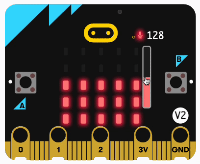
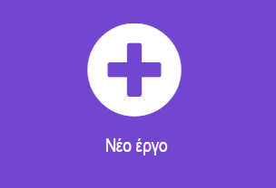
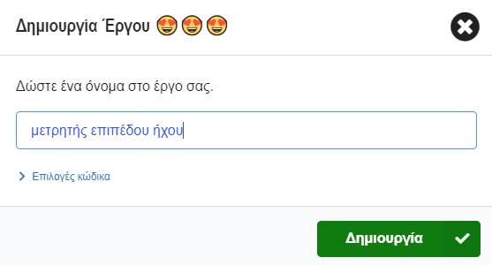
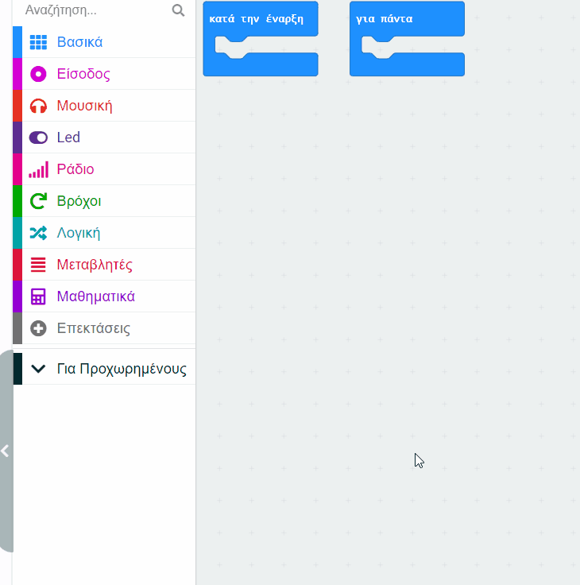
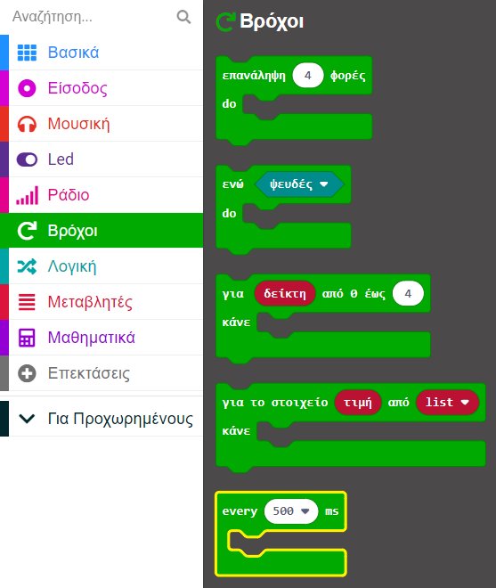
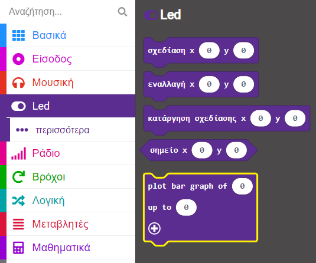
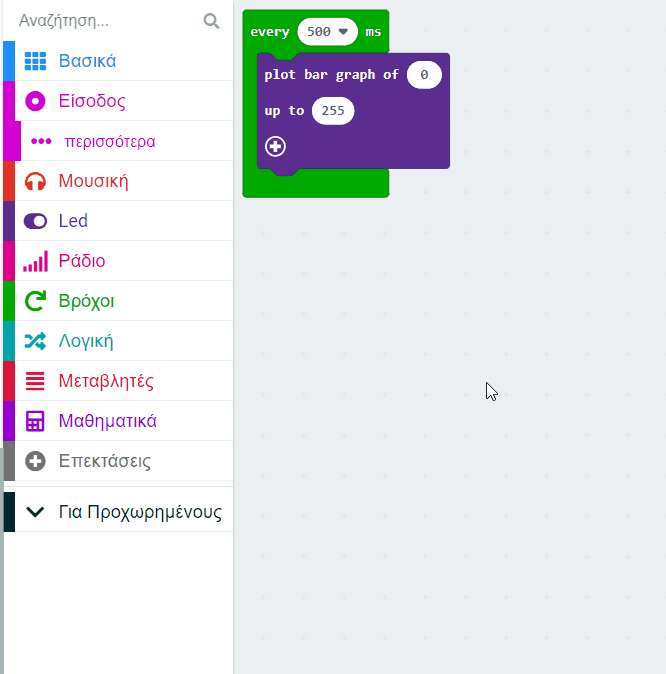
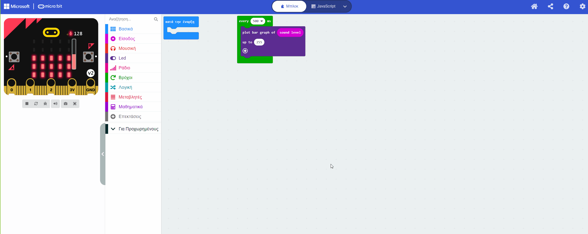
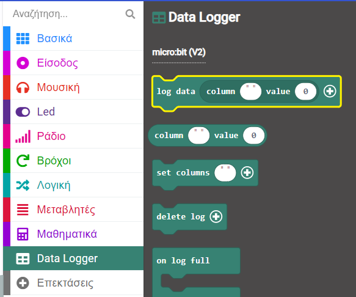
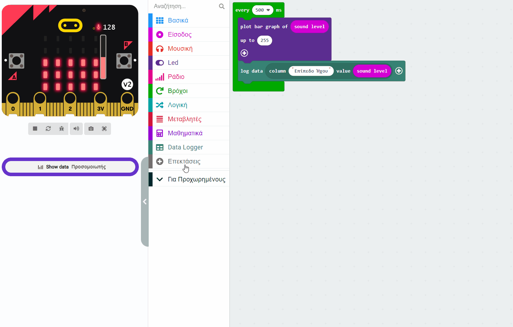

## Κατάγραψε το επίπεδο έντασης

<div style="display: flex; flex-wrap: wrap">
<div style="flex-basis: 200px; flex-grow: 1; margin-right: 15px;">
Θα δημιουργήσεις το δικό σου έργο MakeCode και θα προσθέσεις κώδικα για να μετρήσεις τα επίπεδα έντασης ήχου (ή φωτός). Θα εμφανίσεις το τρέχον επίπεδο στα LED για τον χρήστη. 
</div>
<div>
{:width="300px"}
</div>
</div>

### Άνοιξε το MakeCode

Για να ξεκινήσεις τη δημιουργία του έργου σου με το micro:bit, πρέπει να ανοίξεις το πρόγραμμα επεξεργασίας MakeCode.

--- task ---

Άνοιξε το πρόγραμμα επεξεργασίας MakeCode στη διεύθυνση [makecode.microbit.org](https://makecode.microbit.org){:target="_blank"}

--- collapse ---

---
title: Εκτός σύνδεσης έκδοση του επεξεργαστή
---

Υπάρχει επίσης μια έκδοση με [δυνατότητα λήψης του προγράμματος επεξεργασίας MakeCode](https://makecode.microbit.org/offline-app){:target="_blank"}.

--- /collapse ---

--- /task ---

### Πρώτο έργο micro:bit;

[[[makecode-tour]]]

### Δημιούργησε το έργο σου

Μόλις ανοίξει το πρόγραμμα επεξεργασίας, θα χρειαστεί να δημιουργήσεις ένα νέο έργο και να δώσεις ένα όνομα στο έργο σου.

--- task ---

Κάνε κλικ στο κουμπί **Νέο έργο**.



--- /task ---

--- task ---

Δώσε στο νέο σου έργο το όνομα `μετρητής έντασης ήχου` και κάνε κλικ στο **Δημιουργία**.



**Συμβουλή:** Για να γίνει πιο εύκολη η εύρεση του έργου σου αργότερα, δώσε του ένα όνομα που να σχετίζεται με τη δραστηριότητα που δημιουργείς.

--- /task ---

### Σχεδίασε ένα γράφημα της στάθμης έντασης του ήχου

Σε αυτό το έργο, θα χρησιμοποιήσεις το μπλοκ `κατά την έναρξη`{:class="microbitbasic"}, αλλά όχι το μπλοκ `για πάντα`{:class="microbitbasic"}.

--- task ---

Μπορείς να διαγράψεις το μπλοκ `για πάντα`{:class="microbitbasic"} τώρα σύροντάς το στον πίνακα του μενού.



--- /task ---

Το πρώτο βήμα είναι να δώσεις εντολή στο micro:bit να καταγράφει τα επίπεδα ήχου σε τακτά χρονικά διαστήματα. Υπάρχει ένας συγκεκριμένος βρόχος που μπορείς να χρησιμοποιήσεις για να το κάνεις αυτό.

--- task ---

Από το μενού `Βρόχοι`{:class="microbitinput"}, σύρε το μπλοκ `every 500 ms`{:class="microbitinput"} στον πίνακα επεξεργασίας κώδικα.



Οποιοσδήποτε κώδικας μέσα σ' αυτόν τον βρόχο θα εκτελείται κάθε **500 χιλιοστά του δευτερολέπτου**.

Τα 1000 χιλιοστά του δευτερολέπτου είναι 1 δευτερόλεπτο, επομένως αυτός ο βρόχος θα εκτελείται κάθε **μισό δευτερόλεπτο**.

--- /task ---

--- task ---

Από το μενού `Led`{:class="microbitmath"}, σύρε ένα μπλοκ `plot bar graph`{:class="microbitled"}.



Τοποθέτησέ το μέσα στο μπλοκ `every 500 ms`{:class='microbitlogic'}.

```microbit
loops.everyInterval(500, function () {
    led.plotBarGraph(
    0,
    0
    )
})
```

--- /task ---

--- task ---

Από το μενού `Είσοδος`{:class="microbitinput"}, σύρε ένα μπλοκ `sound level`{:class="microbitinput"}.

Τοποθέτησέ το μέσα στο πρώτο `0` στο μπλοκ `plot bar graph of`{:class="microbitled"}.

Άλλαξε το δεύτερο `0` σε `255`.

```microbit
loops.everyInterval(500, function () {
    led.plotBarGraph(
    input.soundLevel(),
    255
    )
})
```

--- collapse ---

---
title: Για το micro:bit V1
---

Δεν υπάρχει μικρόφωνο στο micro:bit V1, επομένως μπορείς να χρησιμοποιήσεις το μπλοκ `επίπεδο φωτισμού`{:class="microbitinput"} για να μετρήσεις τα επίπεδα φωτισμού του περιβάλλοντός σου.



--- /collapse ---

--- /task ---

### Καταγραφή των επιπέδων έντασης ήχου (μόνο V2)

Το V2 micro:bit διαθέτει ενσωματωμένο καταγραφικό δεδομένων, το οποίο σου επιτρέπει να παρακολουθείς δεδομένα από διάφορους αισθητήρες και εισόδους. Θα χρειαστεί να εγκαταστήσεις μια επέκταση για να το χρησιμοποιήσεις.

--- task ---

Στον πίνακα μενού, κάνε κλικ στο **Επεκτάσεις**. Θα ανοίξει ένα παράθυρο που δείχνει τις προτεινόμενες επεκτάσεις. Κάνε κλικ στο **data logger** και θα εγκατασταθεί ως στοιχείο μενού.



--- /task ---

--- task ---

Από το μενού `Data Logger`{:class="microbitdatalogger"}, σύρε ένα μπλοκ `log data`{:class="microbitdatalogger"}.



Τοποθέτησέ το κάτω από το μπλοκ`plot bar graph of`{:class='microbitled'}.

```microbit
loops.everyInterval(500, function () {
    led.plotBarGraph(
    input.soundLevel(),
    255
    )
    datalogger.log(datalogger.createCV("", 0))
})
```

--- /task ---

--- task ---

Πληκτρολόγησε `Επίπεδο έντασης ήχου` στο πεδίο στήλης.

```microbit
loops.everyInterval(500, function () {
    led.plotBarGraph(
    input.soundLevel(),
    255
    )
    datalogger.log(datalogger.createCV("Ένταση Ήχου", 0))
})
```

--- /task ---

--- task ---

Από το μενού `Είσοδος`{:class="microbitinput"}, σύρε ένα ακόμη μπλοκ `sound level`{:class="microbitinput"} και τοποθέτησέ το μέσα στο `0` στο μπλοκ `log data`{:class="microbitdatalogger"}.

```microbit
loops.everyInterval(500, function () {
    led.plotBarGraph(
    input.soundLevel(),
    255
    )
    datalogger.log(datalogger.createCV("Ένταση Ήχου", input.soundLevel()))
})
```

--- /task ---

### Δοκίμασε το έργο σου

Όταν κάνεις μια αλλαγή σε ένα μπλοκ στο πρόγραμμα επεξεργασίας κώδικα, ο προσομοιωτής θα επανεκκινήσει.

**Δοκίμασε το έργο σου**

+ Σύρε την κόκκινη γραμμή στάθμης έντασης ήχου πάνω και κάτω για να αλλάξεις τα επίπεδα έντασης ήχου.

**Μόνο για το V2**

+ Κάνε κλικ στο σύνδεσμο «**Show data** προσομοιωτή» κάτω από τον προσομοιωτή micro:bit για να δεις τα επίπεδα έντασης ήχου που καταγράφονται.



Εκπληκτική δουλειά! Έχεις δημιουργήσει το πρώτο σου πρόγραμμα εμφάνισης δεδομένων σε micro:bit!
