## Σήμανση συναγερμού

<div style="display: flex; flex-wrap: wrap">
<div style="flex-basis: 200px; flex-grow: 1; margin-right: 15px;">
Σε αυτό το βήμα, θα προσθέσεις έναν συναγερμό που ενεργοποιείται όταν η στάθμη του ήχου είναι πολύ υψηλή. Για να εμποδίσεις τον συναγερμό να προκαλεί κι αυτός θόρυβο, να βεβαιωθείς ότι θα χτυπήσει μόνο μία φορά και ότι μπορεί να επανέλθει στην αρχική κατάσταση όποτε θέλεις. 
</div>
<div>

{:width="300px"}

</div>
</div>

### Ορισμός του μέγιστου

Θα χρειαστεί να δημιουργήσεις μια μεταβλητή για να αποθηκεύσεις το επίπεδο έντασης ήχου που θα ενεργοποιήσει τον συναγερμό.

--- task ---

Άνοιξε το μενού `Μεταβλητές`{:class="microbitvariables"} και κάνε κλικ στο κουμπί **Δημιουργία μεταβλητής**.

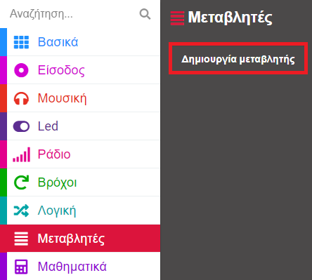

--- /task ---

--- task ---

Ονόμασε τη νέα σου μεταβλητή `μέγιστο`.

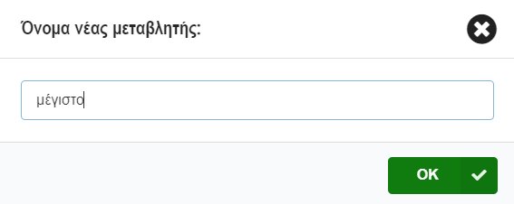

--- /task ---

--- task ---

Από το μενού `Μεταβλητές`{:class="microbitvariables"}, πάρε ένα μπλοκ `ορισμός μέγιστο`{:class="microbitvariables"}.

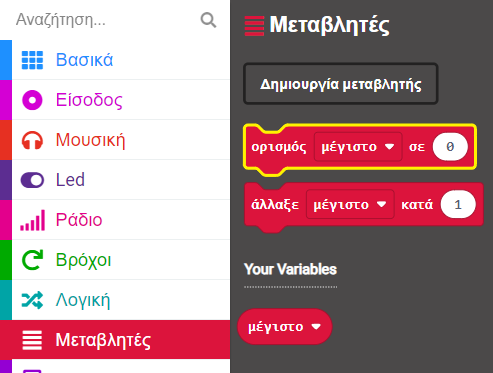

Τοποθέτησε το μπλοκ μέσα στο μπλοκ `κατά την έναρξη`{:class="microbitbasic"} και άλλαξε το `0` σε `150`.

```microbit
let μέγιστο = 150
```

--- /task ---

Η τιμή `150` είναι λίγο παραπάνω από το μισό της μέγιστης στάθμης ήχου που μπορεί να ανιχνεύσει το micro:bit, οπότε πρόκειται για ένα καλό επίπεδο για αρχή.

--- collapse ---

---
title: Για το micro:bit V1
---

Αυτή η μέγιστη τιμή λειτουργεί και για επίπεδα φωτός!

--- /collapse ---

### Απενεργοποίηση συναγερμού

Χρειάζεται επίσης να βεβαιωθείς ότι ο θόρυβος του συναγερμού δεν προσθέτει στο ήδη θορυβώδες περιβάλλον!

Για να το κάνεις αυτό, θα χρησιμοποιήσεις μια άλλη μεταβλητή που θα οριστεί σε `ψευδές` για να ξεκινήσει και θα αλλάξει σε `αληθές` όταν σημάνει ο συναγερμός.

--- task ---

Δημιούργησε μια άλλη νέα `μεταβλητή`{:class="microbitvariables"}, που αυτή τη φορά ονομάζεται `συναγερμός`.

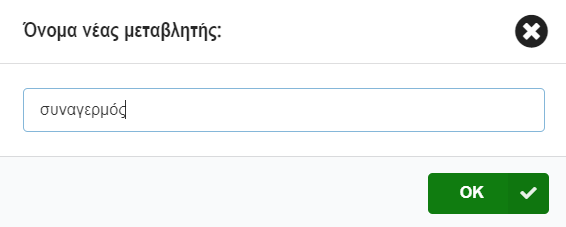

--- /task ---

--- task ---

Σύρε το μπλοκ `ορισμός συναγερμός`{:class="microbitvariables"} από το μενού `Μεταβλητές`{:class="microbitvariables"}.

Τοποθέτησέ το μέσα στο μπλοκ `κατά την αρχή`{:class="microbitbasic"}.

--- /task ---

Πρέπει να ορίσεις αυτή τη νέα μεταβλητή σε `ψευδές` αντί για αριθμό.

--- task ---

Άνοιξε το μενού `Λογική`{:class="microbitlogic"}.

Πάρε ένα μπλοκ `ψευδές`{:class="microbitlogic"}.

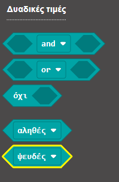

Τοποθέτησε αυτό το μπλοκ πάνω στο `0`.

```microbit
let μέγιστο = 150
let συναγερμός = false
```

--- /task ---

### Έλεγξε εάν πρέπει να σημάνει ο συναγερμός

Ο συναγερμός πρέπει να σημάνει μόνο **εάν:**

+ Το επίπεδο έντασης ήχου είναι **μεγαλύτερο** από το μέγιστο   
  **ΚΑΙ**
+ Η μεταβλητή συναγερμού δεν είναι **αληθές**

--- task ---

Από το μενού `Λογική`{:class="microbitlogic"} σύρε το μπλοκ `εάν...αλλιώς`{:class="microbitlogic"}.

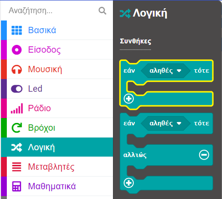

Τοποθέτησε το μπλοκ μέσα στο βρόχο `every`{:class="microbitloops"} κάτω από το μπλοκ `log data`{:class="microbitdatalogger"}.

```microbit
loops.everyInterval(500, function () {
    led.plotBarGraph(
    input.soundLevel(),
    255
    )
    datalogger.log(datalogger.createCV("Ένταση Ήχου", input.soundLevel()))
    if (true) {

    }
})
```

--- /task ---

--- task ---

Άνοιξε ξανά το μενού `Λογική`{:class="microbitlogic"} και πάρε ένα μπλοκ `and`{:class="microbitlogic"}.

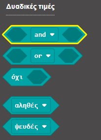

Τοποθετησέ το στο τμήμα `αληθές` του μπλοκ `εάν...αλλιώς`{:class="microbitlogic"}.

```microbit
loops.everyInterval(500, function () {
    led.plotBarGraph(
    input.soundLevel(),
    255
    )
    datalogger.log(datalogger.createCV("Ένταση Ήχου", input.soundLevel()))
    if (false && false) {

    }
})
```

--- /task ---

Τώρα πρέπει να προσθέσεις τις **δύο** συνθήκες σε κάθε πλευρά του **and**.

--- task ---

Και πάλι στο μενού `Λογική`{:class="microbitlogic"}, πάρε ένα μπλοκ συνθηκών `0 < 0`{:class="microbitlogic"}.

Τοποθέτησέ το στη μία πλευρά του μπλοκ `and`{:class="microbitlogic"}.

Χρησιμοποίησε το αναπτυσσόμενο μενού για να αλλάξεις το σύμβολο μικρότερο από (`<`) σε μεγαλύτερο από (`>`).

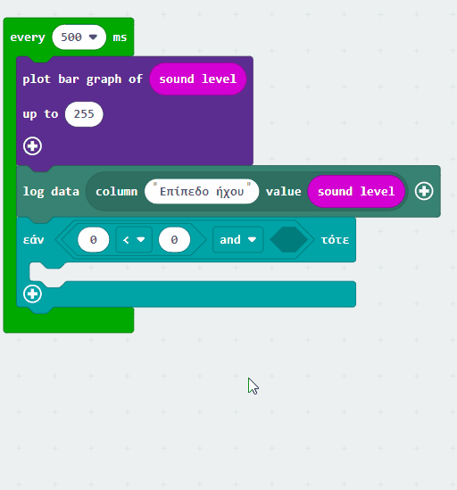

--- /task ---

--- task ---

Από το μενού `Είσοδος`{:class="microbitinput"}, σύρε ένα μπλοκ `sound level`{:class="microbitinput"}.

Τοποθέτησέ το στο πρώτο `0` από το μπλοκ `0 > 0`{:class="microbitlogic"}

Από το μενού `Μεταβλητές`{:class="microbitvariables"}, σύρε ένα μπλοκ `μέγιστο`{:class="microbitvariables"}.

Τοποθέτησέ το στο δεύτερο `0` από το μπλοκ `0 > 0`{:class="microbitlogic"}.

Ο κώδικας θα πρέπει να μοιάζει κάπως έτσι:

```microbit
loops.everyInterval(500, function () {
    let μέγιστο = 0
    led.plotBarGraph(
    input.soundLevel(),
    255
    )
    datalogger.log(datalogger.createCV("Ένταση Ήχου", input.soundLevel()))
    if (input.soundLevel() > μέγιστο && false) {

    }
})
```

--- collapse ---

---
title: Για το micro:bit V1
---

Από το μενού `Είσοδος`{:class="microbitinput"}, σύρε ένα μπλοκ `light level`{:class="microbitinput"}.

Τοποθέτησέ το στο πρώτο `0` από το μπλοκ `0 > 0`{:class="microbitlogic"}.

Από το μενού `Μεταβλητές`{:class="microbitvariables"}, σύρε ένα μπλοκ `μέγιστο`{:class="microbitvariables"}.

Τοποθέτησέ το στο δεύτερο `0` από το μπλοκ `0 > 0`{:class="microbitlogic"}.

Ο κώδικας θα πρέπει να μοιάζει κάπως έτσι:

```microbit
loops.everyInterval(500, function () {
    let μέγιστο = 0
    led.plotBarGraph(
    input.lightLevel(),
    255
    )
    if (input.lightLevel() > μέγιστο && false) {

    }
})
```

--- /collapse ---

--- /task ---

Αυτό που χρειάζεται είναι να απενεργοποιήσεις τον συναγερμό μόνο εάν η μεταβλητή `συναγερμός`{:class="microbitvariables"} είναι **όχι** ορισμένη ως `αληθές`{:class="microbitlogic"}.

--- task ---

Πάρε ένα μπλοκ `όχι`{:class='microbitlogic'} από το μενού `Λογική`{:class='microbitlogic'}.

Τοποθέτησέ το στην άλλη πλευρά του μπλοκ `and`{:class='microbitlogic'}.

```microbit
loops.everyInterval(500, function () {
    let μέγιστο = 0
    led.plotBarGraph(
    input.soundLevel(),
    255
    )
    datalogger.log(datalogger.createCV("Ένταση Ήχου", input.soundLevel()))
    if (input.soundLevel() > μέγιστο && !(false)) {

    }
})
```

--- /task ---

--- task ---

Τοποθέτησε ένα μπλοκ μεταβλητής `συναγερμός`{:class='microbitvariables'} στο `όχι`{:class='microbitlogic'} ως εξής:

```microbit
loops.everyInterval(500, function () {
    let συναγερμός = 0
    let μέγιστο = 0
    led.plotBarGraph(
    input.soundLevel(),
    255
    )
    datalogger.log(datalogger.createCV("Ένταση Ήχου", input.soundLevel()))
    if (input.soundLevel() > μέγιστο && !(συναγερμός)) {

    }
})
```

--- /task ---

### Σήμανση συναγερμού

Τώρα ήρθε η ώρα να προσθέσεις τον ήχο του συναγερμού!

--- task ---

Από το μενού `Μουσική`{:class='microbitmusic'}, σύρε ένα μπλοκ `play`{:class='microbitmusic'}.

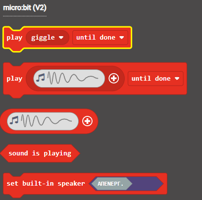

Τοποθέτησέ το μέσα στο μπλοκ `εάν`{:class='microbitlogic'} που ελέγχει εάν θα ηχήσει ο συναγερμός.

```microbit
loops.everyInterval(500, function () {
    let συναγερμός = 0
    let μέγιστο = 0
    led.plotBarGraph(
    input.soundLevel(),
    255
    )
    datalogger.log(datalogger.createCV("Ένταση Ήχου", input.soundLevel()))
    if (input.soundLevel() > μέγιστο && !(συναγερμός)) {
        music.play(music.builtinPlayableSoundEffect(soundExpression.giggle), music.PlaybackMode.UntilDone)
    }
})
```

--- collapse ---

---
title: Για το micro:bit V1
---

Το micro:bit V1 δεν έχει ηχείο, επομένως πρέπει να προσαρμόσεις το πρόγραμμα για το συναγερμό.

Αντί για συναγερμό που χρησιμοποιεί ήχο, μπορείς να εμφανίσεις ένα εικονίδιο στα LED όταν το επίπεδο φωτός είναι υψηλότερο από το μέγιστο.

Από το μενού `Βασικά`{:class='microbitbasic'}, πάρε ένα μπλοκ `εμφάνιση εικονιδίου`{:class='microbitbasic'}.

Τοποθέτησέ το μέσα στο μπλοκ `εάν`{:class='microbitlogic'} που ελέγχει εάν θα ηχήσει ο συναγερμός.

**Επίλεξε** ένα εικονίδιο που θα χρησιμοποιήσεις για τον συναγερμό σου.

```microbit
loops.everyInterval(500, function () {
    let συναγερμός = 0
    let μέγιστο = 0
    led.plotBarGraph(
    input.lightLevel(),
    255
    )
    datalogger.log(datalogger.createCV("Light level", input.lightLevel()))
    if (input.lightLevel() > μέγιστο && !(συναγερμός)) {
        basic.showIcon(IconNames.Sad)
    }
})
```

--- /collapse ---

--- /task ---

--- task ---

**Επίλεξε** ποιο ήχο συναγερμού θέλεις να χρησιμοποιήσεις, από τους διαθέσιμους ήχους στο αναπτυσσόμενο μενού.

--- /task ---

--- task ---

Μέσα στο μπλοκ `κατά την έναρξη`{:class='microbitbasic'}, **κάνε δεξί κλικ** στο μπλοκ `ορισμός`{:class='microbitvariables'} και επίλεξε **Αντίγραφο**.

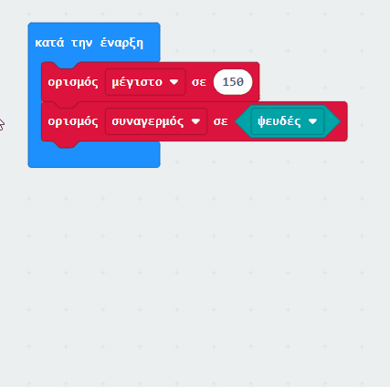

Τοποθέτησε το αντιγραμμένο μπλοκ κάτω από το μπλοκ `play`{:class='microbitmusic'}.

Άλλαξε το `ψευδές`{:class='microbitlogic'} σε `αληθές`{:class='microbitlogic'}.

```microbit
let συναγερμός = false
loops.everyInterval(500, function () {
    let μέγιστο = 0
    led.plotBarGraph(
    input.soundLevel(),
    255
    )
    datalogger.log(datalogger.createCV("Ένταση Ήχου", input.soundLevel()))
    if (input.soundLevel() > μέγιστο && !(συναγερμός)) {
        music.play(music.builtinPlayableSoundEffect(soundExpression.mysterious), music.PlaybackMode.UntilDone)
        συναγερμός = true
    }
})
```

--- /task ---

### Επαναφορά συναγερμού

Όταν σημάνει ο συναγερμός, θα χρειαστεί να τον επαναφέρεις.

Μπορείς να χρησιμοποιήσεις το λογότυπο αφής στο micro:bit για να το κάνεις αυτό.

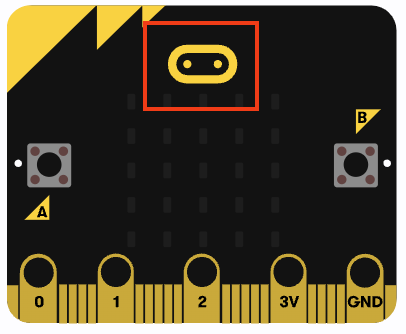

--- task ---

Από το μενού `Είσοδος`{:class='microbitinput'}, σύρε ένα μπλοκ `on logo`{:class='microbitinput'}.

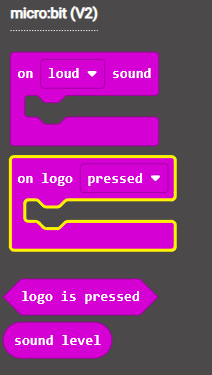

Από το μπλοκ `κατά την έναρξη`{:class='microbitbasic'}, αντίγραψε το μπλοκ `ορισμός συναγερμός`{:class='microbitvariables'} και τοποθέτησέ το μέσα στο μπλοκ `on logo`{:class='microbitinput'}.

```microbit
let συναγερμός = false
input.onLogoEvent(TouchButtonEvent.Pressed, function () {
    συναγερμός = false
})
```

--- collapse ---

---
title: Για το micro:bit V1
---

Δεν υπάρχει αισθητήρας αφής στο λογότυπο του micro:bit V1, επομένως μπορείς να χρησιμοποιήσεις ταυτόχρονα τα δύο κουμπιά `A` και `B`.

Από το μενού `Είσοδος`{:class='microbitinput'}, σύρε ένα μπλοκ `όταν πιεστεί το πλήκτρο button`{:class='microbitinput'}.

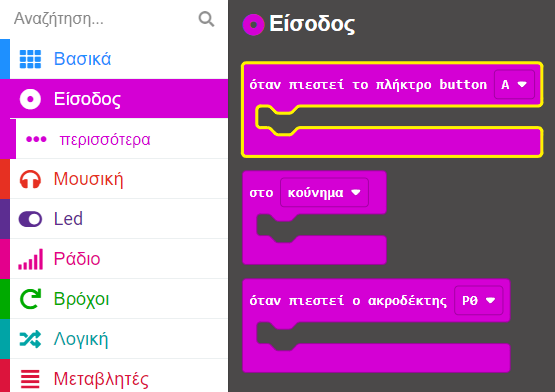

Χρησιμοποίησε το αναπτυσσόμενο μενού για να αλλάξεις το κουμπί σε `A+B`{:class='microbitinput'}.

Από το `κατά την έναρξη`{:class='microbitbasic'}, αντίγραψε το μπλοκ `ορισμός συναγερμός`{:class='microbitvariables'} και τοποθέτησέ το μέσα στο μπλοκ `όταν πιεστεί το πλήκτρο button`{:class='microbitinput'}.

```microbit
let συναγερμός = false
input.onButtonPressed(Button.AB, function () {
    συναγερμός = false
})
```

--- /collapse ---

--- /task ---

Στη συνέχεια θα χρησιμοποιήσεις το κουμπί `A` και το κουμπί `B` για να αλλάξεις την ευαισθησία του συναγερμού σου!
