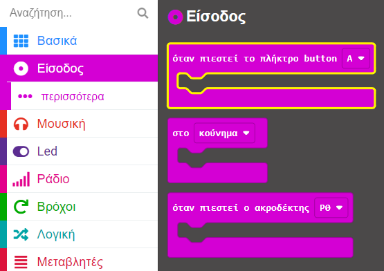
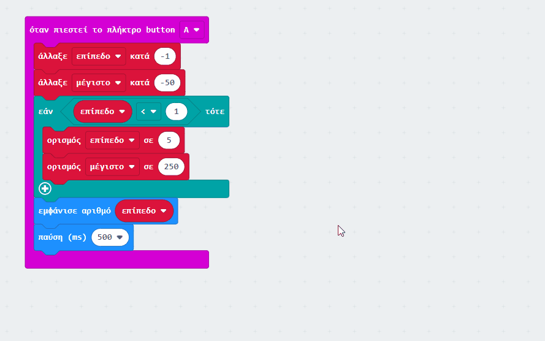

## Αλλαγή της ευαισθησίας

<div style="display: flex; flex-wrap: wrap">
<div style="flex-basis: 200px; flex-grow: 1; margin-right: 15px;">

Σε αυτό το βήμα, θα προγραμματίσεις τα κουμπιά στο micro:bit για να προσαρμόσεις την ευαισθησία του συναγερμού με ρυθμίσεις από 1 (χαμηλότερη μέγιστη τιμή) έως 5 (υψηλότερη μέγιστη τιμή). 

</div>
<div>

{:width="300px"}

</div>
</div>

### Μείωση της μέγιστης στάθμης ήχου

Το κουμπί **A** βρίσκεται στα αριστερά, επομένως θα το χρησιμοποιήσεις για να μειώσεις τη μέγιστη τιμή του συναγερμού.

--- task ---

Από το μενού `Είσοδος`{:class='microbitinput'}, σύρε ένα μπλοκ `όταν πιεστεί το πλήκτρο button`{:class='microbitinput'} και τοποθέτησέ το στο πρόγραμμα επεξεργασίας κώδικα.



--- /task ---

Στο προηγούμενο βήμα, δημιούργησες δύο μεταβλητές, `μέγιστο`{:class='microbitvariables'} και `συναγερμός`{:class='microbitvariables'}.

Τώρα θα δημιουργήσεις μια άλλη μεταβλητή για το **επίπεδο** ευαισθησίας.

--- task ---

Από το μενού `Μεταβλητές`{:class='microbitvariables'}, κάνε κλικ στο **Δημιουργία μεταβλητής** για να δημιουργήσεις μια μεταβλητή που ονομάζεται `επίπεδο`.

--- /task --- 

--- task ---

Σύρε το μπλοκ `άλλαξε`{:class='microbitvariables'} και τοποθέτησέ το μέσα στο μπλοκ `όταν πιεστεί το πλήκτρο button`{:class='microbitinput'}.

Άλλαξε το `1` σε `-1`.

```microbit
let επίπεδο = 0
input.onButtonPressed(Button.A, function () {
    επίπεδο += -1
})
```

--- /task ---

--- task ---

Από το μενού `Μεταβλητές`{:class='microbitvariables'}, σύρε ένα ακόμη μπλοκ `άλλαξε`{:class='microbitvariables'}.

Τοποθέτησέ το **κάτω** από το μπλοκ `άλλαξε επίπεδο κατά -1`{:class='microbitvariables'}.

Άλλαξε τη μεταβλητή που εμφανίζεται στο μπλοκ από `επίπεδο` σε `μέγιστο` κάνοντας κλικ στο όνομα της μεταβλητής.

Άλλαξε το `1` σε `-50`.


```microbit
let επίπεδο = 0
let μέγιστο = 0
input.onButtonPressed(Button.A, function () {
    επίπεδο += -1
    μέγιστο += -50
})
```

--- /task ---

Αυτό σημαίνει ότι κάθε φορά που πατάς το κουμπί A, θα μειώνεται το επίπεδο ευαισθησίας κατά 1 και θα μειώνεται η ευαισθησία του ήχου κατά 50.

Εάν το κουμπί A πατηθεί όταν το επίπεδο είναι ήδη 1, τότε πρέπει να το κάνεις έτσι ώστε το επίπεδο να αλλάξει σε `5` και όχι σε `0`.

--- task ---

Από το μενού `Λογική`{:class='microbitlogic'} σύρε το μπλοκ `εάν`{:class='microbitlogic'}.

Τοποθέτησέ το κάτω από το μπλοκ `άλλαξε μέγιστο κατά -50`{:class='microbitvariables'}.

```microbit
let επίπεδο = 0
let μέγιστο = 0
input.onButtonPressed(Button.A, function () {
    επίπεδο += -1
    μέγιστο += -50
    if (true) {

    }
})
```

--- /task ---

--- task ---

Από το μενού `Λογική`{:class='microbitlogic'}, σύρε το μπλοκ σύγκρισης `0 < 0`{:class='microbitlogic'}.

Τοποθέτησέ το μέσα στο διάστημα `αληθές` μέσα στο μπλοκ `εάν`{:class='microbitlogic'}.

```microbit
let επίπεδο = 0
let μέγιστο = 0
input.onButtonPressed(Button.A, function () {
    επίπεδο += -1
    μέγιστο += -50
    if (0 < 0) {

    }
})
```

--- /task ---

--- task ---

Από το μενού `Μεταβλητές`{:class='microbitvariables'}, σύρε ένα μπλοκ `επίπεδο`{:class='microbitvariables'}.

Τοποθέτησέ το μέσα στο πρώτο `0` του μπλοκ `0 < 0`{:class='microbitlogic'}.

```microbit
let επίπεδο = 0
let μέγιστο = 0
input.onButtonPressed(Button.A, function () {
    επίπεδο += -1
    μέγιστο += -50
    if (επίπεδο < 0) {

    }
})
```

--- /task ---

--- task ---

Άλλαξε το `0` σε `1` στη δεξιά πλευρά του μπλοκ σύγκρισης `0 < 0`{:class='microbitlogic'}.

--- /task ---

--- task ---

Από το μενού `Μεταβλητές`{:class='microbitvariables'}, σύρε το μπλοκ `ορισμός`{:class='microbitvariables'}.

Τοποθέτησέ το μέσα στο μπλοκ `εάν`{:class='microbitlogic'}. Βεβαιώσου ότι η επιλεγμένη μεταβλητή είναι `επίπεδο`{:class='microbitvariables'}.

Άλλαξε το μπλοκ `0` σε `5` στο `ορισμός επίπεδο σε 0`{:class='microbitvariables'}.

```microbit
let επίπεδο = 0
let μέγιστο = 0
input.onButtonPressed(Button.A, function () {
    επίπεδο += -1
    μέγιστο += -50
    if (επίπεδο < 1) {
        επίπεδο = 5
    }
})
```

--- /task ---

--- task ---

Ξανά από το μενού `Μεταβλητές`{:class='microbitvariables'}, σύρε ένα ακόμη μπλοκ `ορισμός`{:class='microbitvariables'}.

Τοποθέτησέ το κάτω από το μπλοκ `ορισμός επίπεδο σε 5`{:class='microbitvariables'}.

Άλλαξε το `0` σε `250`.

```microbit
let επίπεδο = 0
let μέγιστο = 0
input.onButtonPressed(Button.A, function () {
    επίπεδο += -1
    μέγιστο += -50
    if (επίπεδο < 1) {
        επίπεδο = 5
        μέγιστο = 250
    }
})
```

--- /task ---

--- task ---

Από το μενού `Βασικά`{:class='microbitbasic'}, σύρε το μπλοκ `εμφάνιση εικονιδίου`{:class='microbitbasic'}.

Τοποθέτησέ το **κάτω** από το μπλοκ `εάν`{:class='microbitlogic'}.

```microbit
let επίπεδο = 0
let μέγιστο = 0
input.onButtonPressed(Button.A, function () {
    επίπεδο += -1
    μέγιστο += -50
    if (επίπεδο < 1) {
        επίπεδο = 5
        μέγιστο = 250
    }
    basic.showNumber(0)
})
```

--- /task ---

--- task ---

Από το μενού `Μεταβλητές`{:class='microbitvariables'}, σύρε ένα μπλοκ `επίπεδο`{:class='microbitvariables'}.

Τοποθέτησέ το στο μπλοκ `0` στο μπλοκ `εμφάνιση αριθμού`{:class='microbitbasic'}.

```microbit
let επίπεδο = 0
let μέγιστο = 0
input.onButtonPressed(Button.A, function () {
    επίπεδο += -1
    μέγιστο += -50
    if (επίπεδο < 1) {
        επίπεδο = 5
        μέγιστο = 250
    }
    basic.showNumber(επίπεδο)
})
```

--- /task ---

--- task ---

Επίσης, από το μενού `Βασικά`{:class='microbitbasic'}, σύρε το μπλοκ `παύση`{:class='microbitbasic'}.

Τοποθέτησέ το κάτω από το μπλοκ `εμφάνιση αριθμού`{:class='microbitbasic'}.

Άλλαξε το `100` σε `500`.

```microbit
let επίπεδο = 0
let μέγιστο = 0
input.onButtonPressed(Button.A, function () {
    επίπεδο += -1
    μέγιστο += -50
    if (επίπεδο < 1) {
        επίπεδο = 5
        μέγιστο = 250
    }
    basic.showNumber(επίπεδο)
    basic.pause(500)
})
```

--- /task ---

### Αύξηση της μέγιστης στάθμης ήχου

Τώρα έχεις προγραμματίσει το μπλοκ `όταν πιεστεί το πλήκτρο button A`{:class='microbitinput'}.

Θα χρειαστεί να κάνεις το ίδιο για το `όταν πιεστεί το πλήκτρο button B`{:class='microbitinput'} για να αυξήσεις το μέγιστο.

--- task ---

Κάνε δεξί κλικ σε ολόκληρο το μπλοκ `όταν πιεστεί το πλήκτρο button A`μπλοκ {:class='microbitinput'} και κάτε κλικ στο **Αντίγραφο**.



Θα υπάρχουν τώρα δύο μπλοκ `όταν πιεστεί το πλήκτρο button A`{:class='microbitinput'} στον πίνακα επεξεργασίας κώδικα.

--- /task ---

--- task ---

Κάνε κλικ στο `A` στο αντιγραμμένο μπλοκ `όταν πιεστεί το πλήκτρο button A`{:class='microbitinput'}. Θα ανοίξει ένα αναπτυσσόμενο μενού.

Άλλαξε το `A` σε `B`.


--- /task ---

--- task ---

Μέσα στο το μπλοκ `όταν πιεστεί το πλήκτρο button B`{:class='microbitinput'}:

- Άλλαξε το `-1` σε `1` στο μπλοκ `άλλαξε επίπεδο`{:class="microbitvariables"}

- Άλλαξε το μπλοκ `-50` σε `50` στο μπλοκ `άλλαξε μέγιστο`{:class='microbitvariables'}


--- /task ---

--- task ---

Για τις συνθήκες του μπλοκ `εάν`{:class='microbitlogic'}:

- Άλλαξε το `<` σε `>`
- Άλλαξε το `1` σε `5`

Μέσα στο μπλοκ `εάν`{:class='microbitlogic'}:

- Άλλαξε το `5` σε `1` στο μπλοκ `ορισμός επίπεδο σε 5`{:class='microbitvariables'}
- Άλλαξε το `250` σε `50` στο μπλοκ `ορισμός μέγιστο σε 50`{:class='microbitvariables'}

```microbit
let επίπεδο = 0
let μέγιστο = 0
input.onButtonPressed(Button.B, function () {
    επίπεδο += 1
    μέγιστο += 50
    if (επίπεδο > 5) {
        επίπεδο = 1
        μέγιστο = 50
    }
    basic.showNumber(επίπεδο)
    basic.pause(500)
})
```

--- /task ---

### Ορισμός κανονικής στάθμης έντασης ήχου

Χρειάζεται να προγραμματίσεις ένα κανονικό επίπεδο ευαισθησίας συναγερμού χρησιμοποιώντας το μπλοκ `κατά την έναρξη`{:class='microbitbasic'}.

--- task ---

Από το μενού `Μεταβλητές`{:class="microbitvariables"}, σύρε ένα μπλοκ `ορισμός μέγιστο σε 0`{:class="microbitvariables"}.

Τοποθέτησέ το μέσα στο μπλοκ `κατά την έναρξη`{:class="microbitbasic"}.

--- /task ---

--- task ---

Κάνε κλικ στο όνομα της μεταβλητής `μέγιστο` και άλλαξέ το σε `επίπεδο`.

Άλλαξε το `0` σε `3` στο μπλοκ `ορισμός επίπεδο`{:class='microbitvariables'}.

```microbit
let μέγιστο = 150
let συναγερμός = false
let επίπεδο = 3
```

--- /task ---

--- task ---

**Δοκίμασε το έργο σου**

+ Πάτησε τα κουμπιά A και B για να δεις τα επίπεδα ήχου να αυξάνονται και να μειώνονται

Το προεπιλεγμένο σημείο εκκίνησης είναι το επίπεδο 3.

**Σύρε** τα επίπεδα εισόδου μικροφώνου πάνω και κάτω για να ελέγξεις τον μέγιστο ήχο για κάθε επίπεδο όταν χρησιμοποιείς τον προσομοιωτή.

--- /task ---

--- task ---

Κατέβασε το πρόγραμμά σου στο micro:bit!

--- /task ---

[[[download-to-microbit]]]

Συγχαρητήρια! Τώρα έχεις έναν πλήρως λειτουργικό μετρητή ήχου ή φωτός!

Στη συνέχεια, ήρθε η ώρα να ελέγξεις τι έχεις μάθει!
