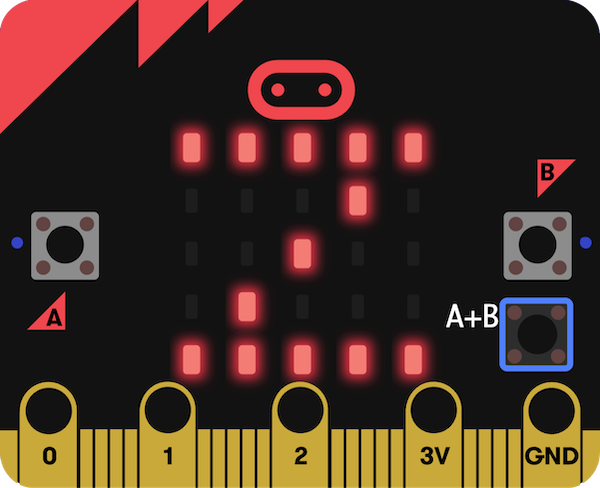

## Τι υπάρχει στη συνέχεια;

Εάν ακολουθείς τη διαδρομή [Εισαγωγή στη micro:bit](https://projects.raspberrypi.org/en/raspberrypi/path-name), μπορείς να προχωρήσεις στο έργο [Καταγραφέας Ύπνου](https://projects.raspberrypi.org/en/projects/sleep-tracker).

Σε αυτό το έργο, θα φτιάξεις έναν καταγραφέα ύπνου που χρησιμοποιεί το επιταχυνσιόμετρο micro:bit για να παρακολουθεί πόσες φορές κινείσαι τη νύχτα. Ο καλός ύπνος είναι πολύ σημαντικός για να σε βοηθήσει να νιώσεις καλύτερα!

--- print-only ---

--- /print-only ---

--- no-print ---

<iframe style="position:absolute;top:0;left:0;width:100%;height:100%;" src="https://makecode.microbit.org/---run?id=_14Lib71CCP0F" allowfullscreen="allowfullscreen" sandbox="allow-popups allow-forms allow-scripts allow-same-origin" frameborder="0"></iframe>

--- /no-print ---

Εάν θέλεις να διασκεδάσεις περισσότερο εξερευνώντας το micro:bit, τότε μπορείς να δοκιμάσεις κάποιο από [αυτά τα έργα](https://projects.raspberrypi.org/en/projects?hardware%5B%5D=microbit).
