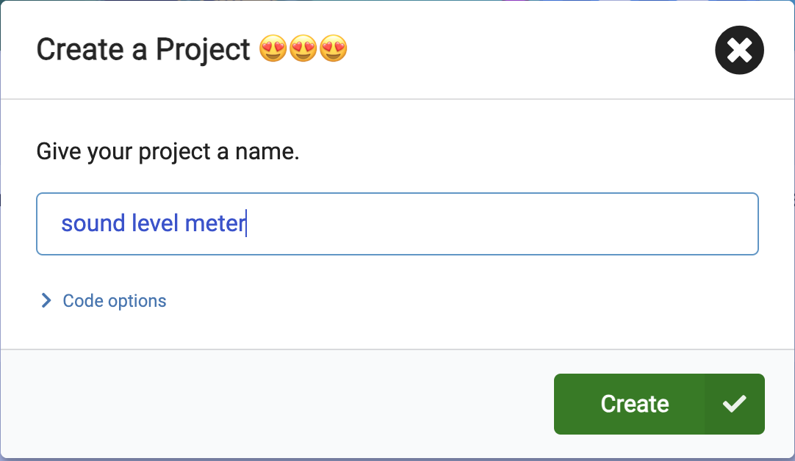
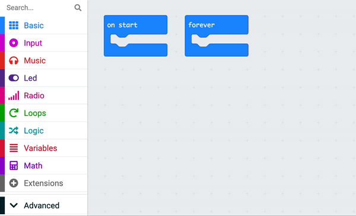
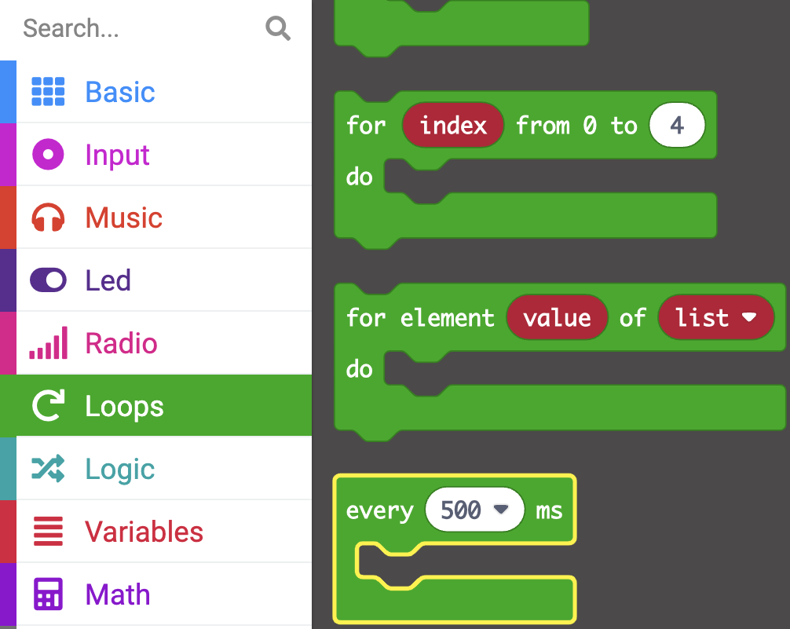
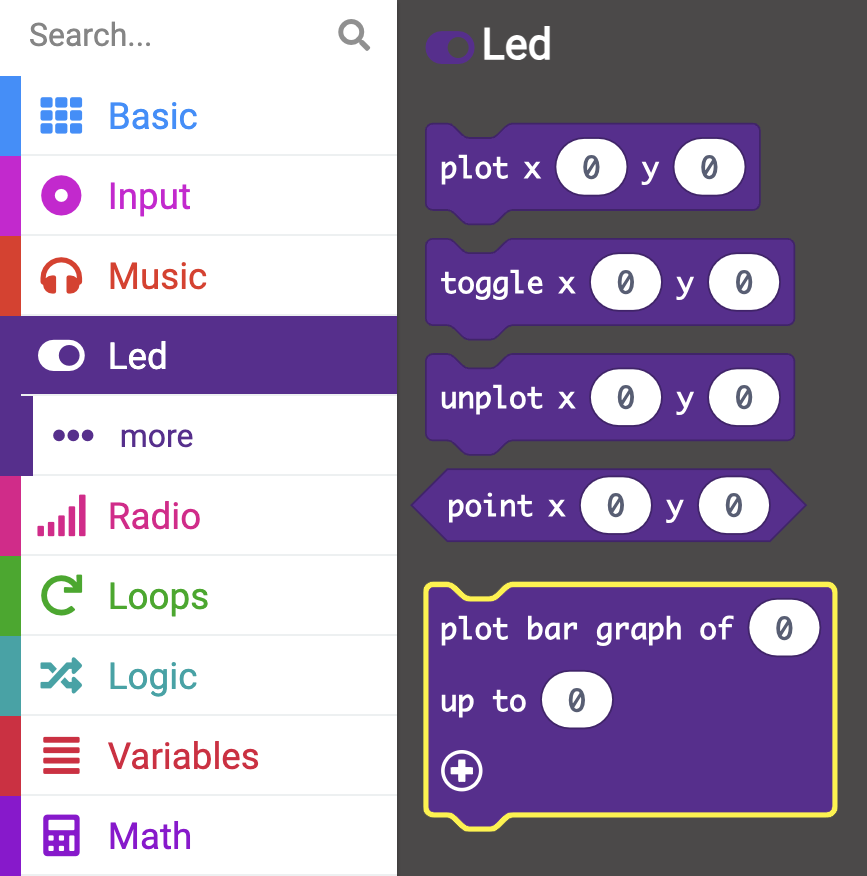
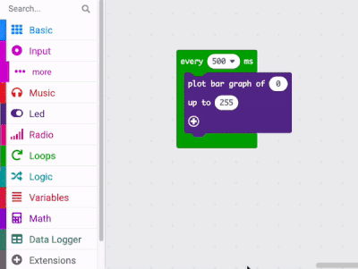
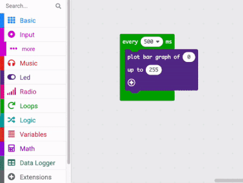
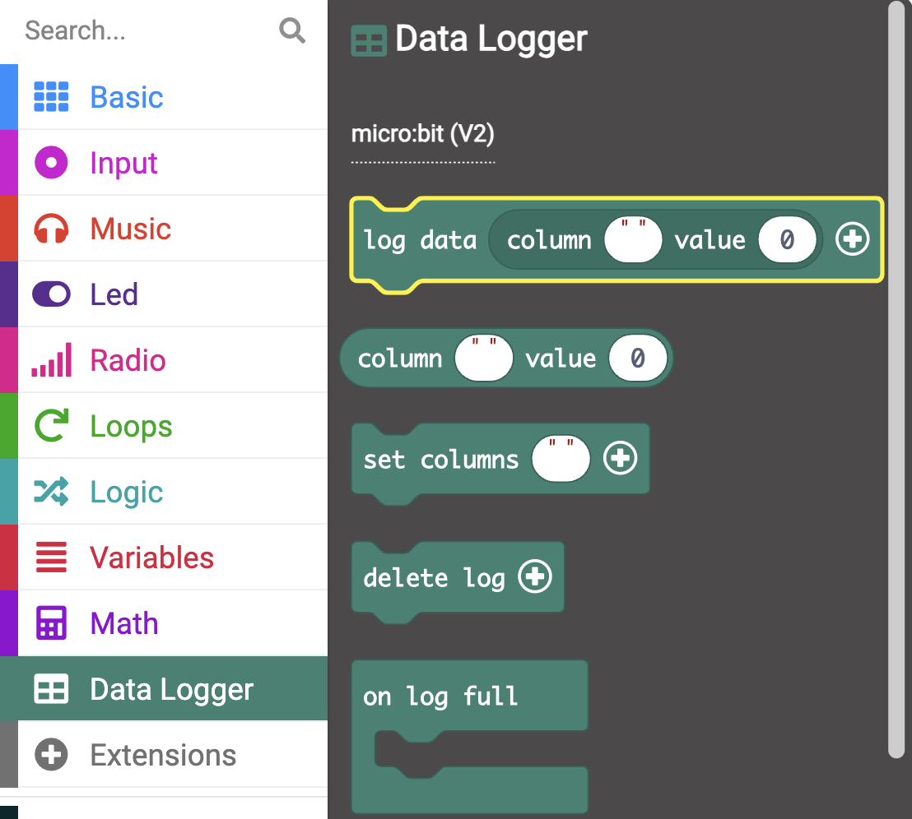

## Log the sound level

You are going to create your MakeCode project and add code to measure the sound (or light) levels. You will show the user the current level on the LEDs. 

{:width="300px"}

### Opening MakeCode

To start creating your micro:bit project, you need to open the MakeCode editor.

--- task ---

Open the MakeCode editor at [makecode.microbit.org](https://makecode.microbit.org){:target="_blank"}

--- collapse ---

---
title: Offline version of the editor
---

There is also a [downloadable version of the MakeCode editor](https://makecode.microbit.org/offline-app){:target="_blank"}.

--- /collapse ---

--- /task ---

### First micro:bit project?

[[[makecode-tour]]]

### Create your project

Once the editor is open, you will need to create a New Project and give your project a name. 

--- task ---

Click on the **New Project** button.

--- /task ---

--- task ---

Give your new project the name `sound level meter` and click **Create**.

**Tip:** Give your project a helpful name that relates to the activity you’re creating. This will make it easier to find if you create other projects on MakeCode.

--- /task ---

### Plot a graph of the sound level

In this project, you will make use of the 'on start' block but not the 'forever' block. 

You can delete the 'forever' block now by dragging it to the menu panel.

You want the micro:bit to take a reading of the sound levels on regular intervals, there is another loop you can use to do this.

--- task ---

From the <code style="background-color: #00AA00">Loops</code> menu, drag out an <code style="background-color: #00aa00">every 500 ms</code> block and place it on the code editor panel

--- /task ---

--- task ---

From the <code style="background-color: #5C2D91">Led</code> menu drag a <code style="background-color: #5c2d91">plot bar graph of</code> block.

Place it inside the <code style="background-color: #00aa00">every 500 ms</code> block.

<iframe style="position:relative;top:0;left:0;width:60%;height:60%;" src="https://makecode.microbit.org/---codeembed#pub:_LheU15Tfr59C" allowfullscreen="allowfullscreen" frameborder="0" sandbox="allow-scripts allow-same-origin"></iframe>

Space check

--- /task ---

--- task ---

From the <code style="background-color: #D400D4">Input</code> menu, drag out a 'sound level' block and place it inside the first '0' on the 'plot bar graph of' block.

--- collapse ---

---
title: For microbit V1
---

There is not a sound sensor on the micro:bit V1, so instead you can use the <code style="background-color: #d400d4">light level</code> block and measure the light levels of your environment.

--- /collapse ---

--- /task ---

--- task ---

Change the second '0' to '255 on the 'plot bar graph of' block.

<iframe style="position:relative;top:0;left:0;width:50%;height:50%;" src="https://makecode.microbit.org/---codeembed#pub:_Xbc6McLCi5gJ" allowfullscreen="allowfullscreen" frameborder="0" sandbox="allow-scripts allow-same-origin"></iframe>

--- /task ---

You will now need a way of tracking the data from the sound levels. 

--- collapse ---

---
title: Installing the Data Logger extension
---

The V2 of the micro:bit has a built in data logger which enables you to track data from various sensors and inputs. You will need to install an extension to use this.

On the menu panel, click on Extensions. Another window will open showing recommended extensions. Click on the data logger and it will be installed as a menu item.

--- /collapse ---

--- task ---

From the <code style="background-color: #378273">Data Logger</code> menu, drag out a 'log data column.. value' block.

Place it below the 'plot bar graph of' block.

<iframe style="position:relative;top:0;left:0;width:50%;height:50%;" src="https://makecode.microbit.org/---codeembed#pub:_93KR1vXYFPj1" allowfullscreen="allowfullscreen" frameborder="0" sandbox="allow-scripts allow-same-origin"></iframe>

--- /task ---

--- task ---

Inside the empty string column field on the 'log data column.. value' block, type 'Sound level'

<iframe style="position:relative;top:0;left:0;width:50%;height:50%;" src="https://makecode.microbit.org/---codeembed#pub:_JHr0atCoo2ju" allowfullscreen="allowfullscreen" frameborder="0" sandbox="allow-scripts allow-same-origin"></iframe>

--- /task ---

--- task ---

From the <code style="background-color: #D400D4">Input</code> menu, drag another 'sound level' block and place it inside the '0' on the 'log data column.. value' block.

<iframe style="position:relative;top:0;left:0;width:50%;height:50%;" src="https://makecode.microbit.org/---codeembed#pub:_VCJdqy3yALDh" allowfullscreen="allowfullscreen" frameborder="0" sandbox="allow-scripts allow-same-origin"></iframe>

--- /task ---

When you make a change to a code block in the code editor panel, the simulator will restart.

**Test** When the program runs, drag the red sound level bar up and down to change the sound levels.

**Click** The 'Show data.. Simulator' link below the micro:bit simulator to see the sound levels being logged.

Awesome work, you have created your first data logging program on a micro:bit!