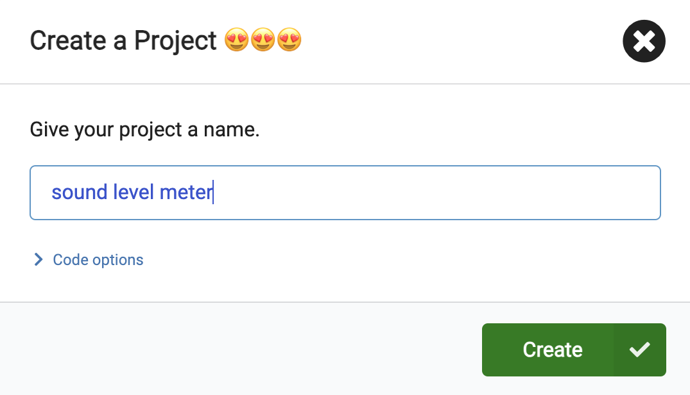

## Log the sound level

<div style="display: flex; flex-wrap: wrap">
<div style="flex-basis: 200px; flex-grow: 1; margin-right: 15px;">
You will create your MakeCode project and add code to measure the sound (or light) levels. You will display the current level on the LEDs for the user. 
</div>
<div>
{:width="300px"}
</div>
</div>

### Open MakeCode

To start creating your micro:bit project, you need to open the MakeCode editor.

--- task ---

Open the MakeCode editor at [makecode.microbit.org](https://makecode.microbit.org){:target="_blank"}

--- collapse ---

---
title: Offline version of the editor
---

There is also a [downloadable version of the MakeCode editor](https://makecode.microbit.org/offline-app){:target="_blank"}.

--- /collapse ---

--- /task ---

### First micro:bit project?

[[[makecode-tour]]]

### Create your project

Once the editor is open, you will need to create a new project and give your project a name. 

--- task ---

Click on the **New Project** button.


--- /task ---

--- task ---

Give your new project the name `sound level meter` and click **Create**.



**Tip:** To make it easier to find your project later, give it a helpful name that relates to the activity you’re creating.

--- /task ---

### Plot a graph of the sound level

In this project, you will make use of the `on start`{:class="microbitbasic"} block, but not the `forever`{:class="microbitbasic"} block. 

--- task ---

You can delete the `forever`{:class="microbitbasic"} block now by dragging it to the menu panel.


--- /task ---

The first step is to get the micro:bit to capture the sound levels at regular intervals. There is a specifc loop you can use to do this.

--- task ---

From the `Loops`{:class="microbitloops"} menu, drag an `every 500 ms`{:class="microbitloops"} block and place it in the code editor panel.


Any code inside this loop will run every **500 milliseconds**. 

1000 milliseconds is 1 second, so this loop will run every **half second**.

--- /task ---

--- task ---

From the `Led`{:class="microbitled"} menu, drag a `plot bar graph`{:class="microbitled"} block.


Place it inside the `every 500 ms`{:class="microbitloops"} block.

```microbit
loops.everyInterval(500, function () {
    led.plotBarGraph(
    0,
    0
    )
})
```

--- /task ---

--- task ---

From the `Input`{:class="microbitinput"} menu, drag a `sound level`{:class="microbitinput"} block.  

Place it inside the first `0` in the `plot bar graph of`{:class="microbitled"} block.

Change the second `0` to `255`.

```microbit
loops.everyInterval(500, function () {
    led.plotBarGraph(
    input.soundLevel(),
    255
    )
})
```

--- collapse ---

---
title: For micro:bit V1
---

There is no microphone on the micro:bit V1, so instead you can use the `light level`{:class="microbitinput"} block to measure the light levels of your environment.


--- /collapse ---

--- /task ---

### Log the sound levels (V2 only)

The V2 micro:bit has a built-in data logger, which enables you to track data from various sensors and inputs. You will need to install an extension to use this.

--- task ---

On the menu panel, click on **Extensions**. Another window will open showing recommended extensions. Click on the **data logger** and it will be installed as a menu item.


--- /task ---

--- task ---

From the `Data Logger`{:class="microbitdatalogger"} menu, drag a `log data`{:class="microbitdatalogger"} block.


Place it below the `plot bar graph of`{:class='microbitled'} block.

```microbit
loops.everyInterval(500, function () {
    led.plotBarGraph(
    input.soundLevel(),
    255
    )
    datalogger.log(datalogger.createCV("", 0))
})
```

--- /task ---

--- task ---

Type `Sound level` in the column field.

```microbit
loops.everyInterval(500, function () {
    led.plotBarGraph(
    input.soundLevel(),
    255
    )
    datalogger.log(datalogger.createCV("Sound level", 0))
})
```

--- /task ---

--- task ---

From the `Input`{:class="microbitinput"} menu, drag another `sound level`{:class="microbitinput"} block and place it inside the `0` on the `log data`{:class="microbitdatalogger"} block.

```microbit
loops.everyInterval(500, function () {
    led.plotBarGraph(
    input.soundLevel(),
    255
    )
    datalogger.log(datalogger.createCV("Sound level", input.soundLevel()))
})
```

--- /task ---

### Test your program

When you make a change to a code block in the code editor panel, the simulator will restart.

**Test your program**

+ Drag the red sound level bar up and down to change the sound levels.

**V2 only**

+ Click The '**Show data** Simulator' link below the micro:bit simulator to see the sound levels being logged.


Awesome work! You have created your first data display program on a micro:bit!
