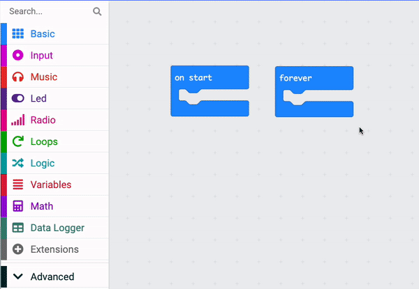
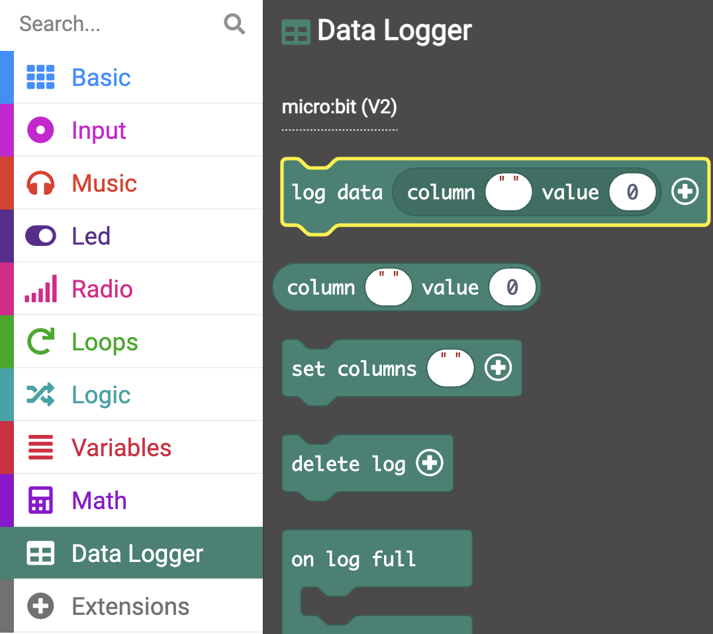
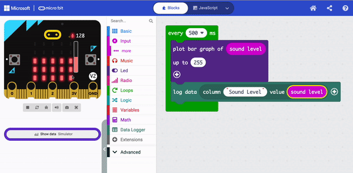

## Log the sound level

You will create your MakeCode project and add code to measure the sound (or light) levels. You will display the current level on the LEDs for the user. 

{:width="300px"}

### Open MakeCode

To start creating your micro:bit project, you need to open the MakeCode editor.

--- task ---

Open the MakeCode editor at [makecode.microbit.org](https://makecode.microbit.org){:target="_blank"}

--- collapse ---

---
title: Offline version of the editor
---

There is also a [downloadable version of the MakeCode editor](https://makecode.microbit.org/offline-app){:target="_blank"}.

--- /collapse ---

--- /task ---

### First micro:bit project?

[[[makecode-tour]]]

### Create your project

Once the editor is open, you will need to create a new project and give your project a name. 

--- task ---

Click on the **New Project** button.

--- /task ---

--- task ---

Give your new project the name `sound level meter` and click **Create**.

**Tip:** To make it easier to find your project later, give it a helpful name that relates to the activity you’re creating.

--- /task ---

### Plot a graph of the sound level

In this project, you will make use of the <code style="background-color: #1e90ff">on start</code> block, but not the <code style="background-color: #1e90ff">forever</code> block. 

--- task ---

You can delete the <code style="background-color: #1e90ff">forever</code> block now by dragging it to the menu panel.

--- /task ---

The first step is to get the micro:bit to capture the sound levels at regular intervals. There is a specifc loop you can use to do this.

--- task ---

From the <code style="background-color: #00AA00">Loops</code> menu, drag an <code style="background-color: #00aa00">every 500 ms</code> block and place it in the code editor panel.

Any code inside this loop will run every **500 milliseconds**. 

1000 milliseconds is 1 second, so this loop will run every **half second**.

--- /task ---

--- task ---

From the <code style="background-color: #5C2D91">Led</code> menu, drag a <code style="background-color: #5c2d91">plot bar graph</code> block.

Place it inside the <code style="background-color: #00aa00">every 500 ms</code> block.

<iframe style="position:relative;top:0;left:0;width:100%;height:100%;" src="https://makecode.microbit.org/---codeembed#pub:_LheU15Tfr59C" allowfullscreen="allowfullscreen" frameborder="0" sandbox="allow-scripts allow-same-origin"></iframe>

--- /task ---

--- task ---

From the <code style="background-color: #D400D4">Input</code> menu, drag a <code style="background-color: #D400D4">sound level</code> block.  

Place it inside the first `0` in the <code style="background-color: #5c2d91">plot bar graph of</code> block.

Change the second `0` to `255`.

<iframe style="position:relative;top:0;left:0;width:100%;height:100%;" src="https://makecode.microbit.org/---codeembed#pub:_Xbc6McLCi5gJ" allowfullscreen="allowfullscreen" frameborder="0" sandbox="allow-scripts allow-same-origin"></iframe>

--- collapse ---

---
title: For micro:bit V1
---

There is no microphone on the micro:bit V1, so instead you can use the <code style="background-color: #d400d4">light level</code> block to measure the light levels of your environment.

--- /collapse ---

--- /task ---

### Log the sound levels (V2 only)

The V2 of the micro:bit has a built-in data logger, which enables you to track data from various sensors and inputs. You will need to install an extension to use this.

--- task ---

On the menu panel, click on **Extensions**. Another window will open showing recommended extensions. Click on the **data logger** and it will be installed as a menu item.

--- /task ---

--- task ---

From the <code style="background-color: #378273">Data Logger</code> menu, drag a <code style="background-color: #378273">log data</code> block.

Place it below the <code style="background-color: #5C2D91">plot bar graph of</code> block.

<iframe style="position:relative;top:0;left:0;width:100%;height:100%;" src="https://makecode.microbit.org/---codeembed#pub:_93KR1vXYFPj1" allowfullscreen="allowfullscreen" frameborder="0" sandbox="allow-scripts allow-same-origin"></iframe>

--- /task ---

--- task ---

Type `Sound level` in the column field.

<iframe style="position:relative;top:0;left:0;width:100%;height:100%;" src="https://makecode.microbit.org/---codeembed#pub:_JHr0atCoo2ju" allowfullscreen="allowfullscreen" frameborder="0" sandbox="allow-scripts allow-same-origin"></iframe>

--- /task ---

--- task ---

From the <code style="background-color: #D400D4">Input</code> menu, drag another <code style="background-color: #D400D4">sound level</code> block and place it inside the `0` on the <code style="background-color: #378273">log data</code> block.

<iframe style="position:relative;top:0;left:0;width:100%;height:100%;" src="https://makecode.microbit.org/---codeembed#pub:_VCJdqy3yALDh" allowfullscreen="allowfullscreen" frameborder="0" sandbox="allow-scripts allow-same-origin"></iframe>

--- /task ---

### Test your program

When you make a change to a code block in the code editor panel, the simulator will restart.

**Test your program**

+ Drag the red sound level bar up and down to change the sound levels.

**V2 only**

+ Click The '**Show data** Simulator' link below the micro:bit simulator to see the sound levels being logged.

Awesome work! You have created your first data display program on a micro:bit!
