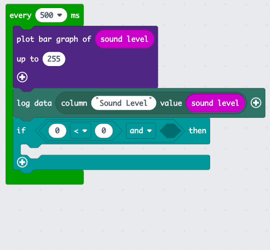
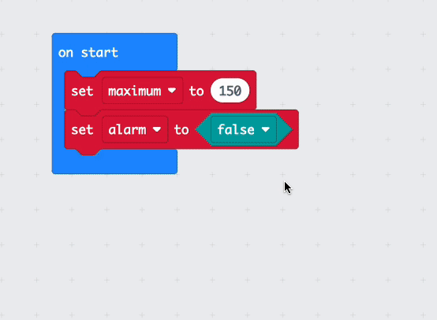

## Sound the alarm

In this step you will add an alarm that triggers when the levels get too high. To stop the alarm adding to the noise you will make sure it only goes off once and can be reset whenever you want. 

{:width="300px"}

### Set the maximum

You will need to make a Variable to set the sound level that will trigger the alarm.

--- task ---

Open the <code style="background-color: #dc143c">Variables</code> menu and click `Make a Variable`.

--- /task ---

--- task ---

Name your new variable `maximum`. 

--- /task ---

--- task ---

From the <code style="background-color: #dc143c">Variables</code> menu, grab the <code style="background-color: #dc143c">set maximum</code> block. 

Place the block inside the <code style="background-color: #1e90ff">on start</code> block, and change the `0` to `150`.

<iframe style="position:relative;top:0;left:0;width:75%;height:75%;" src="https://makecode.microbit.org/---codeembed#pub:_D7PUcJXFR51p" allowfullscreen="allowfullscreen" frameborder="0" sandbox="allow-scripts allow-same-origin"></iframe>

--- /task ---

`150` is a little over half the maximum sound level the micro:bit can sense, so that should be a good level to start with. 

--- collapse ---

---
title: For microbit V1
---

This maximum should work for light levels too!

--- /collapse ---

### Turn the alarm off

You will also want to make sure the alarm noise itself does not add to the already noisy surroundings!

To do this you will use another variable that will be set to `false` when the alarm has not sounded, and then `true` when the alarm sounds. 

--- task ---

Create another new <code style="background-color: #dc143c">Variable</code> this time called `alarm`. 

--- /task ---

--- task ---

Drag another <code style="background-color: #dc143c">set</code> block from the <code style="background-color: #dc143c">Variables</code> menu.

Place it inside the <code style="background-color: #1e90ff">on start</code> block. Underneath the previous one. 

--- /task ---

You need to set this new variable to `false` instead of a number.

--- task ---

Open the <code style="background-color: #00a4a6">Logic</code> menu. Grab a <code style="background-color: #00a4a6">false</code> block. 

Place this block over the top of the `0`. 

<iframe style="position:relative;top:0;left:0;width:75%;height:75%;" src="https://makecode.microbit.org/---codeembed#pub:_43jPJYC2z2fR" allowfullscreen="allowfullscreen" frameborder="0" sandbox="allow-scripts allow-same-origin"></iframe>

--- /task ---

### Check if the alarm should sound

The alarm should only sound **if** the current sound level is **larger** than the maximum **and** the alarm variable is **equal to** `false`. 

--- task ---

From the <code style="background-color: #00a4a6">Logic</code> menu grab an <code style="background-color: #00a4a6">if</code> block. 

Place the block inside the <code style="background-color: #00aa00">every</code> loop underneath the <code style="background-color: #5c2d91">plot bar graph</code> block.

<iframe style="position:relative;top:0;left:0;width:75%;height:75%;" src="https://makecode.microbit.org/---codeembed#pub:_Ve9W13cyKXTi" allowfullscreen="allowfullscreen" frameborder="0" sandbox="allow-scripts allow-same-origin"></iframe>

--- /task ---

--- task ---

Open the <code style="background-color: #00a4a6">Logic</code> menu again and take an <code style="background-color: #00a4a6">and</code> block. 

Place it in the `true` section of the <code style="background-color: #00a4a6">if</code> block. 

<iframe style="position:relative;top:0;left:0;width:75%;height:75%;" src="https://makecode.microbit.org/---codeembed#pub:_JYu2mx9ku6pC" allowfullscreen="allowfullscreen" frameborder="0" sandbox="allow-scripts allow-same-origin"></iframe>

--- /task ---

Now you need to add the **two** conditions either side of the **and**. 

This will mean that the code inside your <code style="background-color: #00a4a6">if</code> block will only run if **both** conditions are true. 

--- task ---

Again in the <code style="background-color: #00a4a6">Logic</code> menu, grab a <code style="background-color: #00a4a6">0 < 0</code> condition block. 

Place it on one side of the <code style="background-color: #00a4a6">and</code> block. 

Use the dropdown to change the less than symbol (`<`) to a greater than (`>`) symbol. 

<iframe style="position:relative;top:0;left:0;width:75%;height:75%;" src="https://makecode.microbit.org/---codeembed#pub:_MtYUvfg1RT9a" allowfullscreen="allowfullscreen" frameborder="0" sandbox="allow-scripts allow-same-origin"></iframe>

--- /task ---

--- task ---

On the **left hand side** (where the first `0` is) put a <code style="background-color: #d400d4">sound level</code> block from the <code style="background-color: #d400d4">Input</code> menu.

On the other side, put a <code style="background-color: #dc143c">maximum</code> block from the <code style="background-color: #dc143c">Variables</code> menu. 

<iframe style="position:relative;top:0;left:0;width:75%;height:75%;" src="https://makecode.microbit.org/---codeembed#pub:_L7M4isPeYR3c" allowfullscreen="allowfullscreen" frameborder="0" sandbox="allow-scripts allow-same-origin"></iframe>

--- collapse ---

---
title: For microbit V1
---

On the **left hand side** (where the first `0` is) put a <code style="background-color: #d400d4">light level</code> block from the <code style="background-color: #d400d4">Input</code> menu.

On the other side, put a <code style="background-color: #dc143c">maximum</code> block from the <code style="background-color: #dc143c">Variables</code> menu. 

<iframe style="position:relative;top:0;left:0;width:75%;height:75%;" src="https://makecode.microbit.org/---codeembed#pub:_h2Y4WJ4LPL1J" allowfullscreen="allowfullscreen" frameborder="0" sandbox="allow-scripts allow-same-origin"></iframe>

--- /collapse ---

--- /task ---

--- task ---

Grab a <code style="background-color: #00a4a6">0 = 0</code> condition block from the <code style="background-color: #00a4a6">Logic</code> menu. 

Place it on the other side of the <code style="background-color: #00a4a6">and</code> block.

<iframe style="position:relative;top:0;left:0;width:75%;height:75%;" src="https://makecode.microbit.org/---codeembed#pub:_X84gwbPC3guw" allowfullscreen="allowfullscreen" frameborder="0" sandbox="allow-scripts allow-same-origin"></iframe>

--- /task ---

--- task ---

This condition needs to check whether the <code style="background-color: #dc143c">alarm</code> variable **is equal to** <code style="background-color: #00a4a6">false</code>. 

This means the alarm has not gone off yet. 

Place an <code style="background-color: #dc143c">alarm</code> variable block on one side of the equals and a <code style="background-color: #00a4a6">false</code> block on the other side. Like this:

<iframe style="position:relative;top:0;left:0;width:75%;height:75%;" src="https://makecode.microbit.org/---codeembed#pub:_4sYXrcHcg0Lt" allowfullscreen="allowfullscreen" frameborder="0" sandbox="allow-scripts allow-same-origin"></iframe>

--- /task ---

### Sounding the alarm

Now it is time to add your alarm sound!

--- task ---

From the <code style="background-color: #e63022">Music</code> menu, take a <code style="background-color: #e63022">play</code> block. 

--- collapse ---

---
title: For microbit V1
---

If you are using a micro:bit V1 you can use the <code style="background-color: #e63022">play</code> block in the **Melody Advanced** section instead. 

--- /collapse ---

Place this inside of the <code style="background-color: #00a4a6">if</code> block that checks if the alarm should sound. 

<iframe style="position:relative;top:0;left:0;width:75%;height:75%;" src="https://makecode.microbit.org/---codeembed#pub:_bHYiMdKDjcw2" allowfullscreen="allowfullscreen" frameborder="0" sandbox="allow-scripts allow-same-origin"></iframe>

--- /task ---

--- task ---

**Choose:** which alarm sound you would like to use, from the available sounds in the dropdown. 

--- /task ---

--- task ---

Inside your <code style="background-color: #1e90ff">on start</code> block, **right click** on the <code style="background-color: #dc143c">set alarm to false</code> part and select **Duplicate**. 

Place the duplicated block below the <code style="background-color: #e63022">play</code> block. 

Change the <code style="background-color: #00a4a6">false</code> to <code style="background-color: #00a4a6">true</code>.

<iframe style="position:relative;top:0;left:0;width:75%;height:75%;" src="https://makecode.microbit.org/---codeembed#pub:_UmibCbeCJhPm" allowfullscreen="allowfullscreen" frameborder="0" sandbox="allow-scripts allow-same-origin"></iframe>

--- /task ---

### Resetting the alarm

When the alarm goes off, you will want to reset it.

You can use the touch logo on the micro:bit to do this.

--- task ---

From the <code style="background-color: #d400d4">Input</code> menu, drag out an <code style="background-color: #d400d4">on logo</code> block.

From your <code style="background-color: #1e90ff">on start</code> block, Duplicate the <code style="background-color: #dc143c">set alarm to false </code> block and place it inside the <code style="background-color: #d400d4">on logo</code> block.     

<iframe style="position:relative;top:0;left:0;width:75%;height:75%;" src="https://makecode.microbit.org/---codeembed#pub:_2eDAPFTsAVxh" allowfullscreen="allowfullscreen" frameborder="0" sandbox="allow-scripts allow-same-origin"></iframe>

--- collapse ---

---
title: For microbit V1
---

There is no touch sensor in the logo on the micro:bit V1, so instead you can use both the `A` and `B` buttons.

From the <code style="background-color: #d400d4">Input</code> menu, drag out an <code style="background-color: #d400d4">on button</code> block.

Use the dropdown to change the button to <code style="background-color: #d400d4">A+B</code>.

From your <code style="background-color: #1e90ff">on start</code> block, Duplicate the <code style="background-color: #dc143c">set alarm to false </code> block and place it inside the <code style="background-color: #d400d4">on button</code> block.     

<iframe style="position:relative;top:0;left:0;width:75%;height:75%;" src="https://makecode.microbit.org/---codeembed#pub:_L6pHzMi2F4m0" allowfullscreen="allowfullscreen" frameborder="0" sandbox="allow-scripts allow-same-origin"></iframe>

--- /collapse ---

--- /task ---

Next you are going to use the `A` button and `B` button to change the sensitivity of your alarm!
