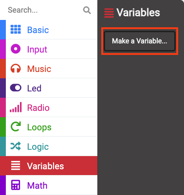

## Sound the alarm

In this step you will add an alarm that triggers when the levels get too high. To stop the alarm adding to the noise you will make sure it only goes off once and can be reset whenever you want. 

Image, gif or video showing what they will achieve by the end of the step. {:width="300px"}

### Set the maximum

You will need to make a Variable to set the sound level that will trigger the alarm.

--- task ---

Open the <code style="background-color: #dc143c">Variables</code> menu and click `Make a Variable`.

--- /task ---

--- task ---

Name your new variable `maximum`. 

--- /task ---

--- task ---

From the <code style="background-color: #dc143c">Variables</code> menu, grab the <code style="background-color: #dc143c">set maximum</code> block. 

Place the block inside the <code style="background-color: #1e90ff">on start</code> block, and change the `0` to `150`.

<iframe style="position:relative;top:0;left:0;width:75%;height:75%;" src="https://makecode.microbit.org/---codeembed#pub:_D7PUcJXFR51p" allowfullscreen="allowfullscreen" frameborder="0" sandbox="allow-scripts allow-same-origin"></iframe>

--- /task ---

`150` is a little over half the maximum sound level the micro:bit can sense, so that should be a good level to start with. 

### Turn the alarm off

You will also want to make sure the alarm noise itself does not add to the already noisy surroundings!

To do this you will use another variable that will be set to `false` when the alarm has not sounded, and then `true` when the alarm sounds. 

--- task ---

Create another new <code style="background-color: #dc143c">Variable</code> this time called `alarm`. 

--- /task ---

--- task ---

Drag another <code style="background-color: #dc143c">set</code> block from the <code style="background-color: #dc143c">Variables</code> menu.

Place it inside the <code style="background-color: #1e90ff">on start</code> block. Underneath the previous one. 

--- /task ---

You need to set this new variable to `false` instead of a number.

--- task ---

Open the <code style="background-color: #00a4a6">Logic</code> menu. Grab a <code style="background-color: #00a4a6">false</code> block. 

Place this block over the top of the `0`. 

<iframe style="position:relative;top:0;left:0;width:75%;height:75%;" src="https://makecode.microbit.org/---codeembed#pub:_43jPJYC2z2fR" allowfullscreen="allowfullscreen" frameborder="0" sandbox="allow-scripts allow-same-origin"></iframe>

--- /task ---

### Check if the alarm should sound

The alarm should only sound **if** the current sound level is **larger** than the maximum **and** the alarm variable is set to false. 

--- task ---

From the <code style="background-color: #00a4a6">Logic</code> menu grab an <code style="background-color: #00a4a6">if</code> block. 

Place the block inside the <code style="background-color: #1e90ff">forever</code> underneath the <code style="background-color: #5c2d91">plot bar graph</code> block.

<iframe style="position:relative;top:0;left:0;width:75%;height:75%;" src="https://makecode.microbit.org/---codeembed#pub:_Fwg1j1V0qX3z" allowfullscreen="allowfullscreen" frameborder="0" sandbox="allow-scripts allow-same-origin"></iframe>

--- /task ---

--- task ---

Open the <code style="background-color: #00a4a6">Logic</code> menu again and take an <code style="background-color: #00a4a6">and</code> block. 

Place it in the `true` section of the <code style="background-color: #00a4a6">if</code> block. 

<iframe style="position:relative;top:0;left:0;width:75%;height:75%;" src="https://makecode.microbit.org/---codeembed#pub:_csx9JCEgUi7R" allowfullscreen="allowfullscreen" frameborder="0" sandbox="allow-scripts allow-same-origin"></iframe>

--- /task ---

Now you need to add the **two** conditions either side of the **and**. 

This will mean that the code inside your <code style="background-color: #00a4a6">if</code> block will only run if **both** conditions are true. 

--- task ---

Again in the <code style="background-color: #00a4a6">Logic</code> menu, grab a <code style="background-color: #00a4a6">0 < 0</code>. 

Place it on one side of the <code style="background-color: #00a4a6">and</code> block. 

--- /task ---