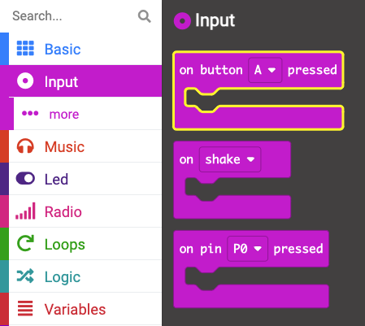
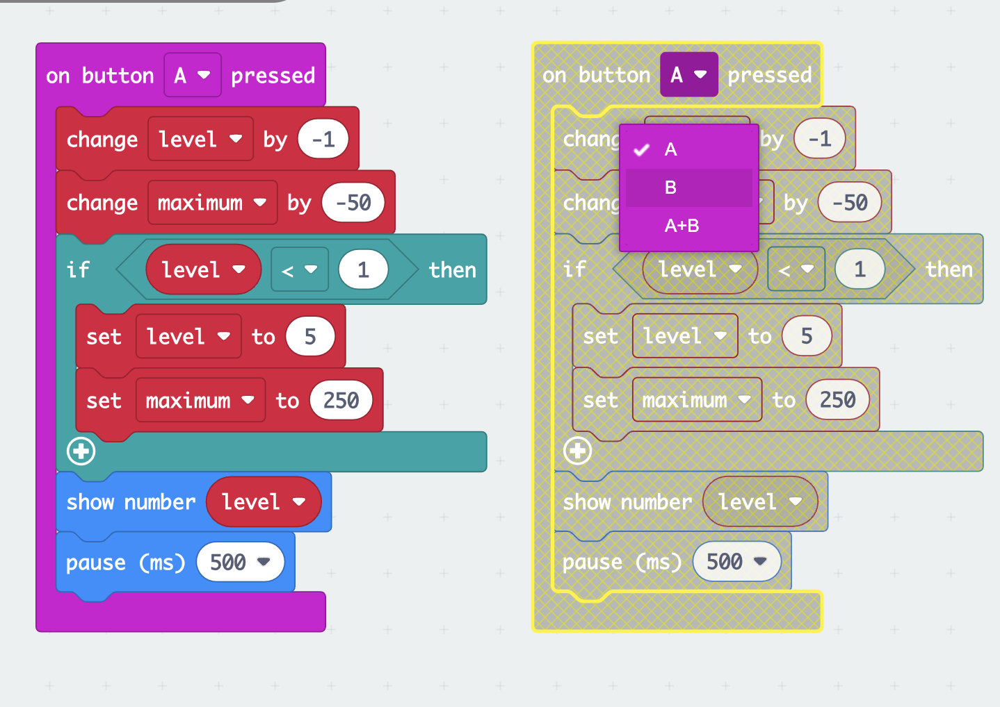

## Change the sensitivity

<div style="display: flex; flex-wrap: wrap">
<div style="flex-basis: 200px; flex-grow: 1; margin-right: 15px;">

In this step, you will program the buttons on the micro:bit to adjust the sensitivity of the alarm with settings from 1 (lowest maximum value) to 5 (highest maximum value). 

</div>
<div>

{:width="300px"}

</div>
</div>

### Decrease the maximum sound level

The **A button** is on the left so you will use this to decrease the maximum value for the alarm. 

--- task ---

From the `Input`{:class='microbitinput'} menu, drag an `on button`{:class='microbitinput'} block and place it in the code editor.



--- /task ---

In the previous step, you created two variables, `maximum`{:class='microbitvariables'} and `alarm`{:class='microbitvariables'}. 

Now you will create another variable for the sensitivity **level**.

--- task ---

From the `Variables`{:class='microbitvariables'} menu, click on **Make a variable** to create a variable called `level`.

--- /task --- 

--- task ---

Drag the `change`{:class='microbitvariables'} block and place it inside the `on button`{:class='microbitinput'} block. 

Change the `1` to `-1`.

```microbit
let level = 0
input.onButtonPressed(Button.A, function () {
    level += -1
})
```

--- /task ---

--- task ---

From the `Variables`{:class='microbitvariables'} menu, drag another `change`{:class='microbitvariables'} block. 

Place it **below** the `change level by -1`{:class='microbitvariables'} block.

Change the variable shown in the block from `level` to `maximum` by clicking on the variable name.

Change the `1` to `-50`.


```microbit
let level = 0
let maximum = 0
input.onButtonPressed(Button.A, function () {
    level += -1
    maximum += -50
})
```

--- /task ---

This means that every time you press button A, it will decrease the sensitivity level by 1 and reduce the sound sensitivity by 50.

If button A is pressed when the level is already 1, then you need to make it so the level changes to `5` and not `0`.

--- task ---

From the `Logic`{:class='microbitlogic'} menu, drag an `if`{:class='microbitlogic'} block. 

Place it below the `change maximum by -50`{:class='microbitvariables'} block.

```microbit
let level = 0
let maximum = 0
input.onButtonPressed(Button.A, function () {
    level += -1
    maximum += -50
    if (true) {
    	
    }
})
```

--- /task ---

--- task ---

From the `Logic`{:class='microbitlogic'} menu, drag the `0 < 0`{:class='microbitlogic'} comparison block.

Place it inside the `true` space in the `if`{:class='microbitlogic'} block. 

```microbit
let level = 0
let maximum = 0
input.onButtonPressed(Button.A, function () {
    level += -1
    maximum += -50
    if (0 < 0) {
    	
    }
})
```

--- /task ---

--- task ---

From the `Variables`{:class='microbitvariables'} menu, drag the `level`{:class='microbitvariables'} block.

Place it inside the first `0` of the `0 < 0`{:class='microbitlogic'} comparison block.

```microbit
let level = 0
let maximum = 0
input.onButtonPressed(Button.A, function () {
    level += -1
    maximum += -50
    if (level < 0) {
    	
    }
})
```

--- /task ---

--- task ---

Change the `0` to `1` on the right-hand side of the `0 < 0`{:class='microbitlogic'} comparison block.

--- /task ---

--- task ---

From the `Variables`{:class='microbitvariables'} menu, drag the `set`{:class='microbitvariables'} block.

Place it inside the `if`{:class='microbitlogic'} block. Ensure the variable selected is `level`{:class='microbitvariables'}.

Change the `0` to `5` on the `set level to 0`{:class='microbitvariables'} block.

```microbit
let level = 0
let maximum = 0
input.onButtonPressed(Button.A, function () {
    level += -1
    maximum += -50
    if (level < 1) {
        level = 5
    }
})
```

--- /task ---

--- task ---

Again from the `Variables`{:class='microbitvariables'} menu, drag another `set`{:class='microbitvariables'} block.

Place it below the `set level to 5`{:class='microbitvariables'} block.

Change the `0` to `250`.

```microbit
let level = 0
let maximum = 0
input.onButtonPressed(Button.A, function () {
    level += -1
    maximum += -50
    if (level < 1) {
        level = 5
        maximum = 250
    }
})
```

--- /task ---

--- task ---

From the `Basic`{:class='microbitbasic'} menu, drag the `show number`{:class='microbitbasic'} block.

Place it **below** the `if`{:class='microbitlogic'} block.

```microbit
let level = 0
let maximum = 0
input.onButtonPressed(Button.A, function () {
    level += -1
    maximum += -50
    if (level < 1) {
        level = 5
        maximum = 250
    }
    basic.showNumber(0)
})
```

--- /task ---

--- task ---

From the `Variables`{:class='microbitvariables'} menu, drag the `level`{:class='microbitvariables'} block.

Place it in the `0` in the `show number`{:class='microbitbasic'} block.

```microbit
let level = 0
let maximum = 0
input.onButtonPressed(Button.A, function () {
    level += -1
    maximum += -50
    if (level < 1) {
        level = 5
        maximum = 250
    }
    basic.showNumber(level)
})
```

--- /task ---

--- task ---

Also from the `Basic`{:class='microbitbasic'} menu, drag the `pause`{:class='microbitbasic'} block.

Place it below the `show number`{:class='microbitbasic'} block. 

Change the `100` to `500`.

```microbit
let level = 0
let maximum = 0
input.onButtonPressed(Button.A, function () {
    level += -1
    maximum += -50
    if (level < 1) {
        level = 5
        maximum = 250
    }
    basic.showNumber(level)
    basic.pause(500)
})
```

--- /task ---

### Increase the maximum sound level

You have now programmed the `on button A pressed`{:class='microbitinput'} block. 

You will need to do the same for `on button B pressed`{:class='microbitinput'} to increase the maximum.

--- task ---

Right-click on the entire `on button A pressed`{:class='microbitinput'} block and click **Duplicate**.


There will now be two `on button A pressed`{:class='microbitinput'} blocks in the code editor panel.

--- /task ---

--- task ---

Click on the `A` in the duplicated `on button A pressed`{:class='microbitinput'} block. A drop-down menu will open.

Change the `A` to `B`.



--- /task ---

--- task ---

Inside the `on button B pressed`{:class='microbitinput'} block:

- Change the `-1` to `1` in the `change level`{:class='microbitvariables'} block 

- Change the `-50` to `50` in the `change maximum`{:class='microbitvariables'} block


--- /task ---

--- task ---

For the `if`{:class='microbitlogic'} block's conditions:

- Change the `<` to a `>`
- Change the `1` to `5`

Inside the `if`{:class='microbitlogic'} block:

- Change the `5` to `1` in the `set level to 5`{:class='microbitvariables'} block
- Change the `250` to `50` in the `set maximum to 50`{:class='microbitvariables'} block

```microbit
let level = 0
let maximum = 0
input.onButtonPressed(Button.B, function () {
    level += 1
    maximum += 50
    if (level > 5) {
        level = 1
        maximum = 50
    }
    basic.showNumber(level)
    basic.pause(500)
})
```

--- /task ---

### Set a normal sound level

You need to program a normal alarm sensitivity level by using the `on start`{:class='microbitbasic'} block.

--- task ---

From the `Variables`{:class='microbitvariables'} menu, drag a `set maximum to 0`{:class='microbitvariables'} block.

Place it inside the `on start`{:class='microbitbasic'} block.

--- /task ---

--- task ---

Click on the variable name `maximum` and change it to `level`.

Change the `0` to `3` in the `set level`{:class='microbitvariables'} block.

```microbit
let maximum = 150
let alarm = false
let level = 3
```

--- /task ---

--- task ---

**Test your program**

+ Press the A and B buttons to see the sound levels increase and decrease 
 
The default starting point is level 3.

**Drag** the mic input levels up and down to test the maximum sound for each level when using the simulator.

--- /task ---

--- task ---

Download your program onto your micro:bit!

--- /task ---

[[[download-to-microbit]]]

Well done! You now have a fully working sound or light meter! 

Next, it is time to check what you have learnt!
