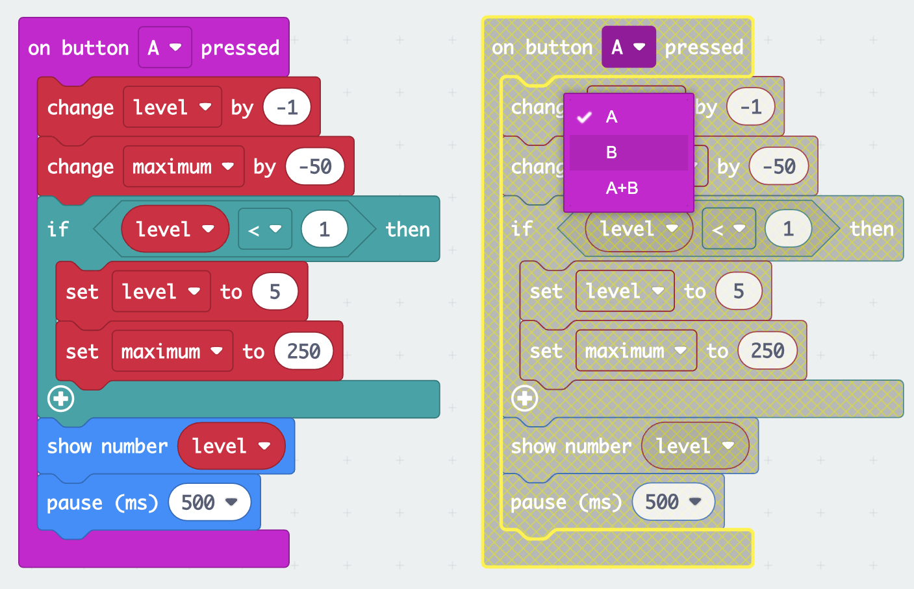

## Change the sensitivity

In this step you will program the buttons on the micro:bit to adjust the sensitivity of the alarm with settings from 1 - lowest maximum value to 5 - highest maximum value. 

{:width="300px"}

### Decrease the sound level

The **A button** is on the left so you will use this to decrease the maximum value for the alarm. 

--- task ---

From the <code style="background-color: #D400D4">Input</code> menu, drag out an  block and place it in the code editor.

--- /task ---

In the previous step you created two variables, `maximum` and `alarm`. Now you need to create another variable for the current sensitivity **level**.

--- task ---

From the <code style="background-color: #DC143C">Variables</code> menu, click on `Make a variable` to create a variable called `level`.

--- /task --- 

--- task ---

Drag the <code style="background-color: #dc143c">change</code> block and place it inside the <code style="background-color: #d400d4">on button pressed</code> block. 

Change the `1` to `-1`.

<iframe style="position:relative;top:0;left:0;width:100%;height:100%;" src="https://makecode.microbit.org/---codeembed#pub:_0m6H8aMea4AW" allowfullscreen="allowfullscreen" frameborder="0" sandbox="allow-scripts allow-same-origin"></iframe>

--- /task ---

--- task ---

From the <code style="background-color: #DC143C">Variables</code> menu, also drag the <code style="background-color: #dc143c">change</code> block. 

Place it below the <code style="background-color: #dc143c">change level by -1</code> block.

Change the variable shown on the block from `level` to `maximum` by clicking on the variable name.

Change the `1` to `-50`

<iframe style="position:relative;top:0;left:0;width:100%;height:100%;" src="https://makecode.microbit.org/---codeembed#pub:_fz1FgF5aEi7k" allowfullscreen="allowfullscreen" frameborder="0" sandbox="allow-scripts allow-same-origin"></iframe>

--- /task ---

This means every time you press button A, it will decrease the sensitivity level by 1 and reduce the sound sensitivity by 50.

If the A button is pressed when the level is already 1 then you need to make it so the level changes to `5` and not `0`

--- task ---

From the <code style="background-color: #00A4A6">Logic</code> menu, drag out an <code style="background-color: #00a4a6">if</code> block. 

Place it below the <code style="background-color: #dc143c">change maximum by -50</code> block.

<iframe style="position:relative;top:0;left:0;width:100%;height:100%;" src="https://makecode.microbit.org/---codeembed#pub:_5kbWwj8aHeTj" allowfullscreen="allowfullscreen" frameborder="0" sandbox="allow-scripts allow-same-origin"></iframe>

--- /task ---

--- task ---

From the <code style="background-color: #00A4A6">Logic</code> menu, drag out the <code style="background-color: #00a4a6">0 < 0</code> comparison block.

Place it inside the `true` space in the <code style="background-color: #00a4a6">if</code> block. 

<iframe style="position:relative;top:0;left:0;width:100%;height:100%;" src="https://makecode.microbit.org/---codeembed#pub:_JrAM55EWFeEj" allowfullscreen="allowfullscreen" frameborder="0" sandbox="allow-scripts allow-same-origin"></iframe>

--- /task ---

--- task ---

From the <code style="background-color: #DC143C">Variables</code> menu, drag out the <code style="background-color: #dc143c">level</code> block.

Place it inside the first `0` of the <code style="background-color: #00a4a6">0 < 0</code> comparison block.

<iframe style="position:relative;top:0;left:0;width:100%;height:100%;" src="https://makecode.microbit.org/---codeembed#pub:_2iFC25Dt3KRt" allowfullscreen="allowfullscreen" frameborder="0" sandbox="allow-scripts allow-same-origin"></iframe>

--- /task ---

--- task ---

Change the `0` to `1` on the right hand side of the <code style="background-color: #00a4a6">0 < 0</code> comparison block.

--- /task ---

--- task ---

From the <code style="background-color: #DC143C">Variables</code> menu, drag out the <code style="background-color: #dc143c">set</code> block.

Place it inside the <code style="background-color: #00a4a6">if</code> block. Ensure the variable selected is `level`.

Change the `0` to `5` on the `set level to 0` block.

<iframe style="position:relative;top:0;left:0;width:100%;height:100%;" src="https://makecode.microbit.org/---codeembed#pub:_L8uHrDTJ14mH" allowfullscreen="allowfullscreen" frameborder="0" sandbox="allow-scripts allow-same-origin"></iframe>

--- /task ---

--- task ---

Also from the <code style="background-color: #DC143C">Variables</code> menu, drag out another <code style="background-color: #dc143c">set</code> block.

Place it below the <code style="background-color: #dc143c">set level to 5</code> block.

Change the `0` to `250`.

<iframe style="position:relative;top:0;left:0;width:100%;height:100%;" src="https://makecode.microbit.org/---codeembed#pub:_Pm3REheUD1uo" allowfullscreen="allowfullscreen" frameborder="0" sandbox="allow-scripts allow-same-origin"></iframe>

--- /task ---

--- task ---

From the <code style="background-color: #1E90FF">Basic</code> menu, drag out the <code style="background-color: #1e90ff">show number</code> block.

Place it **below** the <code style="background-color: #00a4a6">if</code> block.

<iframe style="position:relative;top:0;left:0;width:100%;height:100%;" src="https://makecode.microbit.org/---codeembed#pub:_ACcH4j7hj5p1" allowfullscreen="allowfullscreen" frameborder="0" sandbox="allow-scripts allow-same-origin"></iframe>

--- /task ---

--- task ---

From the <code style="background-color: #DC143C">Variables</code> menu drag out the <code style="background-color: #dc143c">level</code> block.

Place it in the `0` in the <code style="background-color: #1e90ff">show number</code> block.

<iframe style="position:relative;top:0;left:0;width:100%;height:100%;" src="https://makecode.microbit.org/---codeembed#pub:_KDyMygJveb02" allowfullscreen="allowfullscreen" frameborder="0" sandbox="allow-scripts allow-same-origin"></iframe>

--- /task ---

--- task ---

Also from the <code style="background-color: #1E90FF">Basic</code> menu, drag out the <code style="background-color: #1e90ff">pause</code> block.

Place it below the <code style="background-color: #1e90ff">show number</code> block. 

Change the `100` to `500`.

<iframe style="position:relative;top:0;left:0;width:100%;height:100%;" src="https://makecode.microbit.org/---codeembed#pub:_TE52mwevkU37" allowfullscreen="allowfullscreen" frameborder="0" sandbox="allow-scripts allow-same-origin"></iframe>

--- /task ---

### Decrease the sound level

Now you have programmed the <code style="background-color: #d400d4">on button A pressed</code> block, you will need to do the same for <code style="background-color: #d400d4">on button B pressed</code>.

--- task ---

Right-click on the entire <code style="background-color: #d400d4">on button A pressed</code> block and click `Duplicate`.

There will now be two <code style="background-color: #d400d4">on button A pressed</code> blocks on the code editor panel.

--- /task ---

--- task ---

Click on the `A` on the duplicated <code style="background-color: #d400d4">on button A pressed</code> block, a drop down menu will open.

Change the `A` to `B`.

--- /task ---

--- task ---

Inside the <code style="background-color: #d400d4">on button B pressed</code> block:

- Change the `-1` to `1` on the <code style="background-color: #dc143c">change level</code> block 

- Change the `-50` to `50` on the <code style="background-color: #dc143c">change maximum</code> block

--- /task ---

--- task ---

For the <code style="background-color: #00a4a6">if</code> block's condition:

- Change the `<` to a `>`
- Change the `1` to `5`

Inside the <code style="background-color: #00a4a6">if</code> block:

- Change the `5` to `1` on the <code style="background-color: #dc143c">set level to 5</code> block
- Change the `250` to `50` on the <code style="background-color: #dc143c">set maximum to 50</code> block

<iframe style="position:relative;top:0;left:0;width:100%;height:100%;" src="https://makecode.microbit.org/---codeembed#pub:_61hUcH2P8Frx" allowfullscreen="allowfullscreen" frameborder="0" sandbox="allow-scripts allow-same-origin"></iframe>

--- /task ---

### Set a normal sound level

Using the <code style="background-color: #1e90ff">on start</code> block, you will need to program a normal alarm sensitivity level.

--- task ---

From the <code style="background-color: #DC143C">Variables</code> menu, drag out a <code style="background-color: #dc143c">set maximum to 0</code> block.

Place it inside the <code style="background-color: #1e90ff">on start</code> block

--- /task ---

--- task ---

Click on the variable name `maximum` and change it to `level`

Change the `0` to `3` on the <code style="background-color: #dc143c">set level</code> block.

<iframe style="position:relative;top:0;left:0;width:100%;height:100%;" src="https://makecode.microbit.org/---codeembed#pub:_7Hoiqo1sqUyY" allowfullscreen="allowfullscreen" frameborder="0" sandbox="allow-scripts allow-same-origin"></iframe>

--- /task ---

--- task ---

**Test** your program:

+ Press the A and B buttons to see the sound levels increase and decrease. 
 
The default starting point is level 3.

**Drag** the mic input levels up and down to test the maximum sound for each level when using the simulator.

--- /task ---

--- task ---

[[[download-to-microbit]]]

--- /task ---
