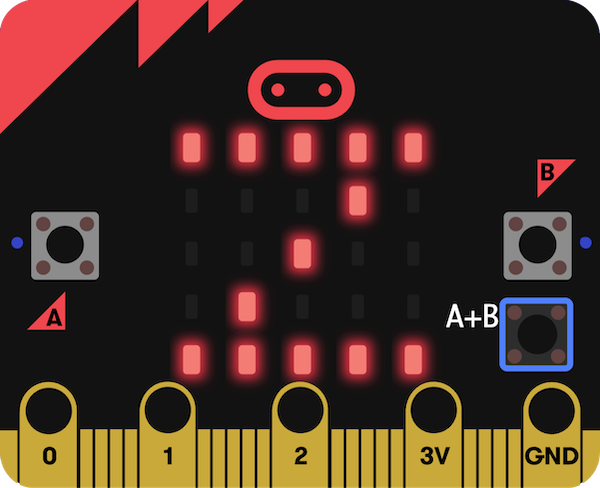

## What next?

If you are following the [Introduction to micro:bit](https://projects.raspberrypi.org/en/raspberrypi/path-name) path, you can move on to the [Sleep tracker](https://projects.raspberrypi.org/en/projects/sleep-tracker) project. 

In this project, you will make a sleep tracker that uses the micro:bit's accelerometer to track how many times you move in the night. Getting good sleep is really important to help you feel your best!

--- print-only ---
 

--- /print-only ---

--- no-print ---

<iframe style="position:absolute;top:0;left:0;width:100%;height:100%;" src="https://makecode.microbit.org/---run?id=_14Lib71CCP0F" allowfullscreen="allowfullscreen" sandbox="allow-popups allow-forms allow-scripts allow-same-origin" frameborder="0"></iframe>

--- /no-print ---

If you want to have more fun exploring micro:bit, then you could try out any of [these projects](https://projects.raspberrypi.org/en/projects?hardware%5B%5D=microbit).
