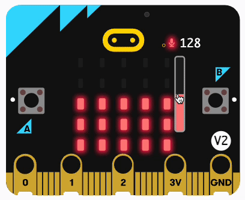
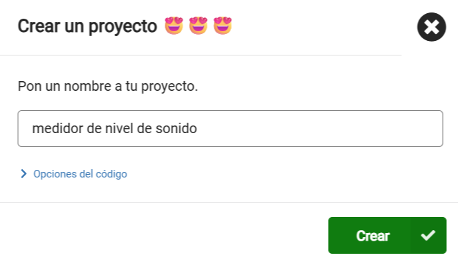
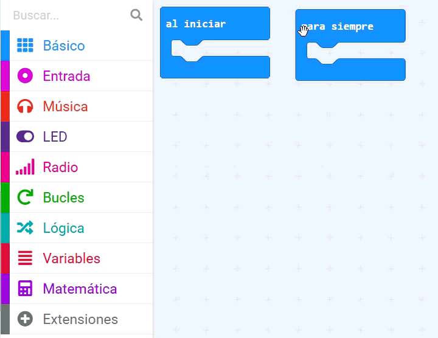
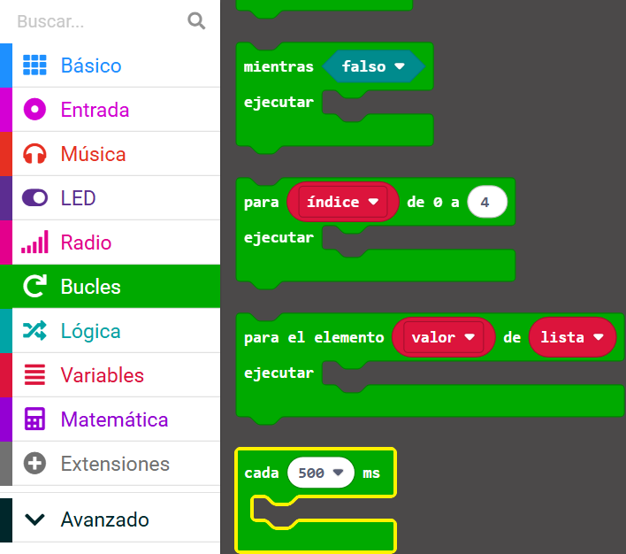
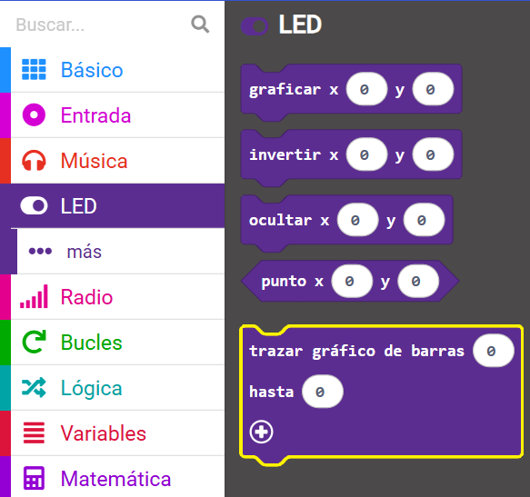
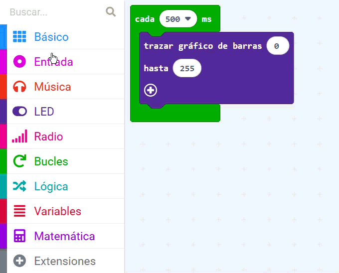
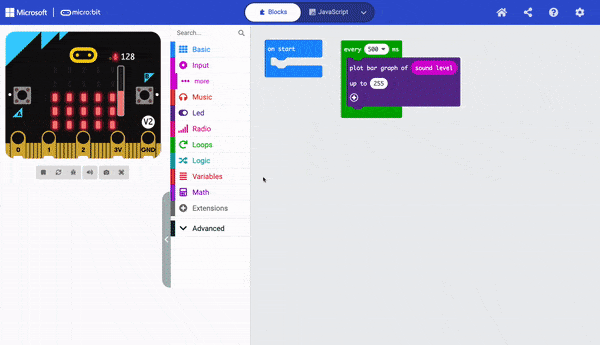
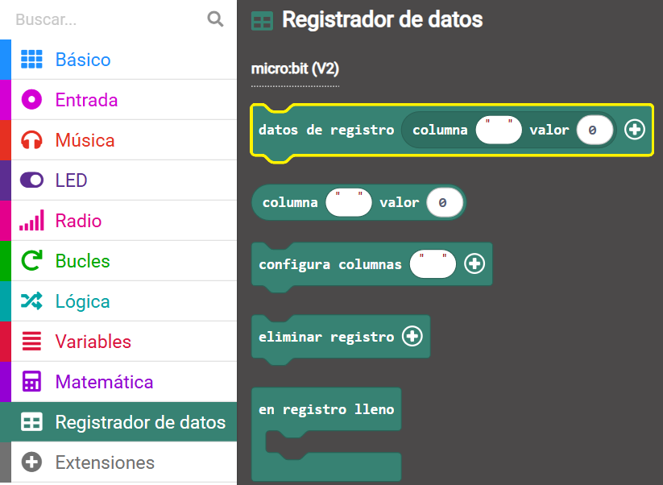
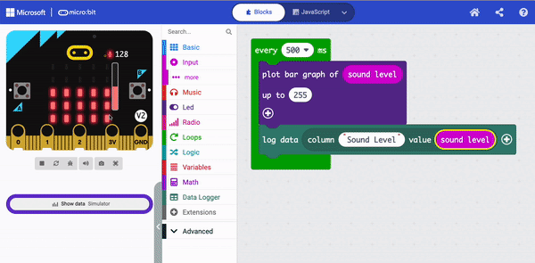

## Registra el nivel de sonido

<div style="display: flex; flex-wrap: wrap">
<div style="flex-basis: 200px; flex-grow: 1; margin-right: 15px;">
Crearas un proyecto en MakeCode y añadiras codigo para medir los niveles de sonido (o luz). Mostrarás el nivel actual en los LED para el usuario. 
</div>
<div>
{:width="300px"}
</div>
</div>

### Abre MakeCode

Para empezar a crear tu proyecto en micro:bit, necesitas abrir el editor MakeCode.

--- task ---

Abre el editor MakeCode en [makecode.microbit.org](https://makecode.microbit.org){:target="_blank"}

--- collapse ---

---
title: Version sin conexion del editor
---

Tambien hay una [version descargable del editor MakeCode](https://makecode.microbit.org/offline-app){:target="_blank"}.

--- /collapse ---

--- /task ---

### ¿Primer proyecto de micro:bit?

[[[makecode-tour]]]

### Crea tu proyecto

Una vez que el editor esta abierto, necesitaras crear un nuevo proyecto y asignarle un nombre.

--- task ---

Haz click en el boton **Nuevo Proyecto**.


--- /task ---

--- task ---

Asignale a tu nuevo proyecto el nombre de `medidor de nivel de sonido` y haz click en**Crear**.



**Consejo:** Para que despues puedas encontrar tu proyecto de una manera sencilla, asiganle un nombre que tenga relacion con la activdad que estas creando.

--- /task ---

### Dibuje un gráfico del nivel de sonido

En este proyecto, haras uso del bloque `al iniciar`{:class="microbitbasic"}, pero no el bloque `por siempre`{:class="microbitbasic"}.

--- task ---

Puedes eliminar el bloque `por siempre`{:class="microbitbasic"} al arrastrarlo al panel del menu.



--- /task ---

El primer paso es hacer que el micro:bit capture niveles de sonido en un intervlo normal. Hay un bucle en especifico que puedes usar para esto.

--- task ---

Desde el menu `Bucles`{:class="microbitloops"}, arrastra el bloque `cada 500 ms`{:class="microbitloops"} y colocalo debajo del panel del editor de codigo.



Cualquier codigo dentro del bucle se ejecutara cada **500 millisegundos**.

1000 milisegundos es 1 segundo, asi que este loop se ejecutara cada **medio segundo**.

--- /task ---

--- task ---

Desde el menu `Led`{:class="microbitled"}, arrastra el bloque `trazar un grafica de barras`{:class="microbitled"}.



Colocalo dentro del bloque `cada 500 ms`{:class="microbitloops"}.

```microbit
loops.everyInterval(500, function () {
    led.plotBarGraph(
    0,
    0
    )
})
```

--- /task ---

--- task ---

Desde el menu `Entrada`{:class="microbitinput"}, arrastra el bloque `nivel de sonido`{:class="microbitinput"}.

Colocalo dentro del primer `0` en el bloque`trazar un grafica de barras`{:class="microbitled"}.

Cambia el segundo `0` a `255`.

```microbit
loops.everyInterval(500, function () {
    led.plotBarGraph(
    input.soundLevel(),
    255
    )
})
```

--- collapse ---

---
title: Para el micro:bit V1
---

El micro:bit V1 no tiene microfono, asi que puedes usar el bloque `nivel de luz`{:class="microbitinput"} para medir el nivel de luz en tu entorno.



--- /collapse ---

--- /task ---

### Registra los niveles de sonido (Solo para V2)

El micro:bit V2 tiene un registrador de datos incorporado, lo que te permite rastrear datos de varios sensores y entradas. Necesitaras instalar una extension para usar esto.

--- task ---

En el panel del menu, haz click en **Extensiones**. Se abrira otra ventana mostrando extensiones recomendadas. Haz click en el **data logger** y se instalara como un elemento del menu.



--- /task ---

--- task ---

Desde el menu `Data Logger`{:class="microbitdatalogger"}, arrastra un bloque `registrar datos`{:class="microbitdatalogger"}.



Colocalo debajo del bloque `trazar un grafica de barras`{:class='microbitled'}.

```microbit
loops.everyInterval(500, function () {
    led.plotBarGraph(
    input.soundLevel(),
    255
    )
    datalogger.log(datalogger.createCV("", 0))
})
```

--- /task ---

--- task ---

Escribe `Nivel de sonido` en el campo de la columna.

```microbit
loops.everyInterval(500, function () {
    led.plotBarGraph(
    input.soundLevel(),
    255
    )
    datalogger.log(datalogger.createCV("Sound level", 0))
})
```

--- /task ---

--- task ---

Desde el menu `Entrada`{:class="microbitinput"}, arrastra otro bloque `nivel de sonido`{:class="microbitinput"} y colocalo dentro del `0` en el bloque `registrar datos`{:class="microbitdatalogger"}.

```microbit
loops.everyInterval(500, function () {
    led.plotBarGraph(
    input.soundLevel(),
    255
    )
    datalogger.log(datalogger.createCV("Sound level", input.soundLevel()))
})
```

--- /task ---

### Prueba tu programa

Cuando haces un cambio a un bloque de codigo en el panel del editor de codigo, el simulador se reiniciara.

**Prueba tu programa**

+ Arrastra hacia arriba y hacia abajo la barra roja de nivel de sonido para cambiar los niveles de sonido.

**Solo V2**

+ Haz click en el enlace '**Mostrar datos** del simulador' debajo del simulador del micro:bit para ver los niveles de sonido que se están registrando.



¡Gran trabajo! ¡Haz creado tu primer programa de visualizacion de datos en un micro:bit!
