## Suena la alarma

<div style="display: flex; flex-wrap: wrap">
<div style="flex-basis: 200px; flex-grow: 1; margin-right: 15px;">
En este paso, implementaras una alarma que se activara cuando el nivel de sonido sea muy alto. Para evitar que la alarma aumente el ruido, debes asegurarte de que la alarma solo suene una vez y que pueda ser reiniciada cuando quieras. 
</div>
<div>

{:width="300px"}

</div>
</div>

### Establecer el maximo

Necesitaras crear una variable para mantener el nivel de sonido que activara la alarma.

--- task ---

Abre el menu de `Variables`{:class="microbitvariables"} y haz click en **Crear una Variable**.

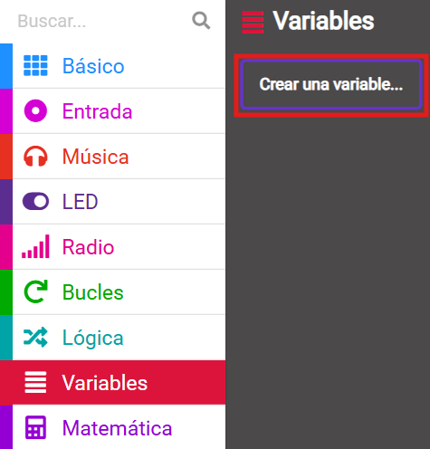

--- /task ---

--- task ---

Nombra tu nueva variable como `maximo`.

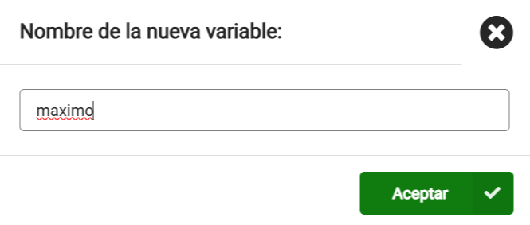

--- /task ---

--- task ---

Desde el menu `Variables`{:class="microbitvariables"}, obten el bloque `Establecer maximo`{:class="microbitvariables"}.

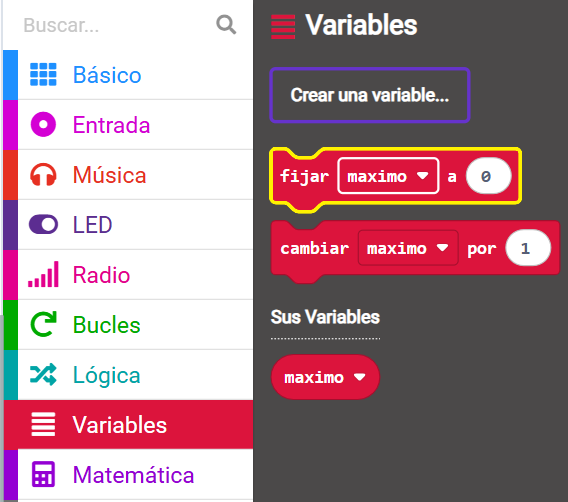

Coloca el bloque dentro del bloque `al iniciar`{:class="microbitbasic"}, y cambia el `0` a `150`.

```microbit
let maximo = 150
```

--- /task ---

El valor `150` es un poco mas de la mitad del nivel maximo de sonido que el micro:bit puede percibir, asi que ese deberia de ser un buen nivel para empezar.

--- collapse ---

---
title: Para el micro:bit V1
---

¡El valor maximo tambien funciona para los niveles de salud!

--- /collapse ---

### Apaga la alarma

¡Tambien quieres asegurarte de que el ruido de la alarma no se sume al ruido del entorno!

Para hacer esto, usaras otra variable que estableceras como `falsa`, y cambiara a `verdadero` cuando suene la alarma.

--- task ---

Crea una nueva `Variable`{:class="microbitvariables"}, esta vez llamala `alarma`.

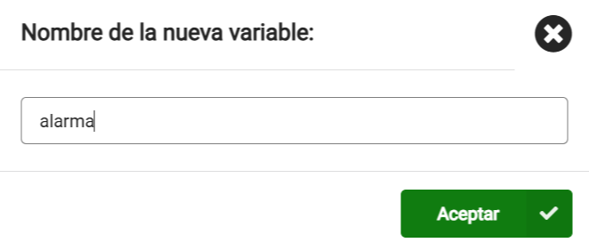

--- /task ---

--- task ---

Arrastra el bloque `establecer alarma`{:class="microbitvariables"} desde el menu `Variables`{:class="microbitvariables"}.

Colocalo dentro del bloque `al iniciar`{:class="microbitbasic"}.

--- /task ---

Necesitas establecer esta nueva variable a `Falso` en vez de un numero.

--- task ---

Abre el menu `Logica`{:class="microbitlogic"}.

Obten un bloque `Falso`{:class="microbitlogic"}.

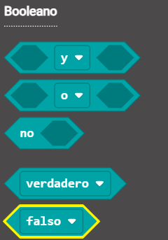

Coloca este bloque encima del `0`.

```microbit
let maximo = 150
let alarma = false
```

--- /task ---

### Verifica si la alarma suena

La alarma solo debe de sonar **si:**

+ El nivel de sonido es **mas grande** que el maximo   
  **Y**
+ La variable de alarma **no es verdadero**

--- task ---

Desde el menu `Logica`{:class="microbitlogic"}, obten un bloque `si...entonces`{:class="microbitlogic"}.

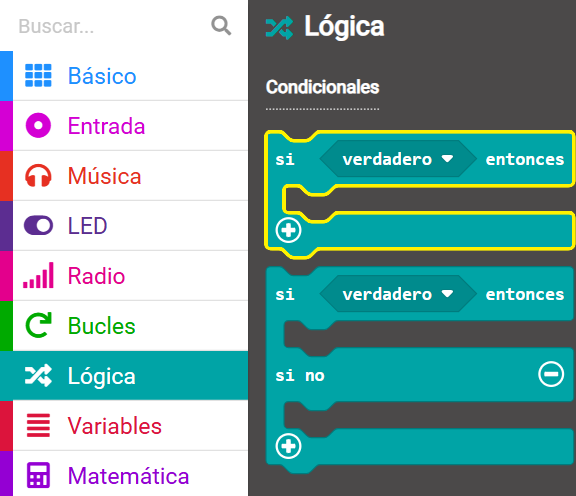

Coloca el bloque dentro del bucle `cada`{:class="microbitloops"} debajo del bloque `registrar datos`{:class="microbitdatalogger"}.

```microbit
loops.everyInterval(500, function () {
    led.plotBarGraph(
    input.soundLevel(),
    255
    )
    datalogger.log(datalogger.createCV("Nivel de sonido", input.soundLevel()))
    if (true) {

    }
})
```

--- /task ---

--- task ---

Abre nuevamente el menu `Logica`{:class="microbitlogic"} y toma un bloque`y`{:class="microbitlogic"}.

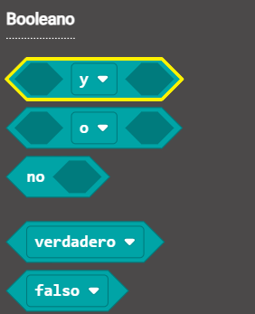

Colocalo en la seccion `verdadero` del bloque `si...entonces`{:class="microbitlogic"}.

```microbit
loops.everyInterval(500, function () {
    led.plotBarGraph(
    input.soundLevel(),
    255
    )
    datalogger.log(datalogger.createCV("Nivel de sonido", input.soundLevel()))
    if (false && false) {

    }
})
```

--- /task ---

Ahora necesitas agregar **dos** condiciones en cada lado del **y**.

--- task ---

De nuevo en el menu de `Logica`{:class="microbitlogic"}, obten un bloque condicional `0 < 0`{:class="microbitlogic"}.

Colocalo a un lado del bloque `y`{:class="microbitlogic"}.

Utiliza el menu desplegable para cambiar el simbolo menor que por un simbolo (`<`) mayor que (`>`).

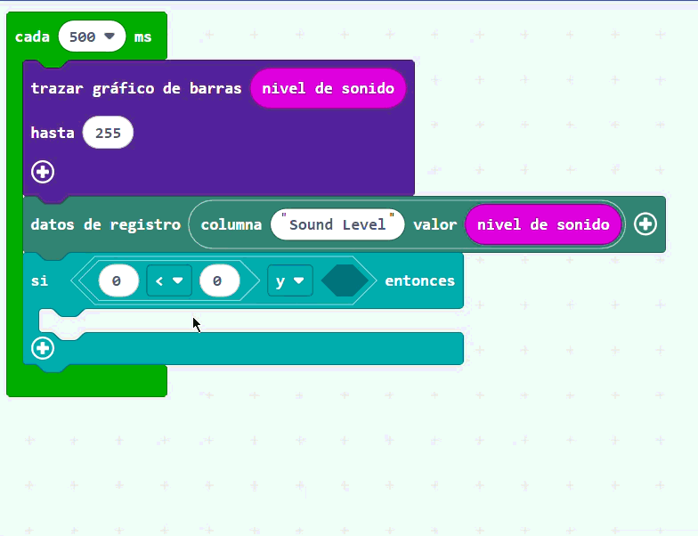

--- /task ---

--- task ---

Desde el menu `Entrada`{:class="microbitinput"}, arrastra un bloque `nivel de sonido`{:class="microbitinput"}.

Colocalo en el primer `0` del bloque `0 > 0`{:class="microbitlogic"}

Desde el menu `Variables`{:class="microbitvariables"}, arrastra el bloque `maximo`{:class="microbitvariables"}.

Colocalo en el segundo `0` del bloque `0 > 0`{:class="microbitlogic"}.

Tu codigo deberia de verse asi:

```microbit
loops.everyInterval(500, function () {
    let maximo = 0
    led.plotBarGraph(
    input.soundLevel(),
    255
    )
    datalogger.log(datalogger.createCV("Nivel de sonido", input.soundLevel()))
    if (input.soundLevel() > maximo && false) {

    }
})
```

--- collapse ---

---
title: Para micro:bit V1
---

Desde el menu `Entrada`{:class="microbitinput"}, arrastra el bloque `nivel de luz`{:class="microbitinput"}.

Colocalo en el primer `0` del bloque `0 > 0`{:class="microbitlogic"}.

Desde el menu `Variables`{:class="microbitvariables"}, arrastra el bloque `maximo`{:class="microbitvariables"}.

Colocalo en el segundo `0` del bloque`0 > 0`{:class="microbitlogic"}.

Tu codigo deberia de verse asi:

```microbit
loops.everyInterval(500, function () {
    let maximo = 0
    led.plotBarGraph(
    input.lightLevel(),
    255
    )
    if (input.lightLevel() > maximo && false) {

    }
})
```

--- /collapse ---

--- /task ---

Solo necesitas apagar la alarma si la variable `alarma`{:class="microbitvariables"} **no** esta configuradado como `verdadero`{:class="microbitlogic"}.

--- task ---

Obten un bloque `no`{:class='microbitlogic'} desde el menu `Logica`{:class='microbitlogic'}.

Colocalo en el otro lado del bloque `y`{:class='microbitlogic'}.

```microbit
loops.everyInterval(500, function () {
    let maximo = 0
    led.plotBarGraph(
    input.soundLevel(),
    255
    )
    datalogger.log(datalogger.createCV("Nivel de sonido", input.soundLevel()))
    if (input.soundLevel() > maximo && !(false)) {

    }
})
```

--- /task ---

--- task ---

Coloca el bloque de la variable `alarma`{:class='microbitvariables'} en el bloque `no`{:class='microbitlogic'} as:

```microbit
loops.everyInterval(500, function () {
    let alarma = 0
    let maximo = 0
    led.plotBarGraph(
    input.soundLevel(),
    255
    )
    datalogger.log(datalogger.createCV("Nivel de sonido", input.soundLevel()))
    if (input.soundLevel() > maximo && !(alarma)) {

    }
})
```

--- /task ---

### Suena la alarma

¡Ahora es momento de agregarle sonido a tu alarma!

--- task ---

Desde el menu `Musica`{:class='microbitmusic'}, toma el bloque `reproducir`{:class='microbitmusic'}.

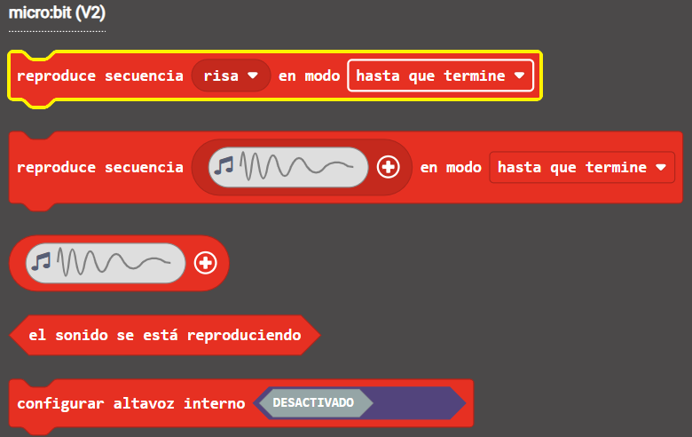

Colocalo dentro del bloque `si`{:class='microbitlogic'} que verifica si la alarma debe de sonar.

```microbit
loops.everyInterval(500, function () {
    let alarma = 0
    let maximo = 0
    led.plotBarGraph(
    input.soundLevel(),
    255
    )
    datalogger.log(datalogger.createCV("Nivel de sonido", input.soundLevel()))
    if (input.soundLevel() > maximo && !(alarma)) {
        music.play(music.builtinPlayableSoundEffect(soundExpression.giggle), music.PlaybackMode.UntilDone)
    }
})
```

--- collapse ---

---
title: Para micro:bit V1
---

El micro:bit V1 ni tiene vocinas, asi que tienes que adaptar el programa para la alarma.

En lugar de que la alarma utilice sonido, puedes mostrar un icono en los LED cuando el nivel de luz sea superior al máximo.

Desde el menu `Basico`{:class='microbitbasic'}, obten un bloque `mostrar logotipo`{:class='microbitbasic'}.

Colocalo dentro del bloque `si`{:class='microbitlogic'} que verifica si la alrma debe de sonar.

**Selecciona** un logotipo que utilizaras para tu alarma.

```microbit
loops.everyInterval(500, function () {
    let alarma = 0
    let maximo = 0
    led.plotBarGraph(
    input.lightLevel(),
    255
    )
    datalogger.log(datalogger.createCV("Nivel de luz", input.lightLevel()))
    if (input.lightLevel() > maximo && !(alarma)) {
        basic.showIcon(IconNames.Sad)
    }
})
```

--- /collapse ---

--- /task ---

--- task ---

**Escoge** que ruido deberias utilizar para la alarma, de los sonidos disponibles en el menu desplegable.

--- /task ---

--- task ---

Dentro del bloque `al iniciar`{:class='microbitbasic'}, **haz click derecho** en el bloque `establecer`{:class='microbitvariables'} y selecciona **Duplicar**.

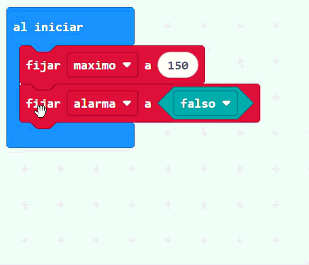

Coloca el bloque duplicado debajo del bloque `reproducir`{:class='microbitmusic'}.

Cambia el `falso`{:class='microbitlogic'} a `verdadero`{:class='microbitlogic'}.

```microbit
let alarma = false
loops.everyInterval(500, function () {
    let maximo = 0
    led.plotBarGraph(
    input.soundLevel(),
    255
    )
    datalogger.log(datalogger.createCV("Nivel de sonido", input.soundLevel()))
    if (input.soundLevel() > maximo && !(alarma)) {
        music.play(music.builtinPlayableSoundEffect(soundExpression.mysterious), music.PlaybackMode.UntilDone)
        alarma = true
    }
})
```

--- /task ---

### Reinicia la alarma

Cuando la alarma se apague, querras reiniciarla.

Puedes utilizar el logotipo tactil del micro:bit para hacer esto.

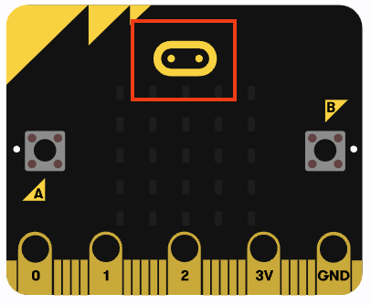

--- task ---

Desde el menu `Entrada`{:class='microbitinput'}, arrastra el bloque `al pulsar el logotipo`{:class='microbitinput'}.

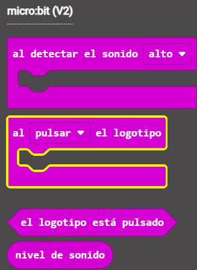

Desde el bloque `al iniciar`{:class='microbitbasic'}, duplica el bloque `establecer alarma`{:class='microbitvariables'}y colocalo dentro del bloque `al pulsar el logotipo`{:class='microbitinput'}.

```microbit
let alarma = false
input.onLogoEvent(TouchButtonEvent.Pressed, function () {
    alarma = false
})
```

--- collapse ---

---
title: Para micro:bit V1
---

No hay un logotipo tactil en el micro:bit V1, asi que puedes utilizar los botones `A` y `B`.

Desde el menu `Entrada`{:class='microbitinput'}, arrastra el bloque `al presionar el boton`{:class='microbitinput'}.


Utiliza el menu desplegable para cambiar el boton`A+B`{:class='microbitinput'}.

Desde el bloque `al iniciar`{:class='microbitbasic'}, duplica el bloque `establecer alarma`{:class='microbitvariables'} y colocalo dentro del bloque `al presionar el boton`{:class='microbitinput'}.

```microbit
let alarma = false
input.onButtonPressed(Button.AB, function () {
    alarma = false
})
```

--- /collapse ---

--- /task ---

¡A continuacion utilizaras el boton `A` y `B` para cambiar la sensibilidad de la alarma!
