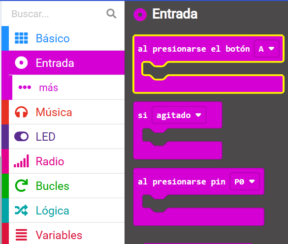
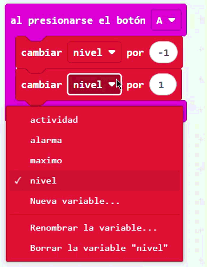
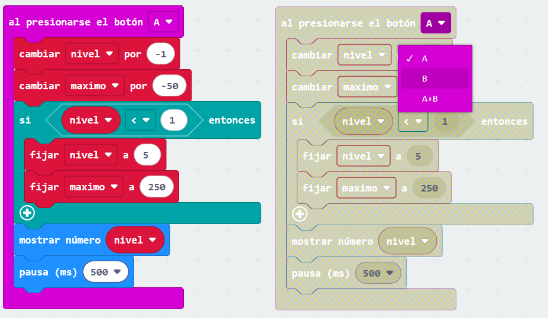
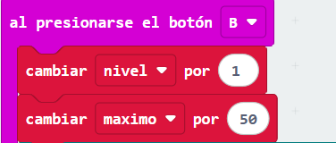

## Cambia la sensibilidad

<div style="display: flex; flex-wrap: wrap">
<div style="flex-basis: 200px; flex-grow: 1; margin-right: 15px;">

En este paso, programaras los botones del micro:bit para ajustar la sensibilidad de la alarma, con configuraciones desde 1 (volumen minimo) a 5 (volumen maximo). 

</div>
<div>

{:width="300px"}

</div>
</div>

### Disminuir el nivel máximo de sonido

El **Bboton A** se encuentra a la izquierda asi que lo usaras para disminuir el valor maximo de la alarma.

--- task ---

Desde el menu `Entrada`{:class='microbitinput'}, arrastrea un bloque `al presionar el boton`{:class='microbitinput'} y colocalo en el editor de codigo.



--- /task ---

En el paso anterior, creaste dos variables, `maximo`{:class='microbitvariables'} y `alarma`{:class='microbitvariables'}.

Ahora crearas otra variable para el **nivel** de sensibilidad.

--- task ---

Desde el menu `Variables`{:class='microbitvariables'}, haz click en**Crear variable** para crear una varibale llamada `nivel`.

--- /task --- 

--- task ---

Arrastra el bloque `cambiar`{:class='microbitvariables'} y colocalo dentro del bloque `al presionar el boton`{:class='microbitinput'}.

Cambia el `1` a `-1`.

```microbit
let nivel = 0
input.onButtonPressed(Button.A, function () {
    nivel += -1
})
```

--- /task ---

--- task ---

Desde el menu `Variables`{:class='microbitvariables'}, arrasttra otro bloque `cambiar`{:class='microbitvariables'}.

Colocalo **debajo** del bloque `cambiar nivel en -1`{:class='microbitvariables'}.

Cambia la variable `nivel` mostrada en el bloque a `maximo` haciendo click en el nombre de la variable.

Cambia el `1` a `-50`.



```microbit
let nivel = 0
let maximo = 0
input.onButtonPressed(Button.A, function () {
    nivel += -1
    maximo += -50
})
```

--- /task ---

Esto significa que cada vez que presiones el boton A, disminuira el nivel de sensibilidad en 1 y la sensiblidad de sonida en 50.

Si se presiona el boton A cuando el nivel ya es 1, entonces necesitaras hacer que el nivel cambie a `5` y no a `0`.

--- task ---

Desde el menu `Logica`{:class='microbitlogic'}, arrastra un bloque `si`{:class='microbitlogic'}.

Colocalo debjo del bloque `cambiar maximo en -50`{:class='microbitvariables'} block.

```microbit
let nivel = 0
let maximo = 0
input.onButtonPressed(Button.A, function () {
    nivel += -1
    maximo += -50
    if (true) {

    }
})
```

--- /task ---

--- task ---

Desde el menu `Logica`{:class='microbitlogic'}, arrasttra el bloque de comparacion `0 < 0`{:class='microbitlogic'}.

Colocalo dentro del espacio de `Verdadero` en el bloque `si`{:class='microbitlogic'}.

```microbit
let nivel = 0
let maximo = 0
input.onButtonPressed(Button.A, function () {
    nivel += -1
    maximo += -50
    if (0 < 0) {

    }
})
```

--- /task ---

--- task ---

Desde el menu `Variables`{:class='microbitvariables'}, arrastra el bloque `nivel`{:class='microbitvariables'}.

Colocalo encima del primer `0` del bloque de comparacion `0 < 0`{:class='microbitlogic'}.

```microbit
let nivel = 0
let maximo = 0
input.onButtonPressed(Button.A, function () {
    nivel += -1
    maximo += -50
    if (nivel < 0) {

    }
})
```

--- /task ---

--- task ---

Cambia el `0` a `1` en la parte derecha del bloque de comparacion `0 < 0`{:class='microbitlogic'}.

--- /task ---

--- task ---

Desde el menu `Variables`{:class='microbitvariables'}, arrastra el bloque `establecer`{:class='microbitvariables'}.

Colocalo dentro del bloque `si`{:class='microbitlogic'}. Asegurate que la variable seleecionada sea `nivel`{:class='microbitvariables'}.

Cambia el `0` a `5` en el bloque `establecer nivel a 0`{:class='microbitvariables'}.

```microbit
let nivel = 0
let maximo = 0
input.onButtonPressed(Button.A, function () {
    nivel += -1
    maximo += -50
    if (nivel < 1) {
        nivel = 5
    }
})
```

--- /task ---

--- task ---

De nuevo, desde el menu `Variables`{:class='microbitvariables'}, arrasttra otro bloque `establecer`{:class='microbitvariables'}.

Colocalo debajo del bloque `establecer nivel en 5`{:class='microbitvariables'}.

Cambia el `0` a `250`.

```microbit
let nivel = 0
let maximo = 0
input.onButtonPressed(Button.A, function () {
    nivel += -1
    maximo += -50
    if (nivel < 1) {
        nivel = 5
        maximo = 250
    }
})
```

--- /task ---

--- task ---

Desde el menu `Basico`{:class='microbitbasic'}, arrastra el bloque `mostrar numero`{:class='microbitbasic'}.

Colocalo **debajo** del bloque `si`{:class='microbitlogic'}.

```microbit
let nivel = 0
let maximo = 0
input.onButtonPressed(Button.A, function () {
    nivel += -1
    maximo += -50
    if (nivel < 1) {
        nivel = 5
        maximo = 250
    }
    basic.showNumber(0)
})
```

--- /task ---

--- task ---

Desde el menu `Variables`{:class='microbitvariables'}, arrastra el bloque `nivel`{:class='microbitvariables'}.

Colocalo en el `0` del bloque `mostrar numero`{:class='microbitbasic'}.

```microbit
let nivel = 0
let maximo = 0
input.onButtonPressed(Button.A, function () {
    nivel += -1
    maximo += -50
    if (nivel < 1) {
        nivel = 5
        maximo = 250
    }
    basic.showNumber(nivel)
})
```

--- /task ---

--- task ---

Tambien, desde el menu `Basico`{:class='microbitbasic'}, arrastra el bloque de `pausa`{:class='microbitbasic'}.

Colocalo debajo del bloque `mostrar numero`{:class='microbitbasic'}.

Cambia el `100` a `500`.

```microbit
let nivel = 0
let maximo = 0
input.onButtonPressed(Button.A, function () {
    nivel += -1
    maximo += -50
    if (nivel < 1) {
        nivel = 5
        maximo = 250
    }
    basic.showNumber(nivel)
    basic.pause(500)
})
```

--- /task ---

### Aumenta el nuvel maximo de sonido

Ya has programado el bloque `al presionar el boton A`{:class='microbitinput'} block.

Necesita shacer lo mismo para el bloque `al presionar el boton B`{:class='microbitinput'} para incrementar el maximo.

--- task ---

Haz click derecho en el bloque `al presionar el boton A`{:class='microbitinput'} y haz click en **Duplicar**.


Ahora habra dos bloques `al presionar el boton A`{:class='microbitinput'} en el panel del editor de codigo.

--- /task ---

--- task ---

Haz click en `A` en bloque duplicado de `al presionar el boton A`{:class='microbitinput'}. Un menu desplegable se abrira.

Cambia el `A` a `B`.



--- /task ---

--- task ---

Dentro del bloque `al presionar el boton B`{:class='microbitinput'}:

- Cambia el `-1` a `1` en el bloque `cambiar nivel`{:class='microbitvariables'}

- Cambia el `-50` a `50` en el bloque `cambiar maximo`{:class='microbitvariables'}



--- /task ---

--- task ---

Para las condiciones del bloque `si`{:class='microbitlogic'}:

- Cambia el `<` a `>`
- Cambia el `1` a `5`

Dentro del bloque `si`{:class='microbitlogic'}:

- Cambia el `5` a `1` en el bloque `establecer nivel en 5`{:class='microbitvariables'}
- Cambia el `250` a `50` en el bloque `establecer maximo en 50`{:class='microbitvariables'}

```microbit
let nivel = 0
let maximo = 0
input.onButtonPressed(Button.B, function () {
    nivel += 1
    maximo += 50
    if (nivel > 5) {
        nivel = 1
        maximo = 50
    }
    basic.showNumber(nivel)
    basic.pause(500)
})
```

--- /task ---

### Establecer un nivel de sonido normal

Necesitas programar una sensibilidad normal de alarma utilizando el bloque `al iniciar`{:class='microbitbasic'}.

--- task ---

Desde el menu `Variables`{:class='microbitvariables'}, arrastra un bloque `establecer el mazimo en 0`{:class='microbitvariables'}.

Colocalo dentro del bloque `al iniciar`{:class='microbitbasic'}.

--- /task ---

--- task ---

Haz click en el nombre de la variable `maximo` y cambialo a `nivel`.

Cambia el `0` a `3` en el bloque `establecer nivel`{:class='microbitvariables'}.

```microbit
let maximo = 150
let alarma = false
let nivel = 3
```

--- /task ---

--- task ---

**Prueba tu programa**

+ Presiona los botones A y B para observar como los niveles de sonido aumentan y disminuyen

El punto de inicio predeterminado es el nivel 3.

**Arrastra** los niveles de entrada del micrófono hacia arriba y abajo para probar el sonido máximo de cada nivel al usar el simulador.

--- /task ---

--- task ---

¡Descarga el programa en tu micro:bit!

--- /task ---

[[[download-to-microbit]]]

¡Bien hecho! ¡Ahora tienes un medidor de sonido o luz completamente funcional!

A continuacion, ¡es momento de revisar lo que has aprendido!
