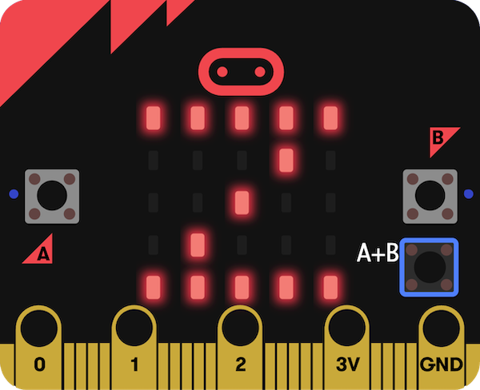

## ¿Que sigue?

Si estas siguiendo el camino de [introduccion a micro:bit](https://projects.raspberrypi.org/es-LA/raspberrypi/path-name), puedes pasar al siguiente proyecto [Rastreador de sueño](https://projects.raspberrypi.org/es-LA/projects/sleep-tracker).

Enn este proyecto, crearas un rastreador de sueño, que utiliza el acelerometro del micro:bit para rastrear cuantas veces te mueves por la noche. ¡Dormir bien es muy importante para que te sientas mejor durante el dia!

--- print-only ---

--- /print-only ---

--- no-print ---

<iframe style="position:absolute;top:0;left:0;width:100%;height:100%;" src="https://makecode.microbit.org/---run?id=_14Lib71CCP0F" allowfullscreen="allowfullscreen" sandbox="allow-popups allow-forms allow-scripts allow-same-origin" frameborder="0"></iframe>

--- /no-print ---

Si quieres divertirte mas explorando micro:bit, entonces podrias probar cualquiera de [estos proyectos](https://projects.raspberrypi.org/es-LA/projects?hardware%5B%5D=microbit).
