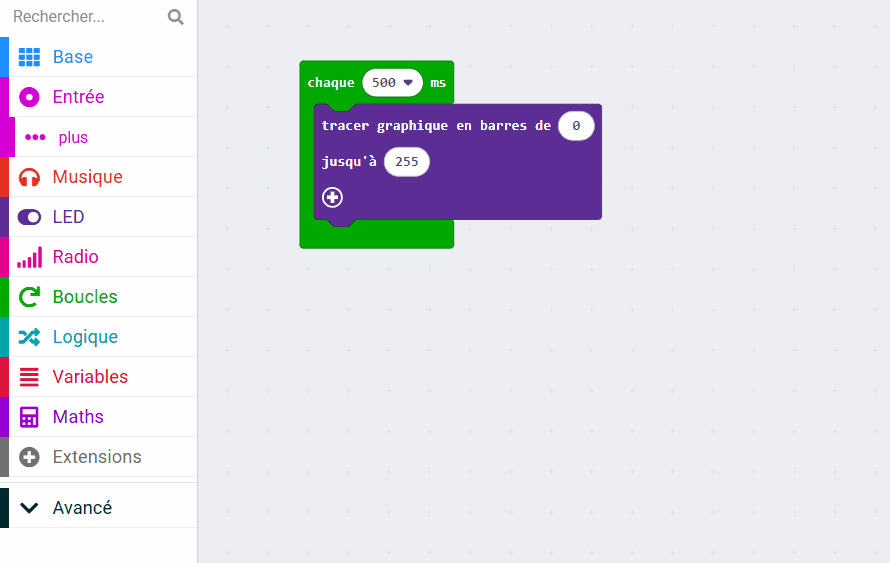
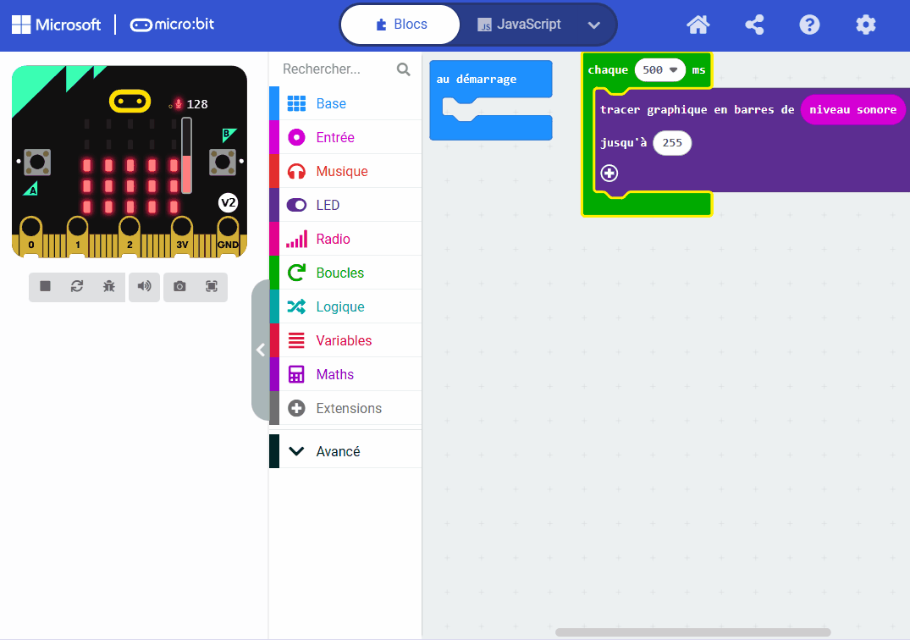

## Enregistrer le niveau sonore

<div style="display: flex; flex-wrap: wrap">
<div style="flex-basis: 200px; flex-grow: 1; margin-right: 15px;">
Tu vas créer ton projet MakeCode et ajouter du code pour mesurer le niveau sonore (ou lumière). Tu afficheras le niveau actuel sur les LED pour l'utilisateur. 
</div>
<div>
{:width="300px"}
</div>
</div>

### Ouvrir MakeCode

Pour commencer à créer ton projet micro:bit, tu dois ouvrir l'éditeur MakeCode.

--- task ---

Ouvre l'éditeur MakeCode sur [makecode.microbit.org](https://makecode.microbit.org){:target="_blank"}

--- collapse ---

---
title: Version hors ligne de l'éditeur
---

Il y a aussi une version [téléchargeable de l'éditeur MakeCode](https://makecode.microbit.org/offline-app){:target="_blank"}.

--- /collapse ---

--- /task ---

### Premier projet sur micro:bit ?

[[[makecode-tour]]]

### Créer ton projet

Une fois que l'éditeur est ouvert, tu devras créer un nouveau projet et donner un nom à ton projet.

--- task ---

Clique sur le bouton **Nouveau projet**.


--- /task ---

--- task ---

Donne à ton nouveau projet le nom `sonomètre` et clique sur **Créer**.


**Astuce :** pour faciliter la recherche de ton projet plus tard, donne-lui un nom utile qui se rapporte à l'activité que tu crées.

--- /task ---

### Tracer un graphe du niveau sonore

Dans ce projet, tu utiliseras le bloc `au démarrage`{:class="microbitbasic"}, mais pas le bloc `toujours`{:class="microbitbasic"}.

--- task ---

Tu peux supprimer le bloc `toujours`{:class="microbitbasic"} maintenant en le faisant glisser vers le panneau de menu.


--- /task ---

La première étape consiste à amener le micro:bit à capturer les niveaux sonores à intervalles réguliers. Il existe une boucle spécifique que tu peux utiliser pour faire cela.

--- task ---

Dans le menu `Boucles`{:class="microbitloops"}, fais glisser un bloc `chaque 500 ms`{:class="microbitloops"} et place-le dans le panneau de l'éditeur de code.


Tout code à l'intérieur de cette boucle s'exécutera toutes les **500 millisecondes**.

1 000 millisecondes correspondent à 1 seconde, donc cette boucle s'exécutera toutes les **demi-secondes**.

--- /task ---

--- task ---

Dans le menu `LED`{:class="microbitled"}, fais glisser un bloc `tracer graphique en barres`{:class="microbitled"}.


Place-le à l'intérieur du bloc `chaque 500 ms`{:class="microbitloops"}.

```microbit
loops.everyInterval(500, function () {
    led.plotBarGraph(
    0,
    0
    )
})
```

--- /task ---

--- task ---

Dans le menu `Entrée`{:class="microbitinput"}, fais glisser un bloc `niveau sonore`{:class="microbitinput"}.

Place-le à l'intérieur du premier `0` dans le bloc `tracer graphique en barres de`{:class="microbitled"}.

Remplace le deuxième `0` par `255`.

```microbit
loops.everyInterval(500, function () {
    led.plotBarGraph(
    input.soundLevel(),
    255
    )
})
```

--- collapse ---

---
title: Pour micro:bit V1
---

Le micro:bit V1 n'est pas équipé d'un microphone, tu peux donc utiliser le bloc `niveau d'intensité lumineuse`{:class="microbitinput"} pour mesurer le niveau de luminosité de ton environnement.



--- /collapse ---

--- /task ---

### Enregistrer les niveaux sonores (V2 uniquement)

Le micro:bit V2 dispose d'un enregistreur de données intégré, qui te permet de suivre les données de divers capteurs et entrées. Tu devras installer une extension pour l'utiliser.

--- task ---

Dans le panneau de menu, clique sur **Extensions**. Une autre fenêtre s'ouvrira affichant les extensions recommandées. Clique sur le **data logger** et il sera installé en tant qu'élément de menu.



--- /task ---

--- task ---

Dans le menu `Data Logger`{:class="microbitdatalogger"}, fais glisser un bloc `log data`{:class="microbitdatalogger"}.


Place-le sous le bloc `tracer graphique en barres de`{:class='microbitled'}.

```microbit
loops.everyInterval(500, function () {
    led.plotBarGraph(
    input.soundLevel(),
    255
    )
    datalogger.log(datalogger.createCV("", 0))
})
```

--- /task ---

--- task ---

Tape `niveau sonore` dans le champ colonne (column).

```microbit
loops.everyInterval(500, function () {
    led.plotBarGraph(
    input.soundLevel(),
    255
    )
    datalogger.log(datalogger.createCV("Sound level", 0))
})
```

--- /task ---

--- task ---

Dans le menu `Entrée`{:class="microbitinput"}, fais glisser un autre bloc `niveau sonore`{:class="microbitinput"} et place-le à l'intérieur du bloc `0` sur le bloc `log data`{:class="microbitalogger"}.

```microbit
loops.everyInterval(500, function () {
    led.plotBarGraph(
    input.soundLevel(),
    255
    )
    datalogger.log(datalogger.createCV("Sound level", input.soundLevel()))
})
```

--- /task ---

### Teste ton programme

Lorsque tu modifies un bloc de code dans le panneau de l'éditeur de code, le simulateur redémarrera.

**Teste ton programme**

+ Fais glisser la barre de son rouge vers le haut et vers le bas pour changer les niveaux sonores.

**V2 uniquement**

+ Clique sur le lien « **Afficher données** Simulateur » sous le simulateur micro:bit pour voir les niveaux sonores enregistrés.


Excellent travail ! Tu as créé ton premier programme d'affichage de données sur un micro:bit !
