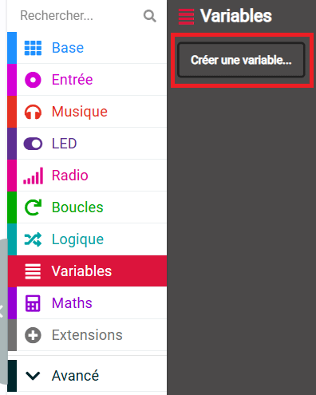
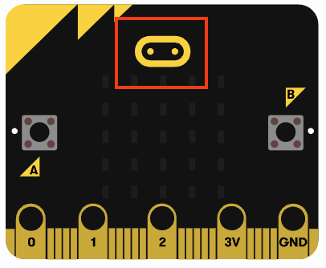

## Sound the alarm

<div style="display: flex; flex-wrap: wrap">
<div style="flex-basis: 200px; flex-grow: 1; margin-right: 15px;">
In this step, you will add an alarm that triggers when the sound level get too high. To stop the alarm adding to the noise, you will make sure it only goes off once and can be reset whenever you want. 
</div>
<div>

{:width="300px"}

</div>
</div>

### Set the maximum

You will need to make a variable to hold the sound level that will trigger the alarm.

--- task ---

Open the `Variables`{:class="microbitvariables"} menu and click **Make a Variable**.



--- /task ---

--- task ---

Name your new variable `maximum`.


--- /task ---

--- task ---

From the `Variables`{:class="microbitvariables"} menu, get the `set maximum`{:class="microbitvariables"} block.


Place the block inside the `on start`{:class="microbitbasic"} block, and change the `0` to `150`.

```microbit
let maximum = 150
```

--- /task ---

The value `150` is a little more than half the maximum sound level the micro:bit can sense, so that should be a good level to start with.

--- collapse ---

---
title: For micro:bit V1
---

This maximum value works for light levels, too!

--- /collapse ---

### Turn the alarm off

You also want to make sure the alarm noise does not add to the already noisy environment!

To do this, you will use another variable that will be set to `false` to start, and it will change to `true` when the alarm sounds.

--- task ---

Create another new `Variable`{:class="microbitvariables"}, this time called `alarm`.


--- /task ---

--- task ---

Drag the `set alarm`{:class="microbitvariables"} block from the `Variables`{:class="microbitvariables"} menu.

Place it inside the `on start`{:class="microbitbasic"} block.

--- /task ---

You need to set this new variable to `false` instead of a number.

--- task ---

Open the `Logic`{:class="microbitlogic"} menu.

Get a `false`{:class="microbitlogic"} block.


Place this block over the top of the `0`.

```microbit
let maximum = 150
let alarm = false
```

--- /task ---

### Check if the alarm should sound

The alarm should only sound **if:**

+ The sound level is **larger** than the maximum   
  **AND**
+ The alarm variable is **not true**

--- task ---

From the `Logic`{:class="microbitlogic"} menu, get an `if...then`{:class="microbitlogic"} block.


Place the block inside the `every`{:class="microbitloops"} loop underneath the `log data`{:class="microbitdatalogger"} block.

```microbit
loops.everyInterval(500, function () {
    led.plotBarGraph(
    input.soundLevel(),
    255
    )
    datalogger.log(datalogger.createCV("Sound level", input.soundLevel()))
    if (true) {

    }
})
```

--- /task ---

--- task ---

Open the `Logic`{:class="microbitlogic"} menu again and take an `and`{:class="microbitlogic"} block.


Place it in the `true` section of the `if...then`{:class="microbitlogic"} block.

```microbit
loops.everyInterval(500, function () {
    led.plotBarGraph(
    input.soundLevel(),
    255
    )
    datalogger.log(datalogger.createCV("Sound level", input.soundLevel()))
    if (false && false) {

    }
})
```

--- /task ---

Now you need to add the **two** conditions either side of the **and**.

--- task ---

Again in the `Logic`{:class="microbitlogic"} menu, get a `0 < 0`{:class="microbitlogic"} condition block.

Place it on one side of the `and`{:class="microbitlogic"} block.

Use the drop-down menu to change the less than symbol (`<`) to a greater than (`>`) symbol.


--- /task ---

--- task ---

From the `Input`{:class="microbitinput"} menu, drag a `sound level`{:class="microbitinput"} block.

Put it in the first `0` of the `0 > 0`{:class="microbitlogic"} block

From the `Variables`{:class="microbitvariables"} menu, drag a `maximum`{:class="microbitvariables"} block.

Put it in the second `0` of the `0 > 0`{:class="microbitlogic"} block.

Your code should look like this:

```microbit
loops.everyInterval(500, function () {
    let maximum = 0
    led.plotBarGraph(
    input.soundLevel(),
    255
    )
    datalogger.log(datalogger.createCV("Sound Level", input.soundLevel()))
    if (input.soundLevel() > maximum && false) {

    }
})
```

--- collapse ---

---
title: For micro:bit V1
---

From the `Input`{:class="microbitinput"} menu, drag a `light level`{:class="microbitinput"} block.

Put it in the first `0` of the `0 > 0`{:class="microbitlogic"} block.

From the `Variables`{:class="microbitvariables"} menu, drag a `maximum`{:class="microbitvariables"} block.

Put it in the second `0` of the `0 > 0`{:class="microbitlogic"} block.

Your code should look like this:

```microbit
loops.everyInterval(500, function () {
    let maximum = 0
    led.plotBarGraph(
    input.lightLevel(),
    255
    )
    if (input.lightLevel() > maximum && false) {

    }
})
```

--- /collapse ---

--- /task ---

You only want to set the alarm off if the `alarm`{:class="microbitvariables"} variable is **not** set `true`{:class="microbitlogic"}.

--- task ---

Get a `not`{:class='microbitlogic'} block from the `Logic`{:class='microbitlogic'} menu.

Place it on the other side of the `and`{:class='microbitlogic'} block.

```microbit
loops.everyInterval(500, function () {
    let maximum = 0
    led.plotBarGraph(
    input.soundLevel(),
    255
    )
    datalogger.log(datalogger.createCV("Sound level", input.soundLevel()))
    if (input.soundLevel() > maximum && !(false)) {

    }
})
```

--- /task ---

--- task ---

Place an `alarm`{:class='microbitvariables'} variable block in the `not`{:class='microbitlogic'} block like this:

```microbit
loops.everyInterval(500, function () {
    let alarm = 0
    let maximum = 0
    led.plotBarGraph(
    input.soundLevel(),
    255
    )
    datalogger.log(datalogger.createCV("Sound level", input.soundLevel()))
    if (input.soundLevel() > maximum && !(alarm)) {

    }
})
```

--- /task ---

### Sound the alarm

Now it's time to add your alarm sound!

--- task ---

From the `Music`{:class='microbitmusic'} menu, take a `play`{:class='microbitmusic'} block.


Place this inside the `if`{:class='microbitlogic'} block that checks if the alarm should sound.

```microbit
loops.everyInterval(500, function () {
    let alarm = 0
    let maximum = 0
    led.plotBarGraph(
    input.soundLevel(),
    255
    )
    datalogger.log(datalogger.createCV("Sound level", input.soundLevel()))
    if (input.soundLevel() > maximum && !(alarm)) {
        music.play(music.builtinPlayableSoundEffect(soundExpression.giggle), music.PlaybackMode.UntilDone)
    }
})
```

--- collapse ---

---
title: For micro:bit V1
---

The micro:bit V1 has no speaker, so you have to adapt the program for the alarm.

Rather than an alarm that uses sound, you can display an icon on the LEDs when the light level is higher than the maximum.

From the `Basic`{:class='microbitbasic'} menu, get a `show icon`{:class='microbitbasic'} block.

Place this inside the `if`{:class='microbitlogic'} block that checks if the alarm should sound.

**Select** an icon to use for your alarm.

```microbit
loops.everyInterval(500, function () {
    let alarm = 0
    let maximum = 0
    led.plotBarGraph(
    input.lightLevel(),
    255
    )
    datalogger.log(datalogger.createCV("Light level", input.lightLevel()))
    if (input.lightLevel() > maximum && !(alarm)) {
        basic.showIcon(IconNames.Sad)
    }
})
```

--- /collapse ---

--- /task ---

--- task ---

**Choose** which alarm sound you would like to use, from the available sounds in the drop-down menu.

--- /task ---

--- task ---

Inside your `on start`{:class='microbitbasic'} block, **right-click** on the `set`{:class='microbitvariables'} block and select **Duplicate**.


Place the duplicated block below the `play`{:class='microbitmusic'} block.

Change the `false`{:class='microbitlogic'} to `true`{:class='microbitlogic'}.

```microbit
let alarm = false
loops.everyInterval(500, function () {
    let maximum = 0
    led.plotBarGraph(
    input.soundLevel(),
    255
    )
    datalogger.log(datalogger.createCV("Sound level", input.soundLevel()))
    if (input.soundLevel() > maximum && !(alarm)) {
        music.play(music.builtinPlayableSoundEffect(soundExpression.mysterious), music.PlaybackMode.UntilDone)
        alarm = true
    }
})
```

--- /task ---

### Reset the alarm

When the alarm goes off, you will want to reset it.

You can use the touch logo on the micro:bit to do this.



--- task ---

From the `Input`{:class='microbitinput'} menu, drag an `on logo`{:class='microbitinput'} block.


From your `on start`{:class='microbitbasic'} block, duplicate the `set alarm`{:class='microbitvariables'} block and place it inside the `on logo`{:class='microbitinput'} block.

```microbit
let alarm = false
input.onLogoEvent(TouchButtonEvent.Pressed, function () {
    alarm = false
})
```

--- collapse ---

---
title: For micro:bit V1
---

There is no touch sensor in the logo on the micro:bit V1, so instead you can use both the `A` and `B` buttons.

From the `Input`{:class='microbitinput'} menu, drag an `on button`{:class='microbitinput'} block.


Use the drop-down menu to change the button to `A+B`{:class='microbitinput'}.

From your `on start`{:class='microbitbasic'} block, duplicate the `set alarm`{:class='microbitvariables'} block and place it inside the `on button`{:class='microbitinput'} block.

```microbit
let alarm = false
input.onButtonPressed(Button.AB, function () {
    alarm = false
})
```

--- /collapse ---

--- /task ---

Next you are going to use the `A` button and `B` button to change the sensitivity of your alarm!
