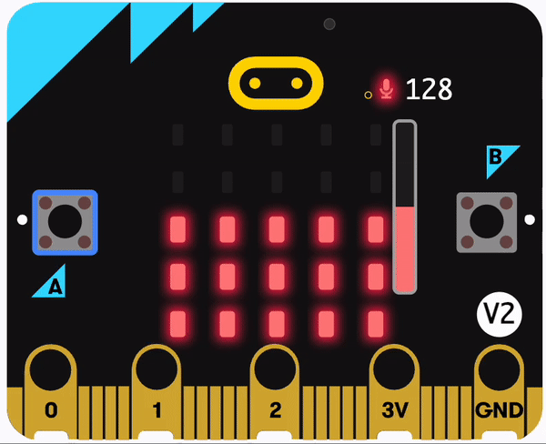
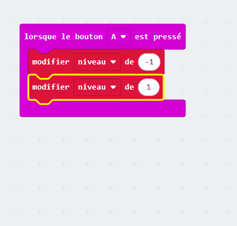
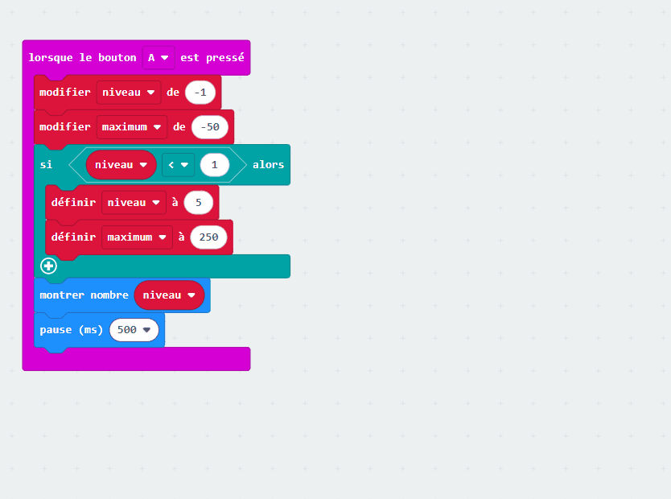
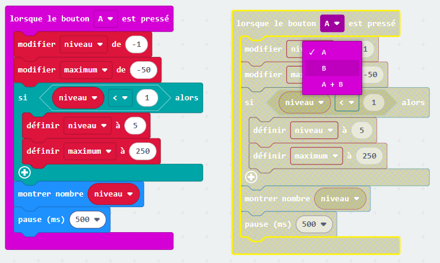
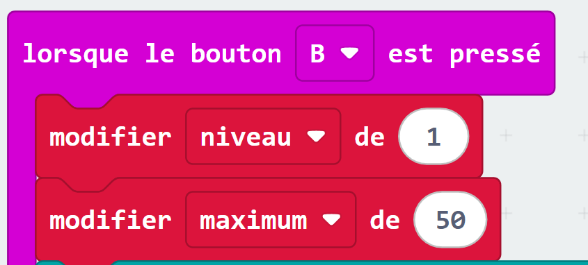

## Modifier la sensibilité

<div style="display: flex; flex-wrap: wrap">
<div style="flex-basis: 200px; flex-grow: 1; margin-right: 15px;">

Dans cette étape, tu programmeras les boutons sur le micro:bit pour régler la sensibilité de l'alarme avec des paramètres allant de 1 (valeur maximale la plus basse) à 5 (valeur maximale la plus élevée). 

</div>
<div>

{:width="300px"}

</div>
</div>

### Diminuer le niveau sonore maximum

Le bouton **A** se trouve sur la gauche, tu l'utiliseras donc pour diminuer la valeur maximale de l'alarme.

--- task ---

Dans le menu `Entrée`{:class='microbitinput'}, fais glisser un bloc `lorsque le bouton`{:class='microbitinput'} et place-le dans l'éditeur de code.


--- /task ---

Dans l'étape précédente, tu as créé deux variables, `maximum`{:class='microbitvariables'} et `alarme`{:class='microbitvariables'}.

Tu vas maintenant créer une autre variable pour le **niveau** de sensibilité.

--- task ---

Dans le menu `Variables`{:class='microbitvariables'}, clique sur **Créer une variable** pour créer une variable appelée `niveau`.

--- /task --- 

--- task ---

Fais glisser le bloc `modifier`{:class='microbitvariables'} et place-le à l'intérieur du bloc `lorsque le bouton`{:class='microbitinput'}.

Modifie le `1` par `-1`.

```microbit
let niveau = 0
input.onButtonPressed(Button.A, function () {
    niveau += -1
})
```

--- /task ---

--- task ---

Dans le menu `Variables`{:class='microbitvariables'}, fais glisser un autre bloc `modifier`{:class='microbitvariables'}.

Place-le **sous** le bloc `modifier niveau de -1`{:class='microbitvariables'}.

Modifie la variable affichée dans le bloc de `niveau` à `maximum` en cliquant sur le nom de la variable.

Modifie le `1` par `-50`.



```microbit
let niveau = 0
let maximum = 0
input.onButtonPressed(Button.A, function () {
    niveau += -1
    maximum += -50
})
```

--- /task ---

Cela signifie que chaque fois que tu appuies sur le bouton A, le niveau de sensibilité diminue de 1 et la sensibilité sonore de 50.

Si le bouton A est appuyé alors que le niveau est déjà 1, tu dois alors faire en sorte que le niveau passe à `5` et non à `0`.

--- task ---

Dans le menu `Logique`{:class='microbitlogic'}, fais glisser un bloc `si`{:class='microbitlogic'}.

Place-le sous le bloc `modifier maximum de -50`{:class='microbitvariables'}.

```microbit
let niveau = 0
let maximum = 0
input.onButtonPressed(Button.A, function () {
    niveau += -1
    maximum += -50
    if (true) {

    }
})
```

--- /task ---

--- task ---

Dans le menu `Logique`{:class='microbitlogic'}, fais glisser le bloc de comparaison `0 < 0`{:class='microbitlogic'}.

Place-le à l'intérieur de la partie `vrai` dans le bloc `si`{:class='microbitlogic'}.

```microbit
let niveau = 0
let maximum = 0
input.onButtonPressed(Button.A, function () {
    niveau += -1
    maximum += -50
    if (0 < 0) {

    }
})
```

--- /task ---

--- task ---

Dans le menu `Variables`{:class='microbitvariables'}, fais glisser le bloc `niveau`{:class='microbitvariables'}.

Place-le à l'intérieur du premier bloc de comparaison `0` de `0 < 0`{:class='microbitlogic'}.

```microbit
let niveau = 0
let maximum = 0
input.onButtonPressed(Button.A, function () {
    niveau += -1
    maximum += -50
    if (niveau < 0) {

    }
})
```

--- /task ---

--- task ---

Remplace `0` par `1` sur le côté droit du bloc de comparaison `0 < 0`{:class='microbitlogic'}.

--- /task ---

--- task ---

Dans le menu `Variables`{:class='microbitvariables'}, fais glisser le bloc `définir`{:class='microbitvariables'}.

Place-le à l'intérieur du bloc `si`{:class='microbitlogic'}. Assure-toi que la variable sélectionnée est `niveau`{:class='microbitvariables'}.

Remplace le `0` par `5` sur le bloc `définir niveau à 0`{:class='microbitvariables'}.

```microbit
let niveau = 0
let maximum = 0
input.onButtonPressed(Button.A, function () {
    niveau += -1
    maximum += -50
    if (niveau < 1) {
        niveau = 5
    }
})
```

--- /task ---

--- task ---

De nouveau dans le menu `Variables`{:class='microbitvariables'}, fais glisser un autre bloc `définir`{:class='microbitvariables'}.

Place-le sous le bloc `définir niveau à 5`{:class='microbitvariables'}.

Remplace le `0` par `250`.

```microbit
let niveau = 0
let maximum = 0
input.onButtonPressed(Button.A, function () {
    niveau += -1
    maximum += -50
    if (niveau < 1) {
        niveau = 5
        maximum = 250
    }
})
```

--- /task ---

--- task ---

Dans le menu `Base`{:class='microbitbasic'}, fais glisser le bloc `montrer nombre`{:class='microbitbasic'}.

Place-le **sous** le bloc `si`{:class='microbitlogic'}.

```microbit
let niveau = 0
let maximum = 0
input.onButtonPressed(Button.A, function () {
    niveau += -1
    maximum += -50
    if (niveau < 1) {
        niveau = 5
        maximum = 250
    }
    basic.showNumber(0)
})
```

--- /task ---

--- task ---

Dans le menu `Variables`{:class='microbitvariables'}, fais glisser le bloc `niveau`{:class='microbitvariables'}.

Place-le dans le bloc `0` dans le bloc `montrer nombre`{:class='microbitbasic'}.

```microbit
let niveau = 0
let maximum = 0
input.onButtonPressed(Button.A, function () {
    niveau += -1
    maximum += -50
    if (niveau < 1) {
        niveau = 5
        maximum = 250
    }
    basic.showNumber(niveau)
})
```

--- /task ---

--- task ---

Aussi dans le menu `Base`{:class='microbitbasic'}, fais glisser le bloc `pause`{:class='microbitbasic'}.

Place-le sous le bloc `montrer nombre`{:class='microbitbasic'}.

Remplace le `100` par `500`.

```microbit
let niveau = 0
let maximum = 0
input.onButtonPressed(Button.A, function () {
    niveau += -1
    maximum += -50
    if (niveau < 1) {
        niveau = 5
        maximum = 250
    }
    basic.showNumber(niveau)
    basic.pause(500)
})
```

--- /task ---

### Augmenter le niveau sonore maximum

Tu as maintenant programmé le bloc `lorsque le bouton A est pressé`{:class='microbitinput'}.

Tu devras faire pareil pour `lorsque le bouton B est pressé`{:class='microbitinput'} pour augmenter le maximum.

--- task ---

Fais un clic droit sur l'ensemble du bloc `lorsque le bouton A est pressé`{:class='microbitinput'} et clique sur **Reproduire**.



Il y aura maintenant deux blocs `lorsque le bouton A est pressé`{:class='microbitinput'} dans le panneau de l'éditeur de code.

--- /task ---

--- task ---

Clique sur le `A` dans le bloc dupliqué `lorsque le bouton A est pressé`{:class='microbitinput'}. Un menu déroulant s'ouvrira.

Remplace le `A` par `B`.



--- /task ---

--- task ---

À l'intérieur du bloc `lorsque le bouton B est pressé`{:class='microbitinput'} :

- Modifie le bloc `-1` par `1` dans le bloc `modifier niveau`{:class='microbitvariables'}

- Modifie le bloc `-50` par `50` dans `modifier maximum`{:class='microbitvariables'}



--- /task ---

--- task ---

Pour les conditions du bloc `si`{:class='microbitlogic'} :

- Remplace le `<` par `>`
- Remplace le `1` par `5`

Dans le bloc `si`{:class='microbitlogic'} :

- Modifie le bloc `5` par `1` dans le bloc `définir niveau à 5`{:class='microbitvariables'}
- Modifie le bloc `250` par `50` dans `modifier maximum de 50`{:class='microbitvariables'}

```microbit
let niveau = 0
let maximum = 0
input.onButtonPressed(Button.B, function () {
    niveau += 1
    maximum += 50
    if (niveau > 5) {
        niveau = 1
        maximum = 50
    }
    basic.showNumber(niveau)
    basic.pause(500)
})
```

--- /task ---

### Définir un niveau sonore normal

Tu dois programmer un niveau de sensibilité d'alarme normal en utilisant le bloc `au démarrage`{:class='microbitbasic'}.

--- task ---

Dans le menu `Variables`{:class='microbitvariables'}, fais glisser un bloc `définir maximum à 0`{:class='microbitvariables'}.

Place-le à l'intérieur du bloc `au démarrage`{:class='microbitbasic'}.

--- /task ---

--- task ---

Clique sur le nom de la variable `maximum` et modifie-le par `niveau`.

Modifie le bloc `0` par `3` dans le bloc `définir niveau`{:class='microbitvariables'}.

```microbit
let maximum = 150
let alarme = false
let niveau = 3
```

--- /task ---

--- task ---

**Teste ton programme**

+ Appuie sur les boutons A et B pour voir les niveaux sonores augmenter et diminuer

Le point de départ par défaut est le niveau 3.

**Fais glisser** les niveaux d'entrée micro vers le haut et le bas pour tester le son maximum pour chaque niveau lors de l'utilisation du simulateur.

--- /task ---

--- task ---

Télécharge ton programme sur ton micro:bit !

--- /task ---

[[[download-to-microbit]]]

Bien joué ! Tu disposes désormais d’un sonomètre ou d’un luxmètre entièrement fonctionnel !

Ensuite, il est temps de vérifier ce que tu as appris !
