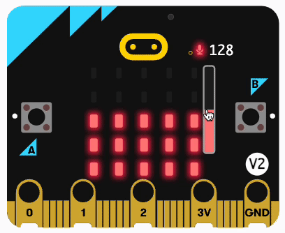
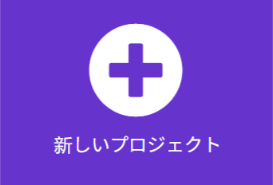
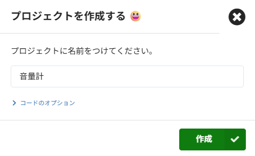
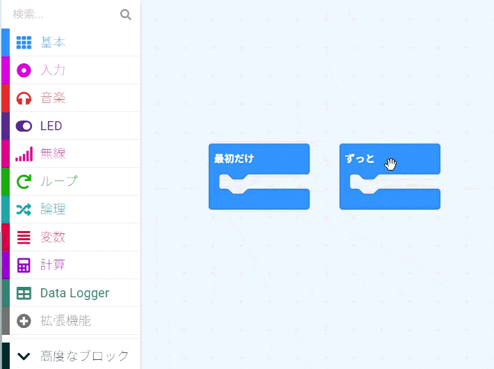
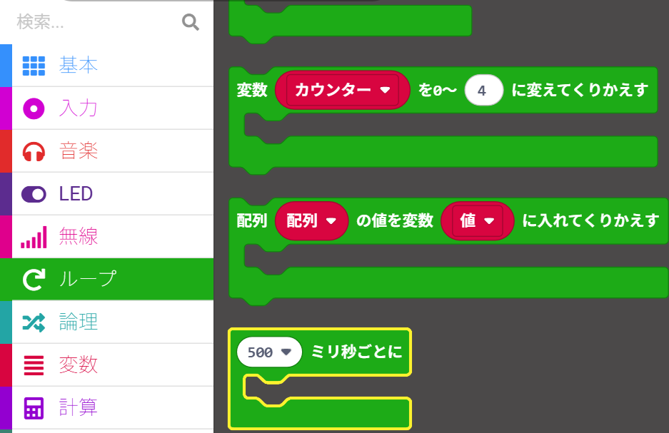
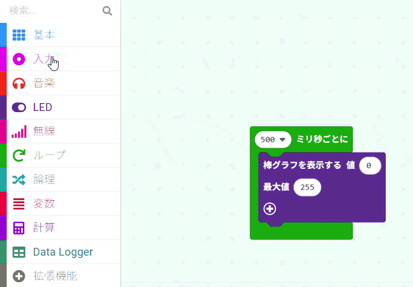
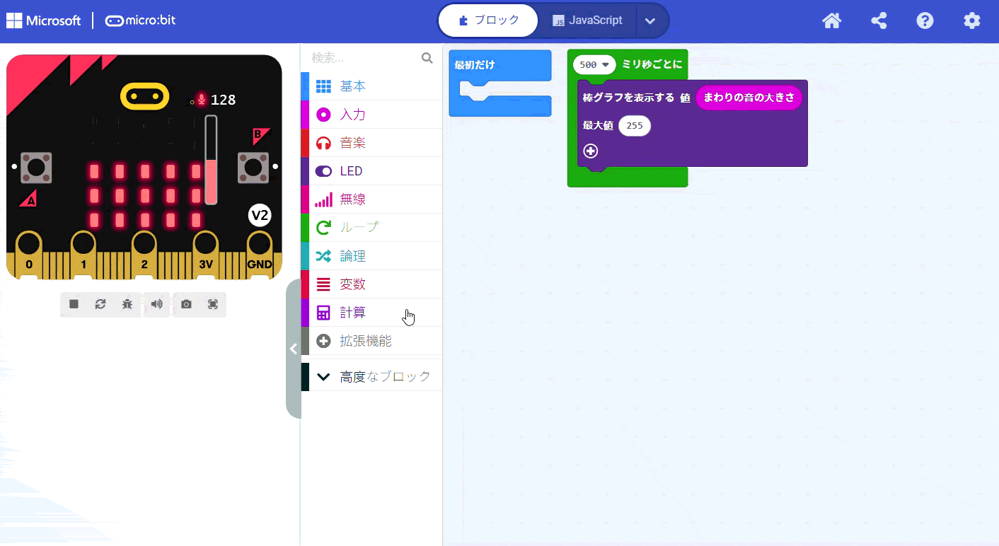
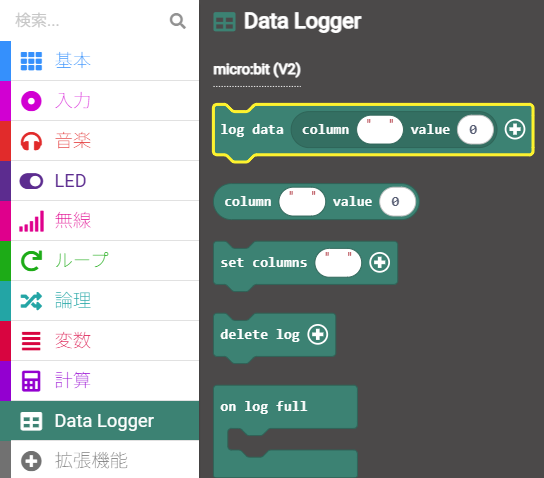
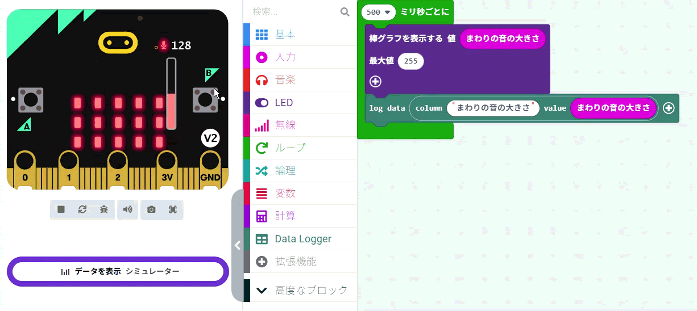

## 音量を記録しよう

<div style="display: flex; flex-wrap: wrap">
<div style="flex-basis: 200px; flex-grow: 1; margin-right: 15px;">
MakeCodeのプロジェクトを作成し、音（または光）の大きさを測定するコードを追加します。 現在のレベルをLED画面に表示して確認できるようにしましょう。 
</div>
<div>
{:width="300px"}
</div>
</div>

### MakeCodeを開く

micro:bit プロジェクトの作成を開始するには、MakeCode エディターを開きます。

\--- task ---

[makecode.microbit.org](https://makecode.microbit.org{:target="_blank"} で MakeCode エディターを開きます

\--- collapse ---

---

## title: エディターのオフライン版

[MakeCode エディターのダウンロード可能バージョン](https://makecode.microbit.org/offline-app){:target="_blank"}もあります。

\--- /collapse ---

\--- /task ---

### 初めてのmicro:bitプロジェクトですか？

[[[makecode-tour]]]

### プロジェクトを作成する

エディタが開いたら、新しいプロジェクトを作成して名前をつけます。

\--- task ---

**新規プロジェクト** ボタンをクリックします。



\--- /task ---

\--- task ---

新しいプロジェクトの名前を「音量計」と入力し、**作成** をクリックします。



**ヒント：** あとでプロジェクトを見つけやすくするために、作っている活動に関連した分かりやすい名前をつけるのがおすすめです。

\--- /task ---

### 音量のグラフを表示する

このプロジェクトでは、「最初だけ」{:class="microbitbasic"} ブロックを使用しますが、「ずっと」{:class="microbitbasic"} ブロックは使用しません。

\--- task ---

「ずっと」{:class="microbitbasic"} ブロックをメニューパネルに動かすと削除できます。



\--- /task ---

最初のステップは、micro:bitに一定の間隔で音量を計測させることです。 これを行うための専用のループブロックがあります。

\--- task ---

「ループ」{:class="microbitloops"} メニューから 「500ミリ秒ごと」{:class="microbitloops"} ブロックを取得して、コードエディタパネルに配置します。



このループの中にあるコードは、**500ミリ秒**ごとに実行されます。

1000ミリ秒が1秒なので、このループは **0.5秒** ごとに実行されることになります。

\--- /task ---

\--- task ---

「LED」{:class="microbitled"} メニューから、「グラフを表示する」{:class="microbitled"} ブロックを取得します。

<0/>

それを「500ミリ秒ごと」{:class="microbitloops"} ブロックの中に配置します。

```microbit
loops.everyInterval(500, function () {
    led.plotBarGraph(
    0,
    0
    )
})
```

\--- /task ---

\--- task ---

「入力」{:class="microbitinput"} メニューから、「音量」\`{:class="microbitinput"} ブロックを取得します。

「グラフを表示する」{:class="microbitled"} ブロックの一つ目の「0」の中に配置します。

二つ目の 0 を 255 に変更します。

```microbit
loops.everInterval(500, function () {
    led.plotBarGraph(
    input.soundLevel(),
    255
    )
})
```

\--- collapse ---

---

## title: micro:bit V1の場合

micro:bit V1にはマイクが搭載されていないため、代わりに「明るさ」{:class="microbitinput"}ブロックを使用して周囲の明るさを測定できます。



\--- /collapse ---

\--- /task ---

### 音量を記録する（V2専用）

micro:bit V2にはデータ記録機能が内蔵されており、さまざまなセンサーや入力からのデータを追跡できます。 これを使用するには、拡張機能をインストールする必要があります。

\--- task ---

メニューパネルの **拡張機能** をクリックします。 おすすめの拡張機能が表示された別のウィンドウが開きます。 **datalogger**（データロガー）をクリックすると、メニュー項目としてインストールされます。



\--- /task ---

\--- task ---

「データロガー」{:class="microbitdatalogger"}メニューから、「データをログする」{:class="microbitdatalogger"}ブロックを取得します。



それを「グラフを表示する」{:class='microbitled'} ブロックの下に配置します。

```microbit
loops.everyInterval(500, function () {
    led.plotBarGraph(
    input.soundLevel(),
    255
    )
    datalogger.log(datalogger.createCV("", 0))
})
```

\--- /task ---

\--- task ---

列の名前として「音量」と入力します。

```microbit
loops.everyInterval(500, function () {
    led.plotBarGraph(
    input.soundLevel(),
    255
    )
    datalogger.log(datalogger.createCV("Sound level", 0))
})
```

\--- /task ---

\--- task ---

「入力」{:class="microbitinput"} メニューから、もう一つ 「音量」\`{:class="microbitinput"} ブロックを取得して、「データをログする」{:class="microbitdatalogger"} ブロックの 「0」 の中に配置します。

```microbit
loops.everyInterval(500, function () {
    led.plotBarGraph(
    input.soundLevel(),
    255
    )
    datalogger.log(datalogger.createCV("Sound level", input.soundLevel()))
})
```

\--- /task ---

### プログラムをテストする

コードエディタパネルでコードブロックを変更すると、シミュレーターが自動的に再起動します。

**プログラムのテスト方法**

- 赤い音量バーを上下に動かして、音量を変化させてみましょう。

**V2 のみ**

- micro:bitシミュレーターの下にある 「**データを表示** シミュレーター」 リンクをクリックすると、音量が記録されていく様子をリアルタイムで確認できます。



すばらしい作品ができましたね！ micro:bitで初めてのデータ表示プログラムが完成しました！
