## アラームを鳴らそう

<div style="display: flex; flex-wrap: wrap">
<div style="flex-basis: 200px; flex-grow: 1; margin-right: 15px;">
このステップでは、音量が大きくなりすぎたときに作動するアラームを追加します。 アラーム自体の音でさらにうるさくなるのを防ぐため、アラームが鳴るのは一回だけに設定し、いつでもリセットできるようにします。 
</div>
<div>

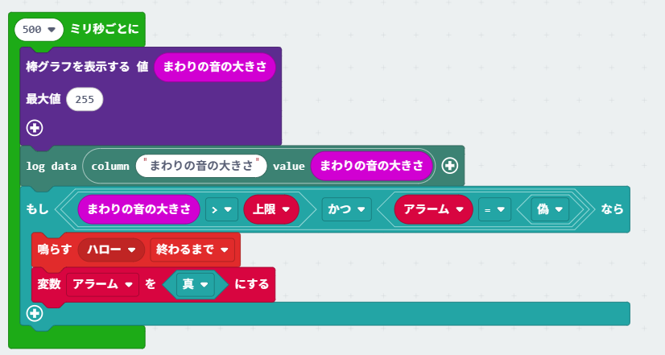{:width="300px"}

</div>
</div>

### 上限を設定する

アラームを作動させる基準となる音量を保存するために、変数を作成する必要があります。

\--- task ---

「変数」{:class="microbitvariables"} メニューを開き、**変数を追加する…** をクリックします。

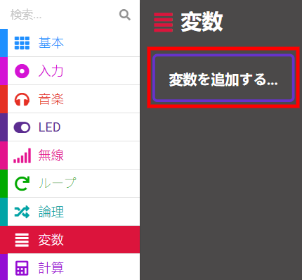

\--- /task ---

\--- task ---

新しい変数の名前に「上限」と入力します。

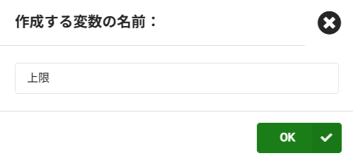

\--- /task ---

\--- task ---

「変数」{:class="microbitvariables"} メニューから、「変数 上限 を～にする」{:class="microbitvariables"} ブロックを取得します。

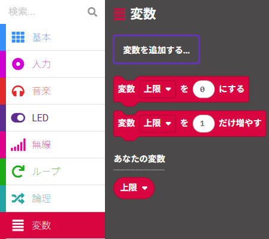

そのブロックを「最初だけ」{:class="microbitbasic"} ブロックの中に配置し、「0」 を 「150」 に変更します。

```microbit
let maximum = 150
```

\--- /task ---

「150」という値は、micro:bitが感知できる最大音量の半分より少し大きい値です。まずはこの数値を基準として始めてみるのがちょうどよいでしょう。

\--- collapse ---

---

## title: micro:bit V1の場合

この上限は、明るさにも適用されます！

\--- /collapse ---

### アラームをオフにする

すでに騒がしい環境を、アラームの音でさらにうるさくしたくはありませんよね！

そこで、もう一つの変数を使います。最初は「偽」にしておき、アラームが鳴ったら「真」に変わるようにします。

\--- task ---

もう一つ新しい変数`Variable`{:class="microbitvariables"}を作成し、名前を「アラーム」にします。

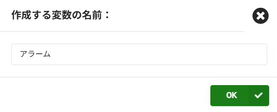

\--- /task ---

\--- task ---

「変数」{:class="microbitvariables"}メニューから「変数を アラーム にする」{:class="microbitvariables"}ブロックを取得します。

それを「最初だけ」{:class="microbitbasic"} ブロックの中に配置します。

\--- /task ---

この新しい変数には、数字ではなく「偽」を設定する必要があります。

\--- task ---

「論理」{:class="microbitlogic"} メニューを開きます。

「偽」ブロックを取り出します。

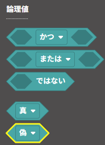

このブロックを、「0」の上に重ねて配置します。

```microbit
let maximum = 150
let alarm = false
```

\--- /task ---

### アラームを鳴らすべきか判定する

アラームは、**もし,** 以下の条件を満たしたときだけ鳴るようにします

- 音量が上限 **よりも大きい** **かつ**
- 変数 アラーム が **真ではない**

\--- task ---

「論理」{:class="microbitlogic"} メニューから、「もし～なら」{:class="microbitlogic"} ブロックを取得します。

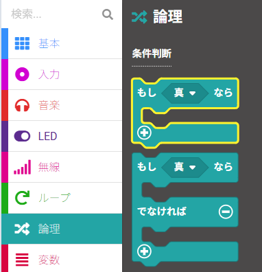

そのブロックを、「500ミリ秒ごと」{:class="microbitloops"} ループ内の「log data (データを記録する)」{:class="microbitdatalogger"} ブロックの下に配置します。

```microbit
loops.everInterval(500, function () {
    led.plotBarGraph(
    input.soundLevel(),
    255
    )
    dataloger.log(dataloger.createCV("sound level", input.soundLevel()))
    if (true) {
    	
    }
})
```

\--- /task ---

\--- task ---

もう一度「論理」{:class="microbitlogic"} メニューを開き、「～かつ～」{:class="microbitlogic"} ブロックを選択します。

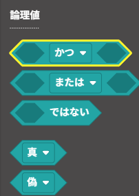

それを「もし～なら」{:class="microbitlogic"} ブロックの「真」の部分に配置します。

```microbit
loops.everyInterval(500, function () {
    led.plotBarGraph(
    input.soundLevel(),
    255
    )
    datalogger.log(datalogger.createCV("Sound level", input.soundLevel()))
    if (false && false) {
    	
    }
})
```

\--- /task ---

ここから、**～かつ～** の左右のスペースに **二つ** の条件を追加していきます。

\--- task ---

再び「論理」{:class="microbitlogic"}メニューから、比較演算子の「0 < 0」{:class="microbitlogic"}ブロックを取得します。

それを「～かつ～」{:class="microbitlogic"} ブロックの片側に配置します。

ドロップダウンメニューから、不等号を未満の（「<」） からより大きい（「>」）に変更します。

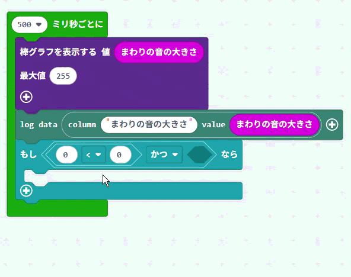

\--- /task ---

\--- task ---

「入力」{:class="microbitinput"} メニューから、「音量」{:class="microbitinput"} ブロックを取得します。

それを「0 > 0」{:class="microbitlogic"} ブロックの一つ目の 「0」 に配置します

「変数」{:class="microbitvariables"}メニューから、「上限」{:class="microbitvariables"}ブロックを取得します。

それを「0 > 0」{:class="microbitlogic"} ブロックの 二つ目の 「0」 に配置します。

ここまでのコードは以下のようになります：

```microbit
loops.everyInterval(500, function () {
    let maximum = 0
    led.plotBarGraph(
    input.soundLevel(),
    255
    )
    datalogger.log(datalogger.createCV("Sound Level", input.soundLevel()))
    if (input.soundLevel() > maximum && false) {
    	
    })
```

\--- collapse ---

---

## title: micro:bit V1の場合

「入力」{:class="microbitinput"} メニューから、「明るさ」{:class="microbitinput"} ブロックを取得します。

それを「0 > 0」{:class="microbitlogic"}ブロック一つ目の「0」に配置します。

「変数」{:class="microbitvariables"}メニューから、「上限」{:class="microbitvariables"}ブロックを取得します。

それを「0 > 0」{:class="microbitlogic"} ブロックの二つ目の 「0」に配置します。

ここまでのコードは以下のようになります：

```microbit
loops.everyInterval(500, function () {
    let maximum = 0
    led.plotBarGraph(
    input.lightLevel(),
    255
    )
    if (input.lightLevel() > maximum && false) {
    	
    }
})
```

\--- /collapse ---

\--- /task ---

さらに、変数「アラーム」{:class="microbitvariables"}が、まだ「真」{:class="microbitlogic"}になっていない場合のみ、アラームを作動させたいと考えます。

\--- task ---

「論理」{:class='microbitlogic'}メニューから「～ではない」{:class='microbitlogic'}ブロックを取得します。

それを「かつ」{:class='microbitlogic'} ブロックのもう片方のスペースに配置します。

```microbit
loops.everyInterval(500, function () {
    let maximum = 0
    led.plotBarGraph(
    input.soundLevel(),
    255
    )
    datalogger.log(datalogger.createCV("Sound level", input.soundLevel()))
    if (input.soundLevel() > maximum && !(false)) {
    	
    }
})
```

\--- /task ---

\--- task ---

「アラーム」{:class='microbitvariables'} ブロックを取り出し、次のように「～ではない」{:class='microbitlogic'} ブロック内に配置します：

```microbit
loops.everyInterval(500, function () {
    let alarm = 0
    let maximum = 0
    led.plotBarGraph(
    input.soundLevel(),
    255
    )
    datalogger.log(datalogger.createCV("Sound level", input.soundLevel()))
    if (input.soundLevel() > maximum && !(alarm)) {
    	
    }
})
```

\--- /task ---

### アラームを鳴らす

いよいよアラームの音を追加します！

\--- task ---

「音楽」{:class='microbitmusic'} メニューから 「鳴らす くすくす笑う 終わるまで」{:class='microbitmusic'} ブロックを選択します。

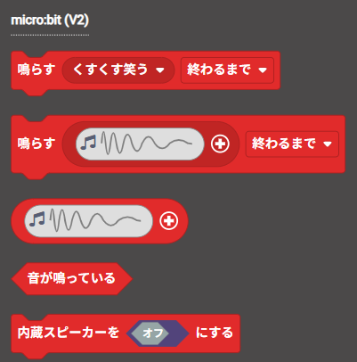

これを、アラームを鳴らすべきか判定する「もし〜なら」{:class='microbitlogic'} ブロックの中に配置します。

```microbit
loops.everyInterval(500, function () {
    let alarm = 0
    let maximum = 0
    led.plotBarGraph(
    input.soundLevel(),
    255
    )
    datalogger.log(datalogger.createCV("Sound level", input.soundLevel()))
    if (input.soundLevel() > maximum && !(alarm)) {
        music.play(music.builtinPlayableSoundEffect(soundExpression.giggle), music.PlaybackMode.UntilDone)
    }
})
```

\--- collapse ---

---

## title: micro:bit V1の場合

micro:bit V1にはスピーカーがないため、アラームに合わせてプログラムを調整する必要があります。

音を使うアラームではなく、明るさが上限よりも高いときにLEDにアイコンを表示することができます。

「基本」{:class='microbitbasic'} メニューから、「アイコンを表示」{:class='microbitbasic'} ブロックを取得します。

これを、アラームを鳴らすべきか判定する「もし〜なら」{:class='microbitlogic'} ブロックの中に配置します。

アラームに使用するアイコンを**選択**します。

```microbit
loops.everyInterval(500, function () {
    let alarm = 0
    let maximum = 0
    led.plotBarGraph(
    input.lightLevel(),
    255
    )
    datalogger.log(datalogger.createCV("Light level", input.lightLevel()))
    if (input.lightLevel() > maximum && !(alarm)) {
        basic.showIcon(IconNames.Sad)
    }
})
```

\--- /collapse ---

\--- /task ---

\--- task ---

ドロップダウンメニューに用意されている音の中から、鳴らしたいアラームの音を**選びます**。

\--- /task ---

\--- task ---

「最初だけ」{:class='microbitbasic'} ブロック内で、「変数 アラームを 偽 にする」{:class='microbitvariables'} ブロックを **右クリック**して、**複製**を選択します。

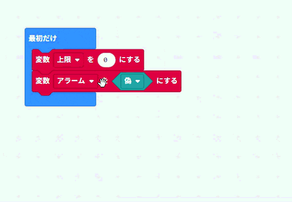

複製したブロックを「音を鳴らす」{:class='microbitmusic'}ブロックの下に配置します。

「偽」{:class='microbitlogic'} を 「真」{:class='microbitlogic'} に変更します。

```microbit
let alarm = false
loops.everyInterval(500, function () {
    let maximum = 0
    led.plotBarGraph(
    input.soundLevel(),
    255
    )
    datalogger.log(datalogger.createCV("Sound level", input.soundLevel()))
    if (input.soundLevel() > maximum && !(alarm)) {
        music.play(music.builtinPlayableSoundEffect(soundExpression.mysterious), music.PlaybackMode.UntilDone)
        alarm = true
    }
})
```

\--- /task ---

### アラームをリセットする

一度アラームが鳴った後、再び作動するようにリセットする仕組みが必要です。

micro:bitの表面にある 触ると作動するロゴマーク を使ってリセットできるようにしましょう。

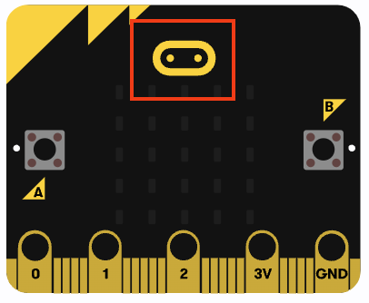

\--- task ---

「入力」{:class='microbitinput'} メニューから、「ロゴが 短くタップされた とき」{:class='microbitinput'} ブロックを取得します。

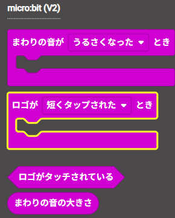

「入力」{:class='microbitbasic'} ブロックから 「変数 アラームを 偽 にする」{:class='microbitvariables'} ブロックを複製し、「ロゴが 短くタップされた とき」{:class='microbitinput'} ブロックの中に配置します。

```microbit
let alarm = false
input.onLogoEvent(TouchButtonEvent.Pressed, function () {
    alarm = false
})
```

\--- collapse ---

---

## title: micro:bit V1の場合

micro:bit V1のロゴにはタッチセンサーが搭載されていないため、代わりに「A」ボタンと「B」ボタンの両方を使用できます。

「入力」{:class='microbitinput'} メニューから、「ボタン A が 押されたとき」{:class='microbitinput'} ブロックを取得します。


ドロップダウンメニューを使用して、ボタンを「A+B」{:class='microbitinput'}に変更します。

「入力」{:class='microbitbasic'} ブロックから 「変数 アラームを 偽 にする」{:class='microbitvariables'} ブロックを複製し、「ボタン A +B が 押されたとき」{:class='microbitinput'} ブロックの中に配置します。

```microbit
let alarm = false
input.onButtonPressed(Button.AB, function () {
    alarm = false
})
```

\--- /collapse ---

\--- /task ---

次のステップでは、「A」ボタンと「B」ボタンを使って、アラームの感度を変更できるようにします！
