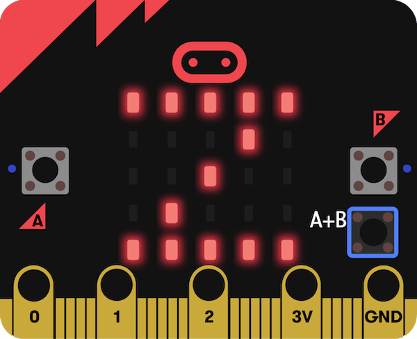

## 次は何をしましょうか？

[micro:bit入門](https://projects.raspberrypi.org/en/raspberrypi/path-name)の手順を踏んでいる場合は、[睡眠トラッカー](https://projects.raspberrypi.org/en/projects/sleep-tracker)プロジェクトに進むことができます。

このプロジェクトでは、micro:bitの加速度センサーを使って、夜間の体の動きの回数を追跡する睡眠トラッカーを作成します。 最高の体調を維持するためには、質の良い睡眠をとることが本当に大切です！

\--- print-only ---

\--- /print-only ---

\--- no-print ---

<iframe style="position:absolute;top:0;left:0;width:100%;height:100%;" src="https://makecode.microbit.org/---run?id=_14Lib71CCP0F" allowfullscreen="allowfullscreen" sandbox="allow-popups allow-forms allow-scripts allow-same-origin" frameborder="0"></iframe>

\--- /no-print ---

micro:bitをもっと楽しく探求したいなら、[これらのプロジェクト](https://projects.raspberrypi.org/en/projects?hardware%5B%5D=microbit)を試してみるといいでしょう。
