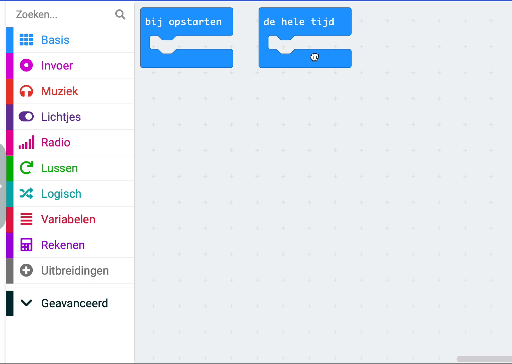

## Het geluidsniveau vastleggen

<div style="display: flex; flex-wrap: wrap">
<div style="flex-basis: 200px; flex-grow: 1; margin-right: 15px;">
Je maakt je MakeCode project en voegt code toe om de geluids- (of licht) niveaus te meten. Je geeft het huidige niveau weer op de LED's voor de gebruiker. 
</div>
<div>
{:width="300px"}
</div>
</div>

### MakeCode openen

Om je micro:bit-project te maken, moet je eerst de MakeCode-editor openen.

--- task ---

Open de MakeCode editor in [makecode.microbit.org](https://makecode.microbit.org){:target="_blank"}

--- collapse ---

---
title: Offline versie van de editor
---

Er is ook een [downloadbare versie van de MakeCode editor](https://makecode.microbit.org/offline-app){:target="_blank"}.

--- /collapse ---

--- /task ---

### Is dit je eerste micro:bit-project?

[[[makecode-tour]]]

### Maak je project

Zodra de editor is geopend, moet je een nieuw project aanmaken en je project een naam geven.

--- task ---

Klik op de knop **Nieuw Project**.


--- /task ---

--- task ---

Geef je nieuwe project de naam `geluidsniveau meter` en klik op **Aanmaken**.


**Tip:** Om het makkelijker te maken om je project later terug te vinden, geef het een logische naam die gerelateerd is aan de activiteit die je aan doen bent.

--- /task ---

### Teken een grafiek van het geluidsniveau

In dit project maak je gebruik van het `bij opstarten`{:class="microbitbasic"} blok, maar niet het `de hele tijd`{:class="microbitbasic"} blok.

--- task ---

Je kunt het blok `de hele tijd`{:class="microbitbasic"} nu verwijderen door het naar het menupaneel te slepen.



--- /task ---

De eerste stap is om de micro:bit met regelmatige tussenpozen de geluidsniveaus te laten maken. Er is een speciale lus die je kunt gebruiken om dit te doen.

--- task ---

Vanuit het `Lussen`{:class="microbitloops"} menu, sleep je een `elk 500 ms`{:class="microbitloops"} blok en plaats het in het bewerkingspaneel.


Elke code binnen deze lus wordt elke **500 milliseconden uitgevoerd**.

1000 milliseconden is 1 seconde, dus deze lus wordt elke **halve seconde** uitgevoerd.

--- /task ---

--- task ---

Vanuit het `Lichtjes`{:class="microbitled"} menu, sleep je een `plot bar graph of`{:class="microbitled"} (teken staafdiagram) blok.


Plaats het in het `elk 500 ms`{:class="microbitloops"} blok.

```microbit
loops.everyInterval(500, function () {
    led.plotBarGraph(
    0,
    0
    )
})
```

--- /task ---

--- task ---

Sleep vanuit het menu `Invoer`{:class="microbitinput"} een `geluidsniveau`{:class="microbitinput"} blok.

Plaats het in de eerste `0` in het `plot bar graph of`{:class="microbitled"} blok.

Verander de tweede `0` in `255`.

```microbit
loops.everyInterval(500, function () {
    led.plotBarGraph(
    input.soundLevel(),
    255
    )
})
```

--- collapse ---

---
title: Voor micro:bit V1
---

Er zit geen microfoon op de micro:bit V1, dus in plaats daarvan kun je het `lichtniveau`{:class="microbitinput"} blok gebruiken om de lichtniveaus van je omgeving te meten.


--- /collapse ---

--- /task ---

### Registreer de geluidsniveaus (alleen V2)

De V2 micro:bit heeft een ingebouwde data logger, waarmee je gegevens kunt bijhouden van verschillende sensoren en inputs. Je moet een extensie installeren om dit te kunnen gebruiken.

--- task ---

Klik op het menu paneel op **Extensies**. Er wordt een ander venster geopend met de aanbevolen extensies. Klik op de **data logger** en het zal worden geïnstalleerd als menu-item.


--- /task ---

--- task ---

Vanuit het `Data Logger`{:class="microbitdatalogger"} menu, sleep je een `log data`{:class="microbitdatalogger"} blok.


Plaats het onder het `plot bar graph of`{:class='microbitled'} blok.

```microbit
loops.everyInterval(500, function () {
    led.plotBarGraph(
    input.soundLevel(),
    255
    )
    datalogger.log(datalogger.createCV("", 0))
})
```

--- /task ---

--- task ---

Typ `Geluidsniveau` in het kolomveld (column).

```microbit
loops.everyInterval(500, function () {
    led.plotBarGraph(
    input.soundLevel(),
    255
    )
    datalogger.log(datalogger.createCV("Geluidsniveau", 0))
})
```

--- /task ---

--- task ---

Vanuit het `Invoer`{:class="microbitinput"} menu, sleep een ander `geluidsniveau`{:class="microbitinput"} blok en plaats het in de `0` van het `log data`{:class="microbitdatalogger"} blok.

```microbit
loops.everyInterval(500, function () {
    led.plotBarGraph(
    input.soundLevel(),
    255
    )
    datalogger.log(datalogger.createCV("Geluidsniveau", input.soundLevel()))
})
```

--- /task ---

### Test je programma

Als je een wijziging aanbrengt in een codeblok in het bewerkingspaneel zal de simulator opnieuw starten.

**Test je programma**

+ Sleep het rode geluidsniveau balk omhoog en omlaag om het geluidsniveau te wijzigen.

**Alleen voor de V2**

+ Klik op de '**Gegevens weergeven** Simulator' link onder de micro:bit simulator om de geluidsniveaus te zien die worden gelogd.


Geweldig werk! Je hebt je eerste programma voor het weergeven van gegevens gemaakt op de micro:bit!
