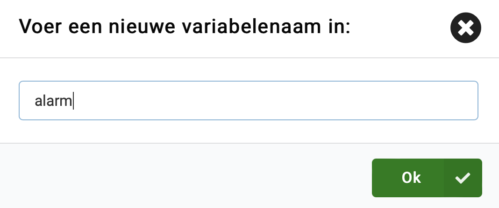
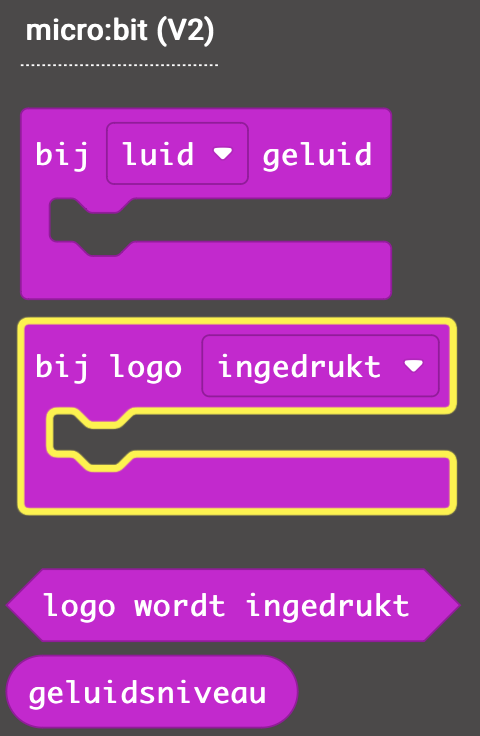

## Sla alarm

<div style="display: flex; flex-wrap: wrap">
<div style="flex-basis: 200px; flex-grow: 1; margin-right: 15px;">
In deze stap voeg je een alarm toe dat geactiveerd wordt wanneer het geluidsniveau te hoog wordt. Om te voorkomen dat het alarm extra geluid toevoegt, zorg je ervoor dat het slechts eenmaal afgaat en kan worden gereset wanneer je dat wilt. 
</div>
<div>

{:width="300px"}

</div>
</div>

### Stel het maximum in

Je moet een variabele maken om het geluidsniveau te bepalen dat het alarm uitlokt.

--- task ---

Open het `Variabelen`{:class="microbitvariables"} menu en klik op **Maak een variabele**.


--- /task ---

--- task ---

Geef je nieuwe variabele de naam `maximum`.


--- /task ---

--- task ---

Sleep vanuit het menu `Variabelen`{:class="microbitvariables"} een blok `stel maximum in op`{:class="microbitvariables"}.


Plaats het blok binnen het `bij opstarten`{:class="microbitbasic"} blok en verander de `0` in `150`.

```microbit
let maximum = 150
```

--- /task ---

De waarde `150` is iets meer dan de helft van het maximale geluidsniveau dat de micro:bit kan waarnemen, dus dat zou een goed niveau moeten zijn om mee te beginnen.

--- collapse ---

---
title: Voor micro:bit V1
---

Deze maximale waarde geldt ook voor lichtniveaus!

--- /collapse ---

### Schakel het alarm uit

Je wilt er ook voor zorgen dat het alarmgeluid de toch al luidruchtige omgeving niet verergert!

Om dit te doen, gebruik je een andere variabele die zal worden ingesteld op `onwaar` om te starten en zal veranderen in `waar` wanneer het alarm klinkt.

--- task ---

Maak nog een nieuwe `Variabele`{:class="microbitvariables"}, deze keer genaamd `alarm`.



--- /task ---

--- task ---

Sleep het `stel alarm in op`{:class="microbitvariables"} blok uit het `Variabelen`{:class="microbitvariables"} menu.

Plaats het in het `bij opstarten`{:class="microbitbasic"} blok.

--- /task ---

Je moet deze nieuwe variabele instellen op `onwaar` in plaats van een getal.

--- task ---

Open het `Logisch`{:class="microbitlogic"} menu.

Haal een `onwaar`{:class="microbitlogic"} blok op.


Plaats dit blok bovenop de `0`.

```microbit
let maximum = 150
let alarm = false
```

--- /task ---

### Controleer of het alarm moeten afgaan

Het alarm mag alleen afgaan **als:**

+ Het geluidsniveau **groter** is dan het maximum   
  **EN**
+ De alarm variabele is **onwaar**

--- task ---

Vanuit het `Logisch`{:class="microbitlogic"} menu, sleep het `als...dan`{:class="microbitlogic"} blok.


Plaats het blok in de `elke`{:class="microbitloops"} lus onder het `log data`{:class="microbitdatalogger"} blok.

```microbit
loops.everyInterval(500, function () {
    led.plotBarGraph(
    input.soundLevel(),
    255
    )
    datalogger.log(datalogger.createCV("Geluidsniveau", input.soundLevel()))
    if (true) {

    }
})
```

--- /task ---

--- task ---

Open het `Logisch`{:class="microbitlogic"} menu opnieuw en sleep een `en`{:class="microbitlogic"} blok.


Plaats het in het `waar` gedeelte van het `als...dan`{:class="microbitlogic"} blok.

```microbit
loops.everyInterval(500, function () {
    led.plotBarGraph(
    input.soundLevel(),
    255
    )
    datalogger.log(datalogger.createCV("Geluidsniveau", input.soundLevel()))
    if (false && false) {

    }
})
```

--- /task ---

Nu moet je de **twee** voorwaarden aan weerszijden van de **of** toevoegen.

--- task ---

Sleep opnieuw vanuit het menu `Logisch`{:class="microbitlogic"} een blok `0 < 0`{:class="microbitlogic"}.

Plaats het aan één kant van het `en`{:class="microbitlogic"} blok.

Gebruik het vervolgkeuzemenu om het kleiner dan-symbool (`<`) te wijzigen in een groter dan-symbool (`>`).


--- /task ---

--- task ---

Sleep vanuit het menu `Invoer`{:class="microbitinput"} een `geluidsniveau`{:class="microbitinput"} blok.

Plaats het in de eerste `0` in het `0 > 0`{:class="microbitlogic"} blok

Sleep vanuit het menu `Variabelen`{:class="microbitvariables"} een blok `maximum`{:class="microbitvariables"}.

Plaats het in het tweede `0` van het `0 > 0`{:class="microbitlogic"} blok.

Je code zou er als volgt uit moeten zien:

```microbit
loops.everyInterval(500, function () {
    let maximum = 0
    led.plotBarGraph(
    input.soundLevel(),
    255
    )
    datalogger.log(datalogger.createCV("Geluidsniveau", input.soundLevel()))
    if (input.soundLevel() > maximum && false) {

    }
})
```

--- collapse ---

---
title: Voor micro:bit V1
---

Sleep vanuit het menu `Invoer`{:class="microbitinput"} een `lichtniveau`{:class="microbitinput"} blok.

Plaats het in de eerste `0` in het `0 > 0`{:class="microbitlogic"} blok.

Sleep vanuit het menu `Variabelen`{:class="microbitvariables"} een blok `maximum`{:class="microbitvariables"}.

Plaats het in het tweede `0` van het `0 > 0`{:class="microbitlogic"} blok.

Je code zou er als volgt uit moeten zien:

```microbit
loops.everyInterval(500, function () {
    let maximum = 0
    led.plotBarGraph(
    input.lightLevel(),
    255
    )
    if (input.lightLevel() > maximum && false) {

    }
})
```

--- /collapse ---

--- /task ---

Je wilt het alarm alleen af laten gaan als de `alarm`{:class="microbitvariables"} variabele **niet** ingesteld is op `waar`{:class="microbitlogic"}.

--- task ---

Haal een `niet`{:class='microbitlogic'} blok op uit het menu `Logisch`{:class='microbitlogic'}.

Plaats het aan de andere kant van de `en`{:class='microbitlogic'} blok.

```microbit
loops.everyInterval(500, function () {
    let maximum = 0
    led.plotBarGraph(
    input.soundLevel(),
    255
    )
    datalogger.log(datalogger.createCV("Geluidsniveau", input.soundLevel()))
    if (input.soundLevel() > maximum && !(false)) {

    }
})
```

--- /task ---

--- task ---

Plaats een `alarm`{:class='microbitvariables'} variabele blok in het `niet`{:class='microbitlogic'} blok zoals hier:

```microbit
loops.everyInterval(500, function () {
    let alarm = 0
    let maximum = 0
    led.plotBarGraph(
    input.soundLevel(),
    255
    )
    datalogger.log(datalogger.createCV("Geluidsniveau", input.soundLevel()))
    if (input.soundLevel() > maximum && !(alarm)) {

    }
})
```

--- /task ---

### Sla alarm

Nu is het tijd om je alarmgeluid toe te voegen!

--- task ---

Neem vanuit het menu `Muziek`{:class='microbitmusic'} een `play`{:class='microbitmusic'} blok.


Plaats dit in het `als`{:class='microbitlogic'} blok dat controleert of het alarm moet afgaan.

```microbit
loops.everyInterval(500, function () {
    let alarm = 0
    let maximum = 0
    led.plotBarGraph(
    input.soundLevel(),
    255
    )
    datalogger.log(datalogger.createCV("Geluidsniveau", input.soundLevel()))
    if (input.soundLevel() > maximum && !(alarm)) {
        music.play(music.builtinPlayableSoundEffect(soundExpression.giggle), music.PlaybackMode.UntilDone)
    }
})
```

--- collapse ---

---
title: Voor micro:bit V1
---

De micro:bit V1 heeft geen luidspreker, waardoor je het programma voor het alarm moet aanpassen.

In plaats van een alarm dat geluid gebruikt, kun je een pictogram op de LED's weergeven wanneer het lichtniveau hoger is dan het maximum.

Sleep vanuit het menu `Basis`{:class='microbitbasic'} het blok `toon pictogram`{:class='microbitbasic'}.

Plaats dit in het `als`{:class='microbitlogic'} blok dat controleert of het alarm moet afgaan.

**Selecteer** een pictogram om te gebruiken voor je alarm.

```microbit
loops.everyInterval(500, function () {
    let alarm = 0
    let maximum = 0
    led.plotBarGraph(
    input.lightLevel(),
    255
    )
    datalogger.log(datalogger.createCV("Lichtniveau", input.lightLevel()))
    if (input.lightLevel() > maximum && !(alarm)) {
        basic.showIcon(IconNames.Sad)
    }
})
```

--- /collapse ---

--- /task ---

--- task ---

**Kies** welk alarmgeluid je wilt gebruiken, uit de beschikbare geluiden in het vervolgkeuzemenu.

--- /task ---

--- task ---

Binnen je `bij opstarten`{:class='microbitbasic'} blok, **klik met de rechtermuisknop** op het `stel in op`{:class='microbitvariables'} blok en selecteer **Dupliceren**.


Plaats het gedupliceerde blok onder het blok `play`{:class='microbitmusic'}.

Verander de `onwaar`{:class='microbitlogic'} naar `waar`{:class='microbitlogic'}.

```microbit
let alarm = false
loops.everyInterval(500, function () {
    let maximum = 0
    led.plotBarGraph(
    input.soundLevel(),
    255
    )
    datalogger.log(datalogger.createCV("Geluidsniveau", input.soundLevel()))
    if (input.soundLevel() > maximum && !(alarm)) {
        music.play(music.builtinPlayableSoundEffect(soundExpression.mysterious), music.PlaybackMode.UntilDone)
        alarm = true
    }
})
```

--- /task ---

### Reset het alarm

Wanneer het alarm af is gegaan, wil je het kunnen resetten.

Je kunt het touch logo op de micro:bit gebruiken om dit te doen.


--- task ---

Sleep vanuit het menu `Invoer`{:class='microbitinput'} een `bij logo ingedrukt`{:class='microbitinput'} blok.



Vanaf je `bij opstarten`{:class='microbitbasic'} blok, dupliceer het `stel alarm in op`{:class='microbitvariables'} blok en plaats het in de `bij logo ingedrukt`{:class='microbitinput'} blok.

```microbit
let alarm = false
input.onLogoEvent(TouchButtonEvent.Pressed, function () {
    alarm = false
})
```

--- collapse ---

---
title: Voor micro:bit V1
---

Er is geen touch sensor in het logo van de micro:bit dus in plaats daarvan kun je zowel de `A` en `B` knoppen gebruiken.

Sleep vanuit het menu `Invoer`{:class='microbitinput'} een `wanneer knop wordt ingedrukt`{:class='microbitinput'} blok.


Gebruik het vervolgkeuzemenu om de knop te wijzigen in `A+B`{:class='microbitinput'}.

Vanaf je `bij opstarten`{:class='microbitbasic'} blok, dupliceer het `stel alarm in op`{:class='microbitvariables'} blok en plaats het in het `wanneer knop wordt ingedrukt`{:class='microbitinput'} blok.

```microbit
let alarm = false
input.onButtonPressed(Button.AB, function () {
    alarm = false
})
```

--- /collapse ---

--- /task ---

Vervolgens ga je de `A` knop en `B` knop gebruiken om de gevoeligheid van je alarm te wijzigen!
