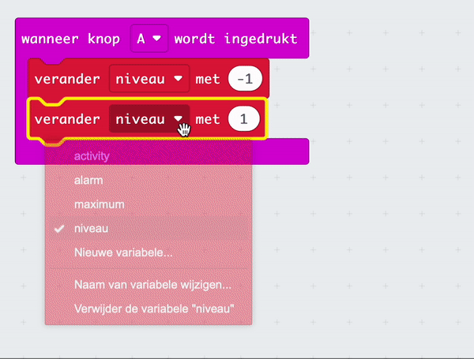
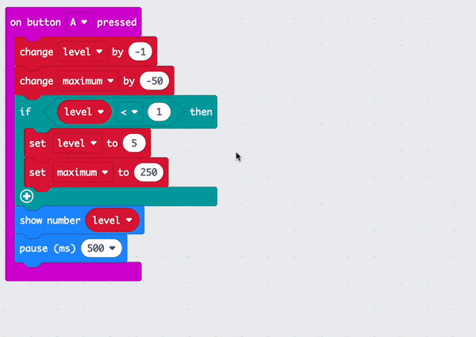
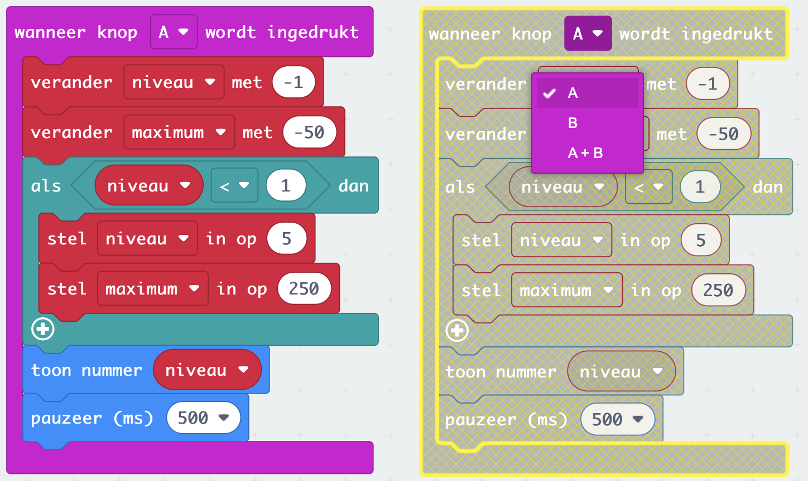
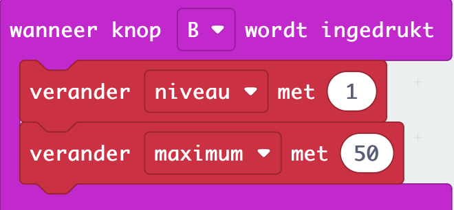

## Wijzig de gevoeligheid

<div style="display: flex; flex-wrap: wrap">
<div style="flex-basis: 200px; flex-grow: 1; margin-right: 15px;">

In deze stap programmeer je de knoppen op de micro:bit om de gevoeligheid van het alarm aan te passen met instellingen van 1 (laagste maximale waarde) tot 5 (hoogste maximale waarde). 

</div>
<div>

{:width="300px"}

</div>
</div>

### Verlaag het maximale geluidsniveau

De **A-knop** bevindt zich aan de linkerkant, dus deze gebruik je om de maximale waarde voor het alarm te verlagen.

--- task ---

Vanuit het `Invoer`{:class="microbitinput"} menu, sleep je het `wanneer knop wordt ingedrukt`{:class="microbitinput"} blok naar het bewerkingspaneel.


--- /task ---

In de vorige stap heb je twee variabelen gemaakt, `maximum`{:class='microbitvariables'} en `alarm`{:class='microbitvariables'}.

Nu maak je nog een variabele voor het gevoeligheids**niveau**.

--- task ---

Van het `Variabelen`{:class='microbitvariables'} menu, klik op **Maak een variabele** om een variabele te maken met de naam `niveau`.

--- /task ---

--- task ---

Sleep het `verander met`{:class='microbitvariables'} blok en plaats het in blok `wanneer knop wordt ingedrukt`{:class='microbitinput'}.

Verander de `1` naar `-1`.

```microbit
let level = 0
input.onButtonPressed(Button.A, function () {
    level += -1
})
```

--- /task ---

--- task ---

Sleep vanuit het menu `Variabelen`{:class="microbitvariables"} nog een blok `verander met`{:class="microbitvariables"}.

Plaats het **hieronder** om het `verander niveau met -1`{:class='microbitvariables'} blok.

Wijzig de variabele die in het blok wordt weergegeven van `niveau` naar `maximum` door op de naam van de variabele te klikken.

Verander de `1` naar `-50`.



```microbit
let level = 0
let maximum = 0
input.onButtonPressed(Button.A, function () {
    level += -1
    maximum += -50
})
```

--- /task ---

Dit betekent dat elke keer dat je op knop A drukt, het gevoeligheidsniveau met 1 zal verlagen en de geluidsgevoeligheid met 50 zal verminderen.

Als knop A wordt ingedrukt terwijl het niveau al 1 is, moet je ervoor zorgen dat het niveau verandert naar `5` en niet `0`.

--- task ---

Vanuit het `Logisch`{:class="microbitlogic"} menu, sleep een `als`{:class="microbitlogic"} blok.

Plaats het onder het `verander maximum met -50`{:class='microbitvariables'} blok.

```microbit
let level = 0
let maximum = 0
input.onButtonPressed(Button.A, function () {
    level += -1
    maximum += -50
    if (true) {

    }
})
```

--- /task ---

--- task ---

Sleep vanuit het menu `Logisch`{:class='microbitlogic'} het vergelijkingsblok `0 < 0`{:class='microbitlogic'}.

Plaats dit in het `waar`{:class="microbitlogic"} deel van het `als`{:class="microbitlogic"} blok.

```microbit
let level = 0
let maximum = 0
input.onButtonPressed(Button.A, function () {
    level += -1
    maximum += -50
    if (0 < 0) {

    }
})
```

--- /task ---

--- task ---

Sleep vanuit het menu `Variabelen`{:class="microbitvariables"} een blok `niveau`{:class="microbitvariables"}.

Plaats het in de eerste `0` van het `0 < 0`{:class='microbitlogic'} vergelijkingsblok.

```microbit
let level = 0
let maximum = 0
input.onButtonPressed(Button.A, function () {
    level += -1
    maximum += -50
    if (level < 0) {

    }
})
```

--- /task ---

--- task ---

Verander de `0` naar `1` aan de rechterkant van het `0 < 0`{:class='microbitlogisch'} vergelijkingsblok.

--- /task ---

--- task ---

Sleep vanuit het menu `Variabelen`{:class="microbitvariables"} een blok `stel in op`{:class="microbitvariables"}.

Plaats het in het `als`{:class="microbitlogic"} blok. Zorg ervoor dat de geselecteerde variabele `niveau`{:class='microbitvariables'} is.

Wijzig de `0` in `5` in het `stel in op`{:class="microbitvariables"} blok.

```microbit
let level = 0
let maximum = 0
input.onButtonPressed(Button.A, function () {
    level += -1
    maximum += -50
    if (level < 1) {
        level = 5
    }
})
```

--- /task ---

--- task ---

Sleep vanuit het menu `Variabelen`{:class="microbitvariables"} opnieuw een blok `stel in op`{:class="microbitvariables"}.

Plaats het onder het `stel niveau in op 5`{:class='microbitvariables'} blok.

Verander de `0` naar `250`.

```microbit
let level = 0
let maximum = 0
input.onButtonPressed(Button.A, function () {
    level += -1
    maximum += -50
    if (level < 1) {
        level = 5
        maximum = 250
    }
})
```

--- /task ---

--- task ---

Sleep vanuit het menu `Basis`{:class="microbitbasic"} een blok `toon nummer`{:class="microbitbasic"}.

Plaats het **onder** het `als`{:class='microbitlogic'} blok.

```microbit
let level = 0
let maximum = 0
input.onButtonPressed(Button.A, function () {
    level += -1
    maximum += -50
    if (level < 1) {
        level = 5
        maximum = 250
    }
    basic.showNumber(0)
})
```

--- /task ---

--- task ---

Sleep vanuit het menu `Variabelen`{:class="microbitvariables"} een blok `niveau`{:class="microbitvariables"}.

Plaats het in de `0` van het `toon nummer`{:class='microbitbasic'} blok.

```microbit
let level = 0
let maximum = 0
input.onButtonPressed(Button.A, function () {
    level += -1
    maximum += -50
    if (level < 1) {
        level = 5
        maximum = 250
    }
    basic.showNumber(level)
})
```

--- /task ---

--- task ---

Sleep ook vanuit het menu `Basis`{:class="microbitbasic"} het blok `pauzeer (ms)`{:class="microbitbasic"}.

Plaats het onder het blok `toon nummer`{:class='microbitbasic'}.

Verander de `100` naar `500`.

```microbit
let level = 0
let maximum = 0
input.onButtonPressed(Button.A, function () {
    level += -1
    maximum += -50
    if (level < 1) {
        level = 5
        maximum = 250
    }
    basic.showNumber(level)
    basic.pause(500)
})
```

--- /task ---

### Verhoog het maximale geluidsniveau

Je hebt nu het `wanneer knop A wordt ingedrukt`{:class='microbitinput'} blok geprogrammeerd.

Je moet hetzelfde doen voor `wanneer knop B wordt ingedrukt`{:class='microbitinput'} om het maximum te verhogen.

--- task ---

Klik met de rechtermuisknop op het volledige `wanneer knop A wordt ingedrukt`{:class='microbitinput'} blok en klik **Dupliceren**.



Er zullen nu twee `wanneer knop A wordt ingedrukt`{:class='microbitinput'} blokken in het bewerkingspaneel staan.

--- /task ---

--- task ---

Klik op de `A` in het gedupliceerde `wanneer knop A wordt ingedrukt`{:class='microbitinput'} blok. Er wordt een vervolgkeuzemenu geopend.

Verander de `A` naar `B`.



--- /task ---

--- task ---

In het `wanneer knop B wordt ingedrukt`op {:class='microbitinput'} blok:

- Verander de `-1` naar `1` in het `verander niveau`{:class='microbitvariables'} blok

- Verander de `-50` naar `50` in het `verander maximum`{:class='microbitvariables'} blok



--- /task ---

--- task ---

Voor de voorwaarden van het blok `als`{:class='microbitlogic'}:

- Verander de `<` naar `>`
- Verander de `1` naar `5`

Binnen het `als`{:class='microbitlogic'} blok:

- Verander de `5` naar `1` in het `stel niveau in op 5`{:class='microbitvariables'} blok
- Verander de `250` naar `50` in het `stel maximum in op 50`{:class='microbitvariables'} blok

```microbit
let level = 0
let maximum = 0
input.onButtonPressed(Button.B, function () {
    level += 1
    maximum += 50
    if (level > 5) {
        level = 1
        maximum = 50
    }
    basic.showNumber(level)
    basic.pause(500)
})
```

--- /task ---

### Stel een normaal geluidsniveau in

Je moet een normaal alarmgevoeligheidsniveau programmeren door het `bij opstarten`{:class='microbitbasic'} blok te gebruiken.

--- task ---

Sleep vanuit het menu `Variabelen`{:class="microbitvariables"} een blok `stel maximum in op`{:class="microbitvariables"}.

Plaats het in het `bij opstarten`{:class='microbitbasic'} blok.

--- /task ---

--- task ---

Klik op de variabele naam `maximum` en verander deze naar `niveau`.

Verander de `` naar `3` in het `stel niveau in op`{:class='microbitvariables'} blok.

```microbit
let maximum = 150
let alarm = false
let level = 3
```

--- /task ---

--- task ---

**Test je programma**

+ Druk op de knoppen A en B om het geluidsniveau te zien stijgen en dalen

Het standaard startpunt is niveau 3.

**Sleep** de microfoon-invoerniveaus omhoog en omlaag om het maximale geluid voor elk niveau te testen bij het gebruik van de simulator.

--- /task ---

--- task ---

Download je programma naar de micro:bit!

--- /task ---

[[[download-to-microbit]]]

Goed gedaan! Je hebt nu een volledig werkende geluids- of lichtmeter!

Nu is het tijd om te kijken wat je hebt geleerd!
